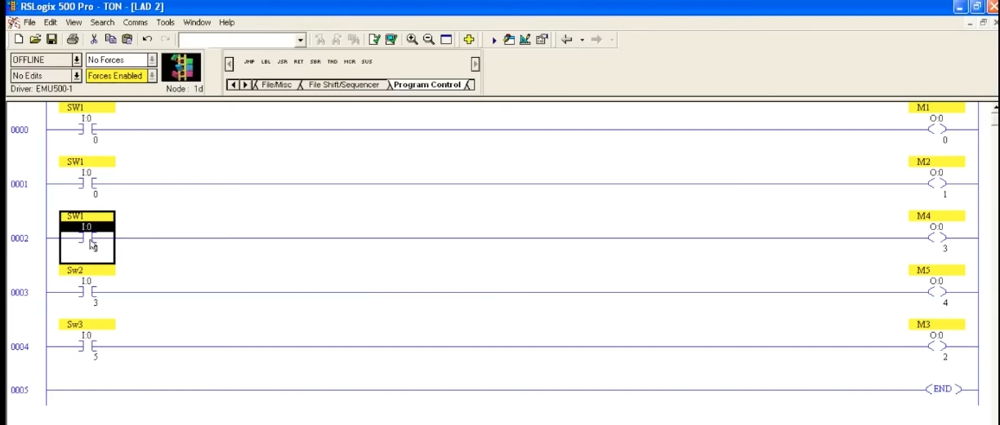
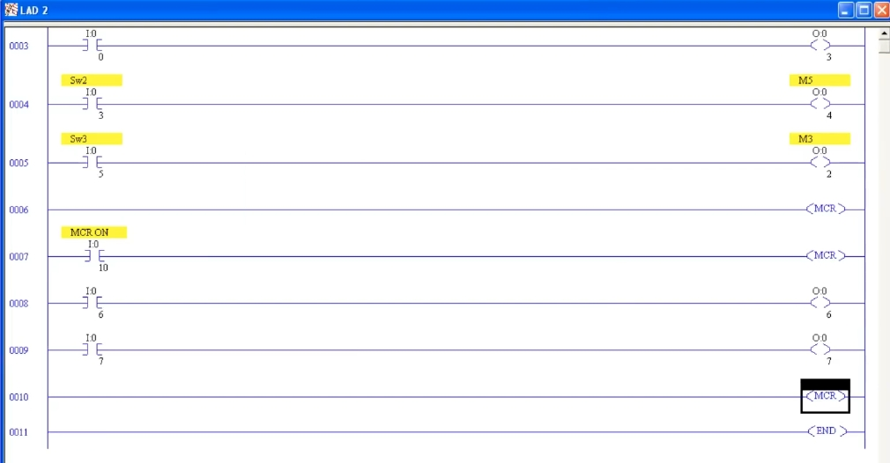
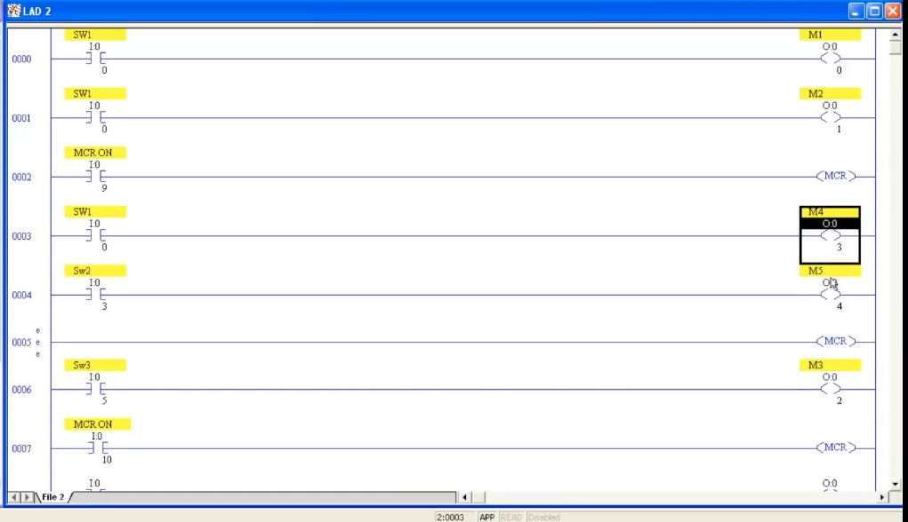
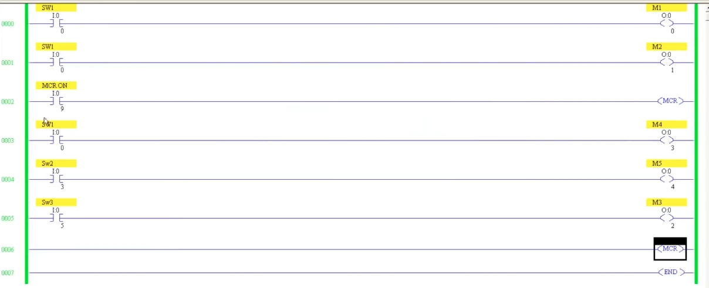

# Master Control Reset (MCR) Instruction in PLC Ladder Logic
# PLC 梯形圖主控重置（MCR）指令（中英對照教程）

> Source / 來源: <https://www.youtube.com/watch?v=KFGDXoS--eM> — *PLC Training 47: Master Control Reset MCR instruction in PLC* (Automation, Full HD)
>
> Software in the video / 影片使用軟體: Allen-Bradley RSLogix 500 Pro (emulator EMU500), file LAD 2。

---

## 1. What Is MCR? / 什麼是 MCR？

**EN:** **MCR (Master Control Reset)** works like the **main switch** of a house. In a home, the switch on the electricity meter/distribution board must be ON before any light or appliance can work. If the main switch is turned OFF, everything goes OFF at once — even though the individual switches are still in the ON position.

**中文：** **MCR（Master Control Reset，主控重置）** 就像家裡的**總開關**。家中電表／配電盤的總開關必須先打開，燈具與電器才能運作；總開關一關，即使各個分開關仍是 ON，所有設備也會**同時斷電**。

**EN – Why it is useful in industry:** a plant has many inputs and outputs. In an **emergency** or any situation where you must shut everything down at the same time, MCR lets you **turn off a whole group of outputs at once**, regardless of their individual input conditions.

**中文 – 工業上的用途：** 工廠有大量輸入與輸出。遇到**緊急情況**或需要同時關閉所有設備時，可用 MCR **一次關閉一整組輸出**，不論各自的輸入條件是否成立。

---

## 2. Starting Program (Without MCR) / 起始程式（尚未使用 MCR）

**EN:** The example has five outputs. Each output is driven by its own input:

| Rung 梯級 | Input 輸入 | Output 輸出 |
|---|---|---|
| 0000 | SW1 `I:0/0` | M1 `O:0/0` |
| 0001 | SW1 `I:0/0` | M2 `O:0/1` |
| 0002 | SW1 `I:0/0` | M4 `O:0/3` |
| 0003 | Sw2 `I:0/3` | M5 `O:0/4` |
| 0004 | Sw3 `I:0/5` | M3 `O:0/2` |

**Goal 目標：** turn off **M4, M5, M3** immediately, at the same time, even if their input conditions (SW1, Sw2, Sw3) are all ON.
**中文：** 目標是讓 **M4、M5、M3** 在輸入（SW1、Sw2、Sw3）都為 ON 的情況下，仍能被**同時立即關閉**。

*Figure 1 / 圖 1：LAD 2 – 五個輸出各自由輸入控制，尚未加入 MCR（工具列 Program Control 頁籤可見 MCR 指令）。*

---

## 3. Using MCR: Step by Step / MCR 使用步驟

**EN:**
1. Decide which outputs you want to control (here M4, M5, M3).
2. **Before** the first of those rungs, insert a new rung with an input contact (here `I:0/9`, description *MCR ON*) followed by an **MCR** output instruction.
   - MCR is an **output instruction**; it needs **no address**, but it **must have an input condition**.
   - This rung is the **start of the MCR zone** – the "main switch".
3. After the last rung you want to control, insert another rung containing **only an MCR** instruction (no input condition).
   - This rung is the **end of the MCR zone**.
4. Verify (check for errors) and go **online**.

**中文：**
1. 先決定要控制哪些輸出（此例為 M4、M5、M3）。
2. 在這些梯級的**最前面**插入新梯級：一個輸入接點（此例為 `I:0/9`，描述 *MCR ON*），後接 **MCR** 輸出指令。
   - MCR 是**輸出指令**，**不需要位址**，但**必須有輸入條件**。
   - 這一條梯級是 **MCR 區域的開始**——也就是「總開關」。
3. 在要控制的最後一個梯級**之後**，再插入一個**只有 MCR** 指令的梯級（不帶輸入條件）。
   - 這一條梯級是 **MCR 區域的結束**。
4. 檢查錯誤（Verify）並**上線（Online）**。

*Figure 2 / 圖 2：第 0002 條 `MCR ON (I:0/9)` → MCR（區域開始）；第 0003–0005 條 M4、M5、M3 位於區域內；第 0006 條 MCR（區域結束）；第 0007 條 END。*

| Rung 梯級 | Content 內容 | Role 作用 |
|---|---|---|
| 0000–0001 | SW1 → M1, M2 | Outside the zone, not affected 區域外，不受影響 |
| 0002 | `I:0/9` → MCR | **Zone start 區域開始** |
| 0003–0005 | M4, M5, M3 | **Inside the zone 區域內** |
| 0006 | MCR | **Zone end 區域結束** |
| 0007 | END | |

---

## 4. Test Results / 測試結果

**EN:**
- With `MCR ON` (`I:0/9`) **OFF**: even if SW1, Sw2, Sw3 are ON, **M4, M5, M3 stay OFF**. (M1 and M2, outside the zone, work normally.)
- Turn `MCR ON` **ON**: the outputs in the zone follow their own inputs and turn ON.
- Turn `MCR ON` **OFF** again: all outputs in the zone **turn off immediately**, at the same time.

**中文：**
- `MCR ON`（`I:0/9`）為 **OFF** 時：即使 SW1、Sw2、Sw3 都是 ON，**M4、M5、M3 仍保持 OFF**。（區域外的 M1、M2 則正常動作。）
- 將 `MCR ON` 打開：區域內的輸出才會依各自輸入條件變為 ON。
- 再將 `MCR ON` 關閉：區域內所有輸出**立即同時關閉**。

> **Key point 重點:** The MCR zone runs from the **MCR rung with a condition** down to the **MCR rung without a condition**. Only the rungs between them are controlled. / MCR 區域從**帶條件的 MCR 梯級**開始，到**不帶條件的 MCR 梯級**結束，只有兩者之間的梯級受控制。

---

## 5. Multiple MCR Zones / 多個 MCR 區域

**EN:** You can use **several MCR zones** in the same program, each with its own control input. In the video a second zone is added:

| Rung 梯級 | Content 內容 |
|---|---|
| 0007 | `MCR ON` `I:0/10` → MCR (zone 2 start 區域 2 開始) |
| 0008 | `I:0/6` → `O:0/6` |
| 0009 | `I:0/7` → `O:0/7` |
| 0010 | MCR (zone 2 end 區域 2 結束) |
| 0011 | END |

**中文：** 同一個程式中可以使用**多個 MCR 區域**，每個區域有自己的控制輸入。影片中新增了第二個區域（見上表）。

*Figure 3 / 圖 3：區域 1 結束於第 0006 條；區域 2 由 `I:0/10` 控制，包含 `O:0/6`、`O:0/7`，結束於第 0010 條。*

**EN – Test:** with `I:0/10` OFF, the outputs `O:0/6` and `O:0/7` will not turn on even if their inputs are ON; turn `I:0/10` ON and they work. Each zone is controlled independently.

**中文 – 測試：** `I:0/10` 為 OFF 時，即使 `I:0/6`、`I:0/7` 為 ON，`O:0/6`、`O:0/7` 也不會輸出；打開 `I:0/10` 後才會動作。各區域彼此獨立控制。

---

## 6. Changing the Zone Boundary / 調整 MCR 區域範圍

**EN:** To change which outputs belong to a zone, simply **move the ending MCR rung**. For example, to remove M3 from the first zone, move the end-MCR rung to **before** the M3 rung. Now only M4 and M5 are in the zone; M3 is outside it and is no longer controlled by the main switch.

**中文：** 若要改變哪些輸出屬於某個區域，只需**移動結束的 MCR 梯級**。例如要把 M3 移出第一個區域，就把結束 MCR 移到 M3 梯級**之前**。這樣區域內只剩 M4、M5；M3 在區域外，不再受總開關控制。

*Figure 4 / 圖 4：第 0002 條 MCR ON（`I:0/9`）；第 0003–0004 條 M4、M5；第 0005 條結束 MCR；第 0006 條 M3 已在區域外；第 0007 條為第二個區域（`I:0/10`）的開始。*

---

## 7. Notes / 補充說明

> **EN:** The following points are general RSLogix/SLC behavior and are **not** covered in the video; check your controller's instruction manual to confirm. / **中文：** 以下為 RSLogix/SLC 的一般特性，**影片中未提及**，請以所用控制器的指令手冊為準。
>
> - When an MCR zone is OFF, normal (non-latched) outputs in the zone are de-energized; **latched outputs (OTL)** keep their state. / MCR 區域為 OFF 時，區域內一般（非鎖存）輸出會被關閉；**鎖存輸出（OTL）** 會保持原狀態。
> - MCR zones should not be nested or overlapped. / MCR 區域不應巢狀或重疊。
> - MCR is **not** a substitute for a hardware emergency stop circuit. / MCR **不能**取代硬體緊急停止迴路。

---

## 8. Summary / 總結

**EN:**
- MCR acts as a **main switch** for a group of rungs.
- Zone start = **conditional MCR rung**; zone end = **unconditional MCR rung**.
- When the start condition is OFF, outputs inside the zone are turned off at the same time, even if their own inputs are ON.
- Rungs outside the zone are unaffected.
- Use multiple zones, and move the end MCR rung to adjust which outputs are controlled.

**中文：**
- MCR 相當於一組梯級的**總開關**。
- 區域開始 = **帶條件的 MCR 梯級**；區域結束 = **不帶條件的 MCR 梯級**。
- 開始條件為 OFF 時，區域內輸出即使輸入為 ON 也會被同時關閉。
- 區域外的梯級不受影響。
- 可使用多個區域，並移動結束 MCR 來調整受控輸出。
