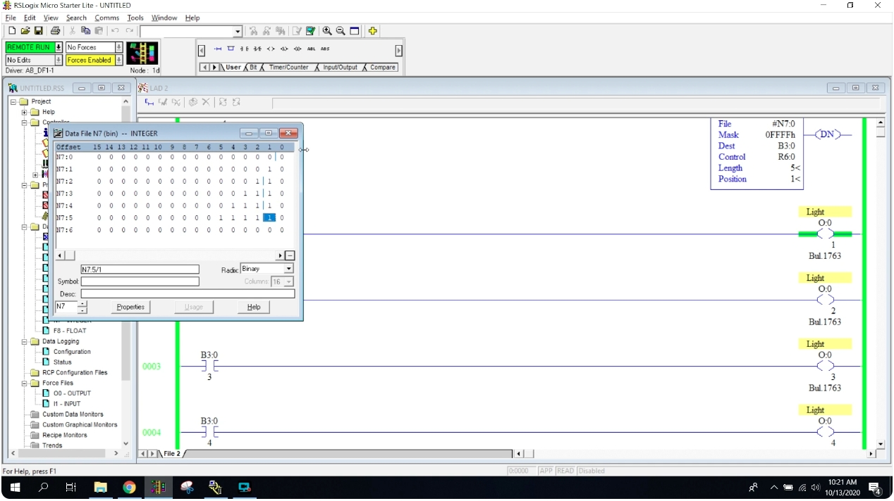
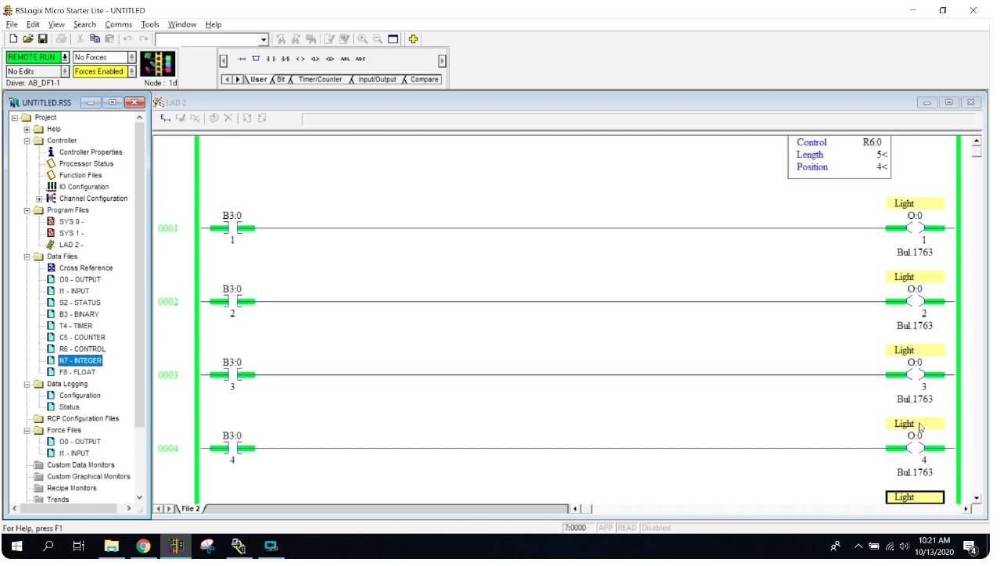
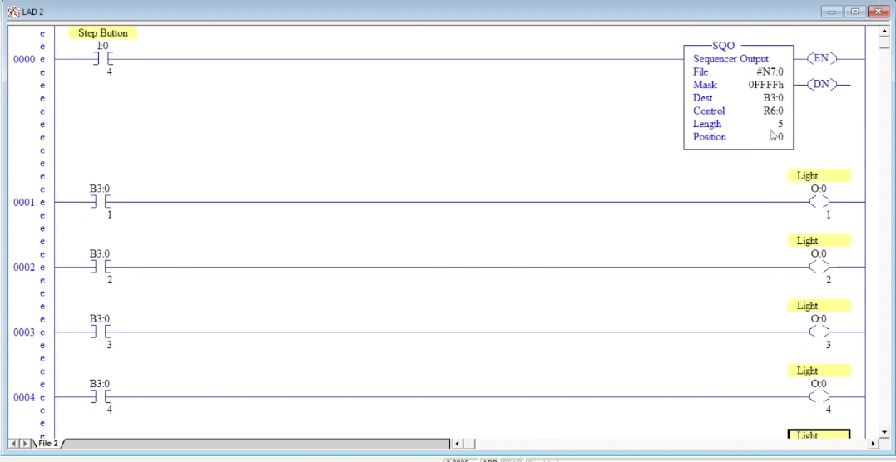
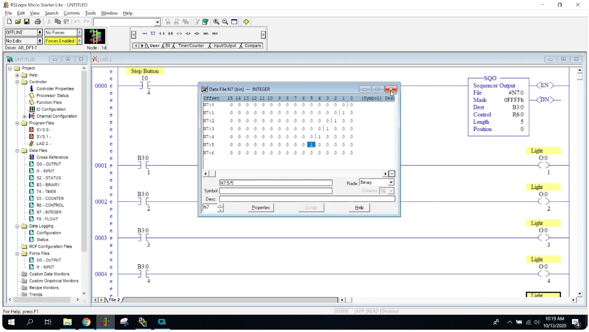
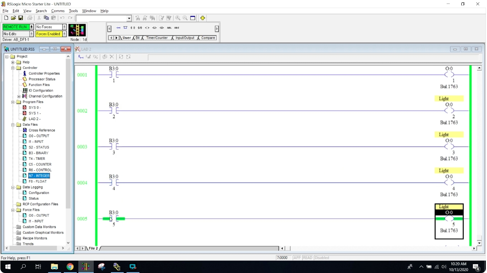
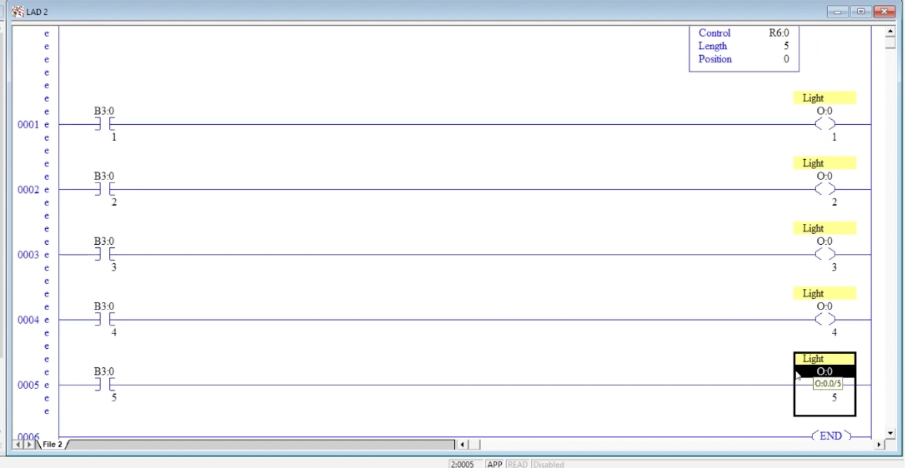
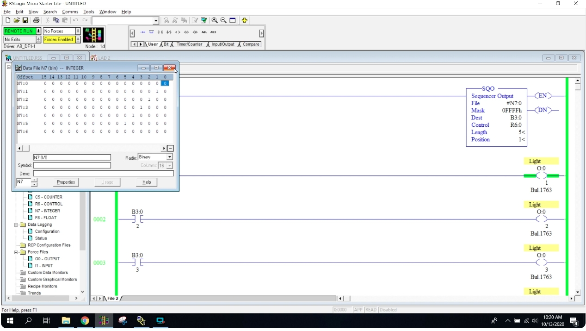

# Basic Sequencer Output (SQO) Instruction – Allen-Bradley PLC
# Allen-Bradley PLC 基本順序器輸出（SQO）指令（中英對照教程）

> Source / 來源: <https://www.youtube.com/watch?v=yc61HOcAVy0> — *Allen Bradley PLC - Basic Sequencer Instructions*
>
> Software in the video / 影片使用軟體: RSLogix Micro Starter Lite（MicroLogix 1100/1400 系列，輸出模組 Bul.1763）。

---

## 1. What Is a Sequencer? / 什麼是順序器？

**EN:** A **sequencer** is used when a program repeats the **same pattern of steps** over and over, with different outputs at each step. Typical examples: sequential tail lights, a car wash, or "every 5 seconds a different light turns on". It is especially handy when the steps are driven by the same time base.

**中文：** 當程式需要**重複相同的步驟流程**、而每一步開啟不同的輸出時，就適合使用**順序器（Sequencer）**。典型例子：流水式尾燈、洗車流程，或「每 5 秒換一盞燈亮」。步驟若由相同的時間基準驅動，用起來特別方便。

**EN – How it works:** the sequencer steps through a series of **words** stored in a data file. For each step it reads one word, applies a **mask**, and writes the result to a **destination** word. The bits that are ON in that word decide which destination bits (and therefore which outputs) are turned ON.

**中文 – 運作方式：** 順序器會逐步讀取資料檔案中的一系列**字組（word）**。每一步讀取一個字組，經過**遮罩（Mask）** 處理後，寫入**目的地（Destination）** 字組。該字組中為 ON 的位元，決定目的地的哪些位元（也就是哪些輸出）要被打開。

**EN:** The instruction is found in the **File/Shift/Sequencer** instruction tab. This video uses **SQO – Sequencer Output**.

**中文：** 此指令位於 **File/Shift/Sequencer** 指令頁籤。本集使用的是 **SQO（Sequencer Output，順序器輸出）**。

---

## 2. SQO Parameters / SQO 參數說明

| Parameter 參數 | Value in video 影片設定 | Meaning 說明 |
|---|---|---|
| **File 檔案** | `#N7:0` | **EN:** The data file holding the step patterns (source). **中文：** 存放各步驟位元圖樣的資料檔案（來源）。 |
| **Mask 遮罩** | `0FFFFh` | **EN:** Which bits of the word are passed on. `FFFF` (hex) = all 16 bits. Start with the digit **zero** `0`, not the letter O. **中文：** 決定字組的哪些位元會被傳送。`FFFF`（十六進位）＝全部 16 位元。開頭要輸入數字**零 0**，不是英文字母 O。 |
| **Dest 目的地** | `B3:0` | **EN:** Where the result is written (bits are turned on here). **中文：** 結果寫入的位置（在這裡打開位元）。 |
| **Control 控制** | `R6:0` | **EN:** Control element in the R6 file; it stores the sequencer's status (length, position, EN/DN). You rarely touch R6 directly. **中文：** R6 檔案中的控制元素，儲存順序器的狀態（長度、位置、EN/DN）。通常不需要直接操作 R6。 |
| **Length 長度** | `5` | **EN:** Number of steps. Five lights → 5 steps. **中文：** 步驟數。五盞燈 → 5 步。 |
| **Position 位置** | `0` (initial 初始) | **EN:** The current step the sequencer is on. **中文：** 順序器目前所在的步驟。 |

**EN:** The instruction also has two status outputs: **EN** (enabled) and **DN** (done).

**中文：** 指令另有兩個狀態輸出：**EN**（致能）與 **DN**（完成）。

*Figure 1 / 圖 1：第 0000 條梯級：`Step Button (I:0/4)` → SQO（File `#N7:0`、Mask `0FFFFh`、Dest `B3:0`、Control `R6:0`、Length 5、Position 0）。*

---

## 3. Building the Program / 建立程式

**EN:**
1. **Rung 0000:** a step button `I:0/4` followed by the **SQO** instruction with the parameters above. When you enter Length = 5, the file `N7` automatically opens up words `N7:0` to `N7:5`.
2. **Rungs 0001–0005:** five rungs, each with an examine-if-closed contact on one bit of `B3:0`, driving an output:

| Rung 梯級 | Contact 接點 | Output 輸出 |
|---|---|---|
| 0001 | `B3:0/1` | `O:0/1` (Light) |
| 0002 | `B3:0/2` | `O:0/2` (Light) |
| 0003 | `B3:0/3` | `O:0/3` (Light) |
| 0004 | `B3:0/4` | `O:0/4` (Light) |
| 0005 | `B3:0/5` | `O:0/5` (Light) |

**中文：**
1. **第 0000 條：** 步進按鈕 `I:0/4`，後接設定好參數的 **SQO** 指令。輸入 Length = 5 後，`N7` 檔案會自動展開 `N7:0` 到 `N7:5`。
2. **第 0001–0005 條：** 五條梯級，各自用 `B3:0` 的一個位元接點驅動一個輸出（見上表）。

*Figure 2 / 圖 2：五個 `B3:0/x` 接點分別驅動 `O:0/1`～`O:0/5`，最後是 END；SQO 的 Control `R6:0`、Length 5、Position 0。*

**EN – Step button:** `I:0/4` is just a **step button**. Each press advances the sequencer by one step. Holding the button does **not** run through all steps — you must press it once for every step.

**中文 – 步進按鈕：** `I:0/4` 只是**步進按鈕**。每按一次，順序器前進一步；按住不放**不會**連續跑完所有步驟，每一步都要再按一次。

---

## 4. Filling in the N7 Data File / 設定 N7 資料檔案

**EN:**
1. Open the **N7** data file and change the radix to **Binary**. Each row `N7:0`, `N7:1`, `N7:2`, … is one 16-bit word.
2. Each row is one **step**: bit 1 of `N7:1` is the pattern for step 1, and so on.
3. For this example, put a `1` in the bit that matches the light for each step:

| Step 步驟 | Word 字組 | Bit set 設為 1 的位元 | Result 結果 |
|---|---|---|---|
| 1 | `N7:1` | bit 1 | `B3:0/1` → Light 1 |
| 2 | `N7:2` | bit 2 | `B3:0/2` → Light 2 |
| 3 | `N7:3` | bit 3 | `B3:0/3` → Light 3 |
| 4 | `N7:4` | bit 4 | `B3:0/4` → Light 4 |
| 5 | `N7:5` | bit 5 | `B3:0/5` → Light 5 |

4. Press **Enter** after every change, otherwise the edit is not saved.

**中文：**
1. 開啟 **N7** 資料檔案，把進位制（Radix）改為 **Binary（二進位）**。每一列 `N7:0`、`N7:1`、`N7:2`… 都是一個 16 位元字組。
2. 每一列就是一個**步驟**：`N7:1` 的位元圖樣是第 1 步，依此類推。
3. 本例依各步驟的燈，把對應位元設為 `1`（見上表）。
4. 每次修改後都要按 **Enter**，否則不會儲存。

*Figure 3 / 圖 3：二進位檢視 `N7:1`～`N7:5`，各列只有一個位元為 1（向左逐步移一位）；`N7:0` 全為 0；Position 0。*

> **⚠ Important – Step 0 / 重要：第 0 步**
> **EN:** Bit pattern `N7:0` is the **"not started" position 0**. After power-up the sequencer begins at position 0, but once it reaches the last step it rolls back to **step 1, never to 0 again**. So **do not put anything in `N7:0`** unless you want it to work only one time.
> **中文：** `N7:0` 是**「尚未開始」的第 0 位置**。開機後順序器從位置 0 開始，但走完最後一步後會回到**第 1 步，不會再回到 0**。因此**不要在 `N7:0` 放任何資料**，除非你只想讓它動作一次。

---

## 5. Running the Program / 執行程式

**EN:** Download the program and go to RUN.
1. At the start the position is **0**. Press the step button once → position **1**, `B3:0/1` turns ON and Light 1 turns ON.
2. Press again → position **2**: `B3:0/2` turns ON and Light 1 turns **OFF**, because step 2's word has no bit 1 set.
3. Keep pressing through steps 3, 4 and 5.
4. At step 5, press once more → the sequencer returns to **step 1** (not 0) and Light 1 turns ON again.

**中文：** 下載程式並切換到 RUN。
1. 一開始位置為 **0**。按一下步進按鈕 → 位置 **1**，`B3:0/1` 變 ON，燈 1 亮。
2. 再按一次 → 位置 **2**：`B3:0/2` 變 ON，燈 1 **熄滅**，因為第 2 步的字組沒有設定 bit 1。
3. 繼續按，依序進入第 3、4、5 步。
4. 在第 5 步再按一次 → 順序器回到**第 1 步**（不是 0），燈 1 再度點亮。

*Figure 4 / 圖 4：RUN 狀態，SQO Position = 1，`O:0/1` 梯級呈綠色（導通）。*

*Figure 5 / 圖 5：第 0005 條 `B3:0/5` 與 `O:0/5` 導通（步驟 5）。*

---

## 6. Turning On Multiple Outputs per Step / 每一步開啟多個輸出

**EN:** A word has 16 bits, so a single step can turn on **several outputs at once**. In the video the pattern is changed so that the number of lights grows with each step:

| Step 步驟 | Bits set 設為 1 的位元 | Lights ON 亮燈數 |
|---|---|---|
| 1 | bit 1 | 1 |
| 2 | bits 1, 2 | 2 |
| 3 | bits 1, 2, 3 | 3 |
| 4 | bits 1–4 | 4 |
| 5 | bits 1–5 | 5 (all 全亮) |

Remember to press **Enter** after each edit.

**中文：** 一個字組有 16 個位元，所以單一步驟可以**同時開啟多個輸出**。影片中把圖樣改成每一步亮的燈逐步增加（見上表）。每次修改後記得按 **Enter**。

*Figure 6 / 圖 6：`N7:1`～`N7:5` 分別有 1、2、3、4、5 個位元為 1；Position = 1，`O:0/1` 導通。*

*Figure 7 / 圖 7：Position = 4，`B3:0/1`～`B3:0/4` 及 `O:0/1`～`O:0/4` 同時導通。*

---

## 7. Notes / 補充說明

> **EN:** The points below are general Allen-Bradley behavior, **not** stated in the video; confirm in your controller's instruction manual. / **中文：** 以下為 Allen-Bradley 的一般特性，**影片中未提及**，請以控制器手冊為準。
>
> - SQO normally advances one step on each **false-to-true transition** of the rung condition (that is why holding the button does not keep stepping). / SQO 通常在梯級條件**由 OFF 變 ON 的瞬間**前進一步（所以按住按鈕不會連續前進）。
> - Position 0 plus Length 5 means the data file needs words `N7:0`–`N7:5` (Length + 1 words). / 位置 0 加上長度 5，表示資料檔案需要 `N7:0`～`N7:5`（Length + 1 個字組）。
> - The video says a follow-up video will show a **time-based** sequencer and a **car wash** example. / 影片提到後續會有**以時間為基準**的順序器與**洗車**範例。

---

## 8. Summary / 總結

**EN:**
- A sequencer replays a series of bit patterns, one per step, to a destination.
- SQO parameters: **File** (patterns), **Mask** (which bits pass), **Dest** (where bits go), **Control** (R6 element), **Length** (steps), **Position** (current step).
- Put the pattern for step *n* in `N7:n`; **leave `N7:0` empty**.
- Each press of the step button moves to the next step; after the last step it returns to **step 1**.
- Several bits in one word turn on several outputs at the same time.

**中文：**
- 順序器依序重現一連串位元圖樣（每步一組），並寫入目的地。
- SQO 參數：**File**（圖樣來源）、**Mask**（哪些位元通過）、**Dest**（位元寫入處）、**Control**（R6 控制元素）、**Length**（步數）、**Position**（目前步驟）。
- 第 *n* 步的圖樣放在 `N7:n`；**`N7:0` 保持空白**。
- 每按一次步進按鈕前進一步；最後一步之後回到**第 1 步**。
- 同一字組中設定多個位元，可同時開啟多個輸出。
