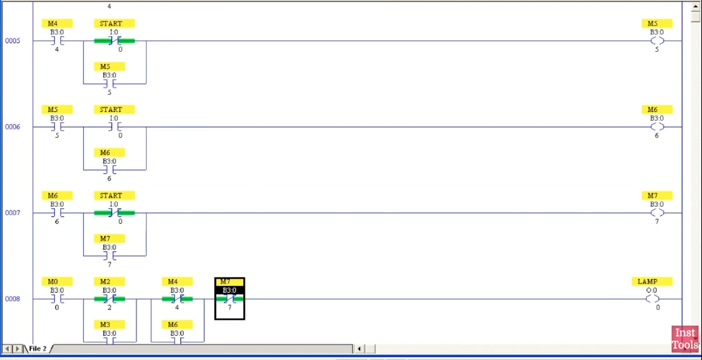
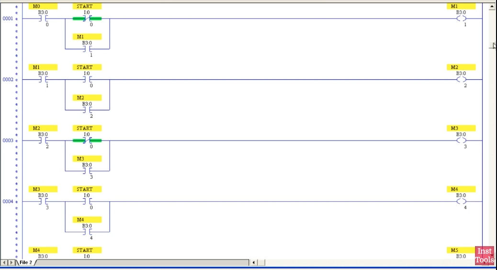
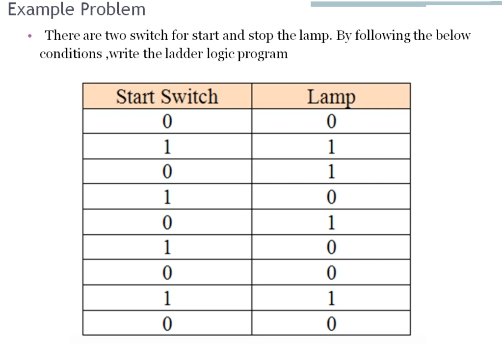
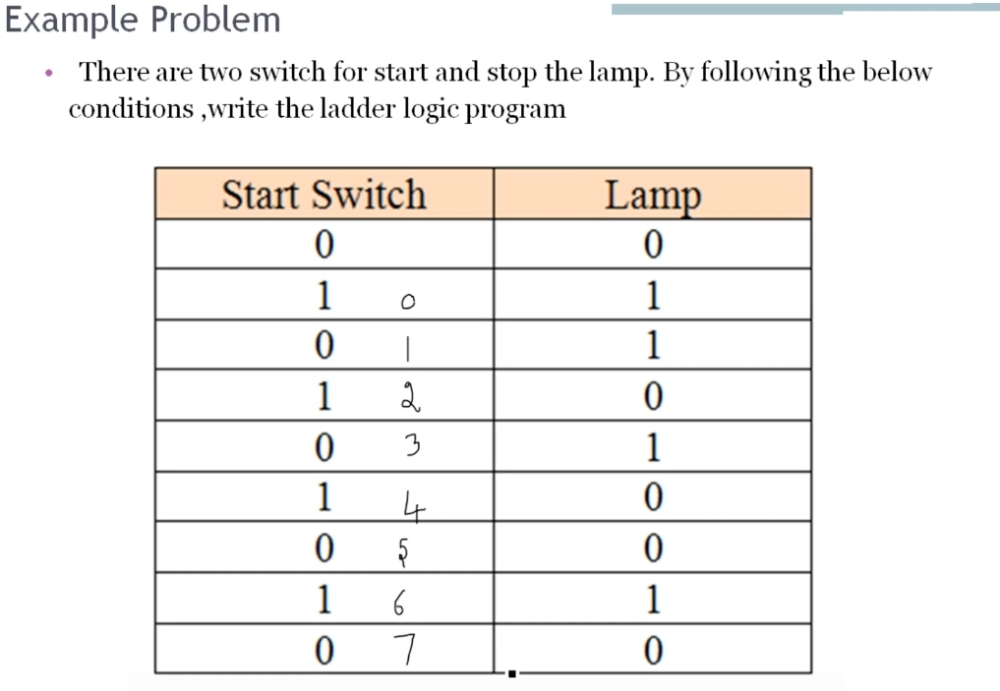
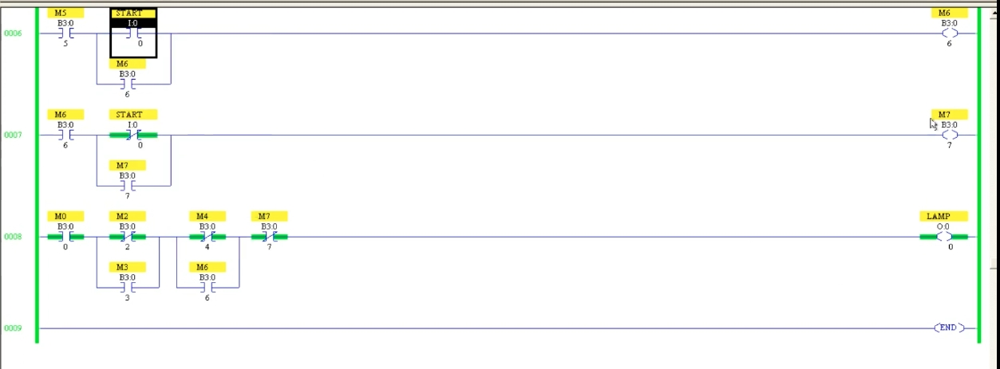
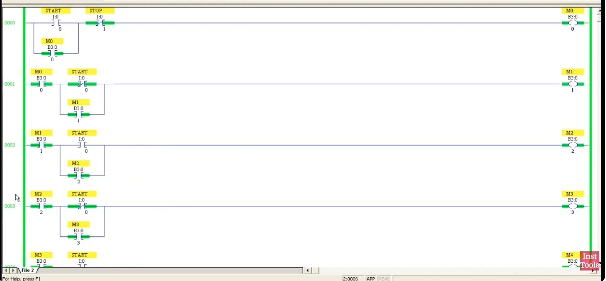

# PLC 教程 49:梯形圖範例 — 開關狀態序列與記憶(Memory)
# PLC Training 49: Ladder Logic Example – Switch Sequence with Memory Bits

> 來源 Source:<https://www.youtube.com/watch?v=KuMSF3H3OW0&list=PLI78ZBihrkE3nnGIj2WmHb_GoWjFlfFIu&index=49>
> 平台 Platform:Allen-Bradley(RSLogix 500 Pro / SLC 500 風格 Style)

---

## 目錄 Contents

1. [簡介 Introduction](#1-簡介--introduction)
2. [題目 The Problem](#2-題目--the-problem)
3. [解題思路:為什麼需要記憶 Approach: Why Memory Bits Are Needed](#3-解題思路為什麼需要記憶--approach-why-memory-bits-are-needed)
4. [位址分配 Address Assignment](#4-位址分配--address-assignment)
5. [第一部分:記憶 Rung(M0 到 M7) Part 1: Memory Rungs (M0 to M7)](#5-第一部分記憶-rungm0-到-m7--part-1-memory-rungs-m0-to-m7)
6. [第二部分:燈號輸出 Rung Part 2: The Lamp Output Rung](#6-第二部分燈號輸出-rung--part-2-the-lamp-output-rung)
7. [測試 Testing](#7-測試--testing)
8. [重點整理 Summary](#8-重點整理--summary)

---

## 1. 簡介 | Introduction

**中文**
本節是一個**綜合練習題**,用來加深對**記憶(Memory)概念**的理解。題目的輸入只有一個開關,但**同樣的輸入狀態會在不同順序時對應不同的輸出**,這種情況就必須用「記憶」把每一步的狀態儲存下來。

**English**
This lesson is a **worked example** that deepens your understanding of the **memory concept**. The program has a single input switch, but **the same input state must produce different outputs depending on its position in the sequence**; this calls for memory bits that store the state of each step.

---

## 2. 題目 | The Problem

**中文**
有**兩個開關**(Start 與 Stop)控制一盞燈。注意 **Start 是「開關(Switch)」,不是按鈕(Push Button)**,它會停留在開或關的位置。請依下表條件寫出梯形圖:

| 步驟 Step | Start 開關 Start Switch | 燈 Lamp |
|:---:|:---:|:---:|
| (初始 initial) | 0 | 0 |
| 0 | 1 | 1 |
| 1 | 0 | 1 |
| 2 | 1 | 0 |
| 3 | 0 | 1 |
| 4 | 1 | 0 |
| 5 | 0 | 0 |
| 6 | 1 | 1 |
| 7 | 0 | 0 |



*圖 1:題目原始表格。*
*Fig. 1: The original problem table.*



*圖 2:影片中手寫標上的步驟編號 0 到 7(從第二列開始)。*
*Fig. 2: Step numbers 0 to 7 written on the slide in the video (starting from the second row).*

**English**
**Two switches** (Start and Stop) control a lamp. Note that **Start is a "switch", not a push button**; it stays in the ON or OFF position. Write a ladder program that follows the table above (initial state: switch 0, lamp 0; then steps 0 to 7).

---

## 3. 解題思路:為什麼需要記憶 | Approach: Why Memory Bits Are Needed

**中文**
- 初始狀態(開關 0、燈 0)就是程式開始前的正常狀態,**不需要記憶**。
- 其後共有 **8 個步驟(0 到 7)**,所以需要 **8 個記憶位元:M0 到 M7**。
- **關鍵是「順序」**:表中有許多相同的輸入值,但並不是同一個狀態。例如第 1 步的「0」與第 3 步的「0」輸入相同,但它們是**不同的步驟**,燈的結果也可能不同。因為 Start 開關是依序切換(開 → 關 → 開 → 關 …),**每一次切換都要記錄下來**,才能在最後依據「目前走到第幾步」決定燈的狀態。
- 作法分兩部分:
  1. 前面 **8 個 Rung**:每個 Rung 儲存一個步驟的狀態(記憶線圈,並以**自保持**鎖住)。
  2. **最後一個 Rung**:把所有記憶組合起來,決定燈何時亮、何時滅。

**English**
- The initial state (switch 0, lamp 0) is just the normal state before the program starts, so **no memory is needed** for it.
- After that there are **8 steps (0 to 7)**, so we need **8 memory bits: M0 to M7**.
- **The key is the sequence.** The table has many identical input values, but they are not the same state. For example the "0" at step 1 and the "0" at step 3 look identical, yet they are **different steps** with possibly different lamp results. Because the Start switch is toggled in order (ON → OFF → ON → OFF …), **every toggle must be recorded** so that the final rung can decide the lamp state from "how far the sequence has progressed".
- The solution has two parts:
  1. **Eight rungs** at the front: each stores the state of one step (a memory coil **latched with a seal-in contact**).
  2. **One last rung**: it combines all the memory bits to decide when the lamp turns ON and OFF.

---

## 4. 位址分配 | Address Assignment

**中文**

| 名稱 Name | 位址 Address | 類型 Type |
|------|------|------|
| `START` | `I:0/0` | 開關 Switch |
| `STOP` | `I:0/1` | 常閉 Normally closed |
| `LAMP` | `O:0/0` | 輸出 Output |
| `M0` 到 `M7` | `B3:0/0` 到 `B3:0/7` | 記憶位元 Memory bits |

**English**
(See the table above.)

---

## 5. 第一部分:記憶 Rung(M0 到 M7) | Part 1: Memory Rungs (M0 to M7)

### 5.1 每個步驟的條件 | Condition for Each Step

**中文**
每一個記憶位元的條件都是:**「前一個記憶已成立」 + 「開關進入這一步應有的狀態」**,並且用**自己的接點並聯**來保持(自保持)。

| 步驟 Step | 記憶 Memory | Rung | 開關狀態 Switch state | 條件 Condition |
|:---:|:---:|:---:|:---:|------|
| 0 | M0 | 0 | 1 | `START`(常開)+ `STOP`(常閉),M0 自保持 |
| 1 | M1 | 1 | 0 | `M0` + `START`(**常閉**),M1 自保持 |
| 2 | M2 | 2 | 1 | `M1` + `START`(**常開**),M2 自保持 |
| 3 | M3 | 3 | 0 | `M2` + `START`(常閉),M3 自保持 |
| 4 | M4 | 4 | 1 | `M3` + `START`(常開),M4 自保持 |
| 5 | M5 | 5 | 0 | `M4` + `START`(常閉),M5 自保持 |
| 6 | M6 | 6 | 1 | `M5` + `START`(常開),M6 自保持 |
| 7 | M7 | 7 | 0 | `M6` + `START`(常閉),M7 自保持 |

規律:**開關為 1 的步驟(0、2、4、6)使用常開接點;開關為 0 的步驟(1、3、5、7)使用常閉接點。** 影片的做法是先做好 Rung 1 與 Rung 2,之後就**複製貼上**,只需要換記憶位址。

**English**
Each memory bit's condition is: **"the previous memory is set" + "the switch is in the state required for this step"**, held with a **parallel contact of its own** (seal-in).

(See the table above.)

Pattern: **steps where the switch is 1 (0, 2, 4, 6) use a normally open contact; steps where the switch is 0 (1, 3, 5, 7) use a normally closed contact.** In the video, Rungs 1 and 2 are built first and the rest are **copied and pasted**, changing only the memory addresses.

### 5.2 第一個 Rung:M0 與 STOP | Rung 0: M0 and STOP

**中文**
- `START`(`I:0/0`,常開)並聯 `M0`(`B3:0/0`,自保持),再串聯 `STOP`(`I:0/1`,**常閉**),輸出 **M0**。
- **為什麼要自保持?** 必須讓 M0 在 Start 開關之後切回 0 時仍然保持,才能記住「第一次打開」這件事(複習前面的記憶單元)。
- **`STOP` 只放在這個 Rung**:按下 Stop,M0 失去保持 → 後面每個記憶都因為依賴前一個記憶而**連鎖失效**,所以**一次按 Stop,全部記憶都會歸零**。



*圖 3:Rung 0:`START` 並聯 `M0`,串聯 `STOP`(常閉)→ `M0`。Rung 1:`M0` + `START`(常閉)並聯 `M1` → `M1`。Rung 2:`M1` + `START`(常開)並聯 `M2` → `M2`。Rung 3:`M2` + `START`(常閉)並聯 `M3` → `M3`。此時 M0 到 M3 都已導通(綠色),代表已走到第 3 步。*
*Fig. 3: Rung 0: `START` in parallel with `M0`, in series with `STOP` (NC) → `M0`. Rung 1: `M0` + `START` (NC) in parallel with `M1` → `M1`. Rung 2: `M1` + `START` (NO) in parallel with `M2` → `M2`. Rung 3: `M2` + `START` (NC) in parallel with `M3` → `M3`. M0 to M3 are all ON (green), meaning the sequence has reached step 3.*

**English**
- `START` (`I:0/0`, NO) in parallel with `M0` (`B3:0/0`, seal-in), in series with `STOP` (`I:0/1`, **NC**), output **M0**.
- **Why seal-in?** M0 must stay ON after the Start switch returns to 0, so that it "remembers" the first time the switch was turned ON (recall the earlier memory lessons).
- **`STOP` appears only in this rung.** Pressing Stop drops M0's hold, and every later memory depends on the previous one, so they **drop out in a chain**: one press of Stop resets all the memory bits.

### 5.3 Rung 1 到 7 | Rungs 1 to 7

**中文**
每個 Rung 的結構相同:**`前一個記憶`(常開)串聯【`START`(常閉或常開)並聯 `自己的記憶`】→ 本步記憶線圈**。



*圖 4:Rung 1(M1)到 Rung 4(M4)。奇數編號的記憶(M1、M3)使用 `START` 常閉接點(圖中綠色表示開關在 0,常閉接點導通);偶數編號的記憶(M2、M4)使用常開接點。因為 M0 尚未成立,所有記憶線圈都熄滅。*
*Fig. 4: Rung 1 (M1) to Rung 4 (M4). Odd-numbered memories (M1, M3) use the `START` NC contact (green = switch at 0, so the NC contact conducts); even-numbered ones (M2, M4) use the NO contact. Since M0 is not set yet, all memory coils are OFF.*



*圖 5:Rung 5(M5)、Rung 6(M6)、Rung 7(M7)和 Rung 8(LAMP)。`START` 常閉接點為綠色(開關在 0);Rung 8 因為 `M0` 尚未成立,燈不導通。*
*Fig. 5: Rung 5 (M5), Rung 6 (M6), Rung 7 (M7) and Rung 8 (LAMP). The `START` NC contacts are green (switch at 0); in Rung 8 the lamp is not conducting because `M0` is not set.*

**English**
Every rung has the same structure: **`previous memory` (NO) in series with [`START` (NC or NO) in parallel with `its own memory`] → this step's memory coil.**

---

## 6. 第二部分:燈號輸出 Rung | Part 2: The Lamp Output Rung

**中文**
最後一個 Rung 把所有記憶組合起來。思考方式:**依序看燈「什麼時候亮」、「什麼時候滅」**:

| 步驟 Step | 燈 Lamp | 需要的接點 Contact needed | 說明 Explanation |
|:---:|:---:|------|------|
| 0、1 | 亮 ON | `M0`(常開) | 第 0 步燈首次亮起;第 1 步仍亮,**不需要接 M1** |
| 2 | 滅 OFF | `M2`(**常閉**,串聯) | 到第 2 步時燈熄滅 |
| 3 | 亮 ON | `M3`(常開,**並聯**於 M2 常閉) | 又要亮,所以在「斷開處」並聯 M3 |
| 4、5 | 滅 OFF | `M4`(**常閉**,串聯) | 第 4 步熄滅,第 5 步維持熄滅,**不需要接 M5** |
| 6 | 亮 ON | `M6`(常開,**並聯**於 M4 常閉) | 又要亮,並聯 M6 |
| 7 | 滅 OFF | `M7`(**常閉**,串聯) | 最後熄滅 |

因此最後的 Rung 為:

```
M0 ──┬── M2(NC) ──┬── M4(NC) ──┬── M7(NC) ───( LAMP )
     └── M3(NO) ──┘  └── M6(NO) ──┘
```

換成邏輯式(補充整理,非影片內容):

```
LAMP = M0 AND (NOT M2 OR M3) AND (NOT M4 OR M6) AND NOT M7
```



*圖 6:Rung 8:`M0` → [`M2`(常閉)並聯 `M3`(常開)] → [`M4`(常閉)並聯 `M6`(常開)] → `M7`(常閉)→ `LAMP`(`O:0/0`)。此時 M0 成立,M2、M4、M7 未成立,燈導通(綠色)。Rung 9 為 END。*
*Fig. 6: Rung 8: `M0` → [`M2` (NC) in parallel with `M3` (NO)] → [`M4` (NC) in parallel with `M6` (NO)] → `M7` (NC) → `LAMP` (`O:0/0`). Here M0 is set while M2, M4 and M7 are not, so the lamp is ON (green). Rung 9 is END.*

**English**
The last rung combines all the memory bits. The thinking process is to go through **when the lamp turns ON and when it turns OFF**: see the table above.

So the final rung is the diagram above. As a Boolean equation (supplementary, not from the video): see the equation above.

---

## 7. 測試 | Testing

**中文**
儲存、下載並進入 Run 模式,依序切換 Start 開關,燈的結果應與題目表格相同:

| 動作 Action | 開關 Switch | 步驟 Step | 已成立的記憶 Memories set | 燈 Lamp |
|------|:---:|:---:|------|:---:|
| 打開 | 1 | 0 | M0 | **亮 ON** |
| 關閉 | 0 | 1 | M0、M1 | **亮 ON**(保持) |
| 打開 | 1 | 2 | M0 到 M2 | **滅 OFF** |
| 關閉 | 0 | 3 | M0 到 M3 | **亮 ON** |
| 打開 | 1 | 4 | M0 到 M4 | **滅 OFF** |
| 關閉 | 0 | 5 | M0 到 M5 | **滅 OFF**(保持) |
| 打開 | 1 | 6 | M0 到 M6 | **亮 ON** |
| 關閉 | 0 | 7 | M0 到 M7 | **滅 OFF** |

- 每切換一次,下一個記憶會被導通,可在畫面上看到記憶一個接一個變成導通。
- **隨時按下 `STOP`,所有記憶與燈都會歸零**,之後從頭開始。
- 影片中以「指標」逐步對照:到第 3 步燈亮、第 4 步燈滅、第 5 步維持熄滅、第 6 步燈亮、第 7 步燈滅。

**English**
Save, download and go to Run mode. Toggle the Start switch in order; the lamp should match the problem table: see the table above.

- Each toggle turns ON the next memory bit; you can watch the memories turn ON one after another.
- **Pressing `STOP` at any time resets all memory bits and the lamp**, and you start again from the beginning.
- In the video the presenter follows along with a pointer: lamp ON at step 3, OFF at step 4, still OFF at step 5, ON at step 6, OFF at step 7.

---

## 8. 重點整理 | Summary

**中文**
1. 當**同一個輸入在不同順序有不同的輸出**時,就需要用**記憶(Memory)** 記住每一步。
2. 初始狀態不需記憶;**8 個步驟 → M0 到 M7**。
3. 每個記憶 Rung:`前一個記憶` + `START`(0 步用常閉、1 步用常開)+ **自保持**。
4. **自保持是關鍵**,沒有它記憶無法在開關切換後保持。
5. **`STOP` 只需放在第一個 Rung**;因為後面的記憶都依賴前一個記憶,按 Stop 就會**連鎖全部歸零**。
6. 最後一個 Rung 以記憶接點組合出燈的亮與滅:亮的時候用常開(並聯),滅的時候用常閉(串聯)。
7. 這個程式看起來很大,但其實只是**重複同樣的 Rung**,可以用複製貼上完成,再修改位址。
8. 建議在軟體中自行練習,有疑問可在影片下留言。

**English**
1. When **the same input leads to different outputs at different points in a sequence**, use **memory bits** to remember each step.
2. The initial state needs no memory; **8 steps → M0 to M7**.
3. Each memory rung: `previous memory` + `START` (NC for switch-0 steps, NO for switch-1 steps) + **seal-in**.
4. **The seal-in is essential**; without it a memory bit cannot hold after the switch toggles.
5. **`STOP` is needed only in the first rung**; since every later memory depends on the previous one, pressing Stop **resets them all in a chain**.
6. The final rung combines the memory contacts to produce the lamp ON and OFF conditions: NO contacts in parallel to turn ON, NC contacts in series to turn OFF.
7. The program looks big but is just **the same rung repeated**; copy and paste, then change the addresses.
8. Practice in the software; leave a comment on the video if you have questions.

---

## 附:檔案結構 | Appendix: File Layout

```
PLC_49_Example_Switch_Sequence_Memory.md
images/
├── ab49_01.jpg   # Rungs 0-3 online (M0 to M3 set)
├── ab49_02.jpg   # Problem table with step numbers 0-7
├── ab49_03.jpg   # Problem table (original)
├── ab49_04.jpg   # Rungs 1-4 (initial state)
├── ab49_05.jpg   # Rungs 5-8 (M5, M6, M7, lamp rung)
└── ab49_06.jpg   # Lamp rung (Rung 8) with END
```
