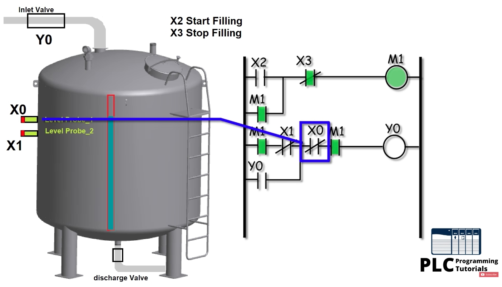
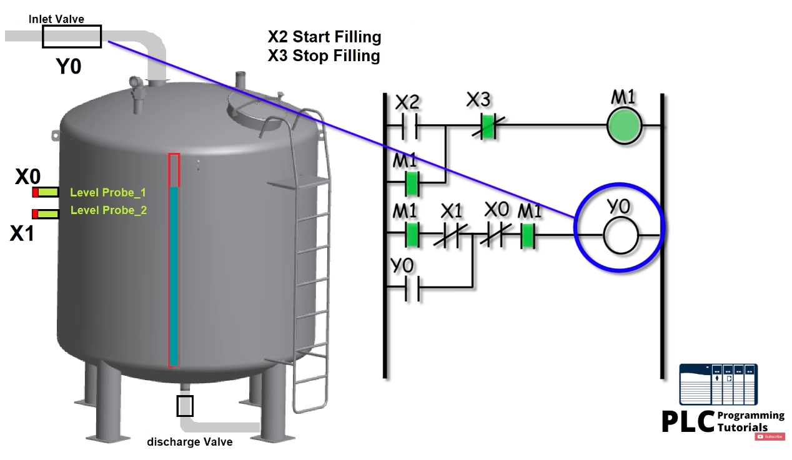
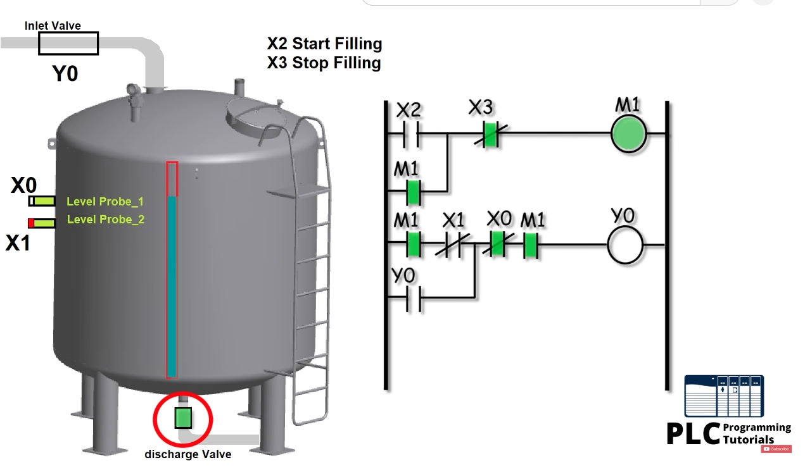
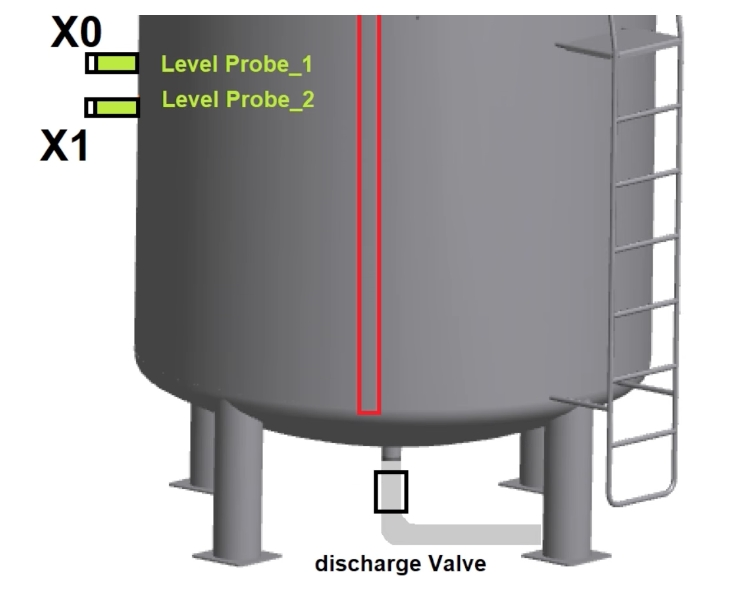
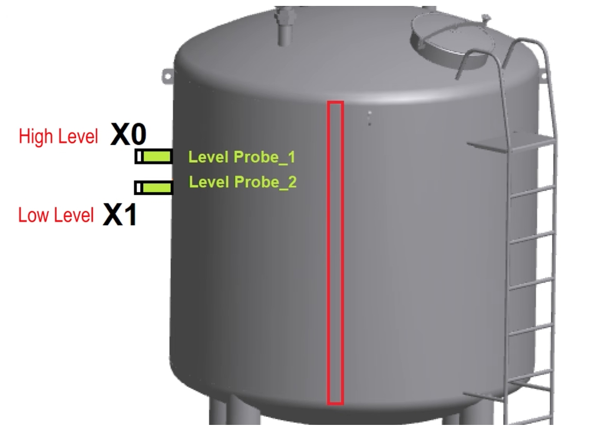
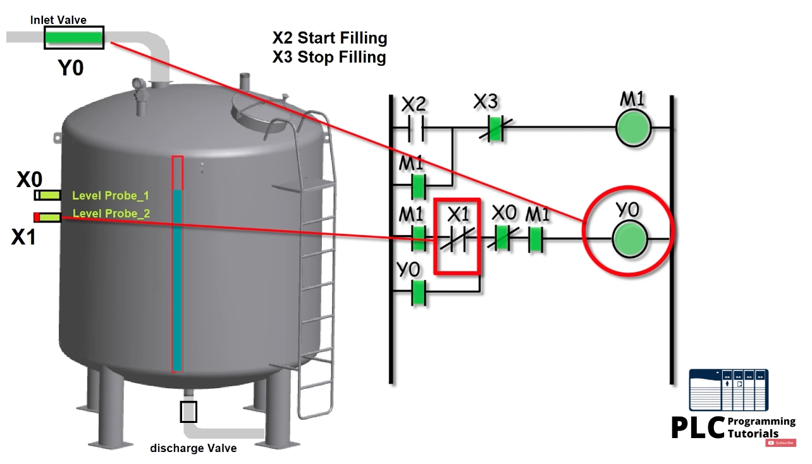
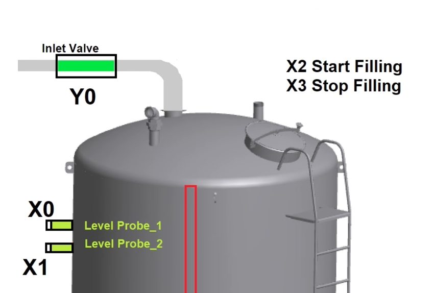
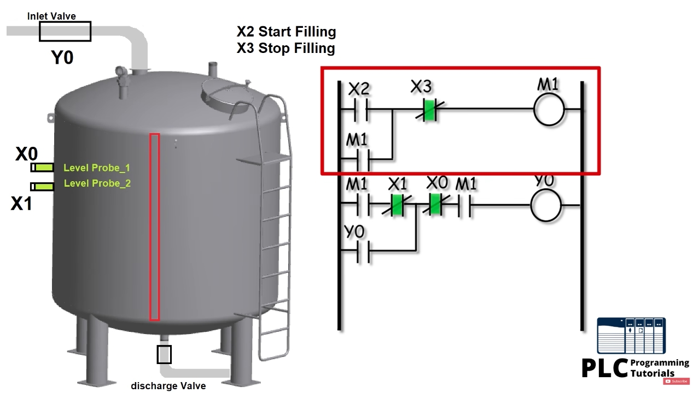

# Tank Level Control with PLC Ladder Logic (Level Probes)
# 以 PLC 梯形圖控制水箱液位（液位探針）（中英對照教程）

> Source / 來源: <https://www.youtube.com/watch?v=qQoHQ0b-d1U> — *Tank Level Control with PLC ladder Logic || Animated || PLC Programming tutorials for beginners*
>
> Note / 備註: The video uses generic I/O names (X inputs, Y outputs, M memory bit), i.e. Mitsubishi-style addressing. The logic applies to any PLC brand. / 影片使用 X（輸入）、Y（輸出）、M（內部繼電器）位址，屬三菱風格表示法；邏輯適用於任何品牌 PLC。

---

## 1. Goal / 控制目標

**EN:** Keep the water level of a tank **between a low level and a high level** automatically. When the cycle is started, the PLC fills the tank until the high level is reached, stops the inlet valve, and starts filling again when the water has dropped below the low level. This repeats until the operator presses Stop.

**中文：** 讓水箱水位自動維持在**低液位與高液位之間**。啟動後，PLC 持續進水直到高液位，關閉進水閥；當水位降到低液位以下時，再次開始進水。此循環會一直重複，直到操作員按下停止鈕。

---

## 2. System Description / 系統說明

### 2.1 Level probe / 液位探針

**EN:** A level probe is a sensor that detects the presence of water (or another liquid). It has two **oscillating forks** as the sensing element. In air the forks oscillate at their natural frequency; when they touch liquid, the **oscillating frequency drops**, so the probe detects the liquid and gives a **24 V DC output signal** to the PLC input.

**中文：** 液位探針是偵測水（或其他液體）是否存在的感測器，感測元件為兩支**振動音叉**。在空氣中音叉以自然頻率振動；碰到液體時**振動頻率下降**，探針因此判斷液體存在，並輸出 **24 V DC** 訊號給 PLC 輸入。



*Figure 1 / 圖 1：水箱側面的兩支液位探針——上方 **X0 = High Level（高液位）**，下方 **X1 = Low Level（低液位）**。*

### 2.2 Valves and buttons / 閥門與按鈕



*Figure 2 / 圖 2：進水閥接在水箱頂部，由 PLC 輸出 **Y0** 控制；**X2** 為啟動填充，**X3** 為停止填充。*



*Figure 3 / 圖 3：排水閥在水箱底部，開啟後水箱開始排水（影片中為手動開啟，不是由 PLC 控制）。*

### 2.3 I/O list / I/O 點位表

| Address 位址 | Device 裝置 | Description 說明 |
|---|---|---|
| **X0** | Level probe 1 液位探針 1 | **High level** 高液位（碰到水 = ON） |
| **X1** | Level probe 2 液位探針 2 | **Low level** 低液位（碰到水 = ON） |
| **X2** | Push button 按鈕 | **Start** filling cycle 啟動填充循環 |
| **X3** | Push button 按鈕 | **Stop** filling cycle 停止填充循環 |
| **Y0** | Inlet valve 進水閥 | Output, opens to fill the tank 輸出，開啟即進水 |
| **M1** | Memory bit 內部繼電器 | "Cycle running" hold-on memory 「循環運轉中」自保持記憶 |
| — | Discharge valve 排水閥 | Opened manually 手動開啟 |

---

## 3. Ladder Logic / 梯形圖邏輯



*Figure 4 / 圖 4：紅框為第一條梯級——X2 啟動、X3 停止、M1 自保持；下方為第二條梯級（控制 Y0）。*

### Rung 1 – Start / stop with hold-on / 第 1 條梯級：啟動／停止自保持

```
 |--[ X2 ]--+--[/ X3 ]------------( M1 )--|
 |          |
 |--[ M1 ]--+
```

**EN:** Pressing **X2** turns on memory bit **M1**; the **M1** contact in parallel holds it on (**hold-on / seal-in** circuit). Pressing **X3** momentarily breaks the circuit (normally-closed contact) and turns M1 off.

**中文：** 按下 **X2** 使內部繼電器 **M1** 動作；並聯的 **M1** 接點將其**自保持**。短暫按下 **X3**（常閉接點）會切斷迴路，M1 隨之釋放。

### Rung 2 – Inlet valve control / 第 2 條梯級：進水閥控制

```
 |--[ M1 ]--[/ X1 ]--+--[/ X0 ]--[ M1 ]--( Y0 )--|
 |                   |
 |--[ Y0 ]-----------+
```

**EN:**
- **M1** – the cycle must be running.
- **X1 (normally closed)** – opens when the water reaches the **low** probe.
- **Y0 (parallel contact)** – holds the valve on. It **bypasses X1**, so once Y0 is on, the water touching the low probe does *not* stop the filling.
- **X0 (normally closed)** – opens when the water reaches the **high** probe, which **breaks the hold-on and turns Y0 off**.

**中文：**
- **M1**：循環必須處於運轉狀態。
- **X1（常閉）**：水位碰到**低液位**探針時打開。
- **Y0（並聯接點）**：自保持進水閥。它**繞過 X1**，所以 Y0 一旦動作，水位碰到低液位探針**不會**中斷進水。
- **X0（常閉）**：水位碰到**高液位**探針時打開，**切斷自保持並關閉 Y0**。

---

## 4. Operation Step by Step / 動作流程

### Step 1 – Start the cycle / 步驟 1：啟動循環

**EN:** The tank is empty, so neither probe senses water and the **X1 / X0 normally-closed contacts are closed**. Press **X2** → **M1 turns on and holds** → the path M1 → X1 → X0 → M1 is complete → **Y0 turns on**, the inlet valve opens and the tank starts filling.

**中文：** 水箱是空的，兩支探針都沒碰到水，**X1／X0 常閉接點為閉合**。按下 **X2** → **M1 動作並自保持** → M1 → X1 → X0 → M1 的路徑導通 → **Y0 動作**，進水閥打開，水箱開始進水。

### Step 2 – Water reaches the low probe (X1) / 步驟 2：水位到達低液位探針（X1）

**EN:** The most important step of the video. When the water touches the **low-level probe X1**, the X1 probe turns ON and its normally-closed contact in the ladder **opens**. But **Y0 stays ON** because the Y0 contact in parallel bypasses X1. The tank keeps filling.

**中文：** 這是影片的關鍵步驟。水位碰到**低液位探針 X1** 時，X1 探針變為 ON，梯形圖中的常閉接點 X1 **打開**。但 **Y0 仍保持 ON**，因為並聯的 Y0 接點繞過了 X1，水箱繼續進水。



*Figure 5 / 圖 5：X1 探針（紅色）已碰水，X1 常閉接點打開，但 Y0 經自保持接點持續導通，進水閥（綠色）開啟。*

### Step 3 – Water reaches the high probe (X0) / 步驟 3：水位到達高液位探針（X0）

**EN:** When the water touches the **high-level probe X0**, its normally-closed contact **opens**, the Y0 hold-on is broken and **Y0 turns OFF** — the inlet valve closes and filling stops. M1 is still ON.

**中文：** 水位碰到**高液位探針 X0** 時，常閉接點 X0 **打開**，Y0 的自保持被切斷，**Y0 關閉**——進水閥關閉，停止進水。此時 M1 仍為 ON。



*Figure 6 / 圖 6：藍框標示 X0 常閉接點——高液位探針碰水後打開，Y0 失電。*



*Figure 7 / 圖 7：X0、X1 兩支探針皆碰水，M1 仍為 ON，Y0 為 OFF（進水閥關閉）。*

### Step 4 – Draining / 步驟 4：排水

**EN:** Open the **discharge valve**. The water level falls. When it drops below the high probe **X0**, the X0 contact **closes again**, but **Y0 stays OFF** because the hold-on branch is no longer energized and X1 is still open (its probe is still covered). Draining continues.

**中文：** 打開**排水閥**，水位下降。當水位降到高液位探針 **X0** 以下，X0 接點**重新閉合**，但 **Y0 仍保持 OFF**：自保持支路已不通電，且 X1 仍為打開（其探針仍碰水）。排水持續。



*Figure 8 / 圖 8：排水閥（綠色）開啟；X0 已離水、X1 仍碰水，Y0 保持 OFF。*

### Step 5 – Water falls below the low probe (X1) / 步驟 5：水位降到低液位探針（X1）以下

**EN:** When the level drops below **X1**, the X1 normally-closed contact **closes**. With M1 still ON and X0 closed, **Y0 turns ON again** and the tank refills. The **cycle repeats indefinitely**.

**中文：** 水位降到 **X1** 以下，X1 常閉接點**閉合**。M1 仍為 ON 且 X0 閉合，**Y0 再度動作**，水箱重新進水。**循環會不斷重複**。

### Step 6 – Stop / 步驟 6：停止

**EN:** Press **X3** at any time → M1 drops out → Y0 turns off and the inlet valve closes.

**中文：** 任何時候按下 **X3** → M1 釋放 → Y0 關閉，進水閥關閉。

---

## 5. State Summary / 狀態對照表

| State 狀態 | X1 (low 低) | X0 (high 高) | M1 | Y0 (inlet 進水閥) |
|---|---|---|---|---|
| Idle, not started 未啟動 | any | any | OFF | OFF |
| Empty, cycle started 空箱，已啟動 | OFF | OFF | ON | **ON** |
| Filling, reached low probe 進水中，到達低液位 | ON | OFF | ON | **ON**（held by Y0 由 Y0 自保持） |
| Reached high level 到達高液位 | ON | ON | ON | **OFF** |
| Draining, below high probe 排水中，低於高液位 | ON | OFF | ON | **OFF** |
| Below low probe 低於低液位 | OFF | OFF | ON | **ON**（refill 重新進水） |
| Stop pressed 按下停止 | any | any | OFF | OFF |

---

## 6. Summary / 總結

**EN:**
- Two level probes (X0 high, X1 low) give 24 V signals to the PLC.
- Rung 1 is a start/stop **hold-on** circuit for M1 (cycle enable).
- Rung 2 controls inlet valve Y0 with a **Y0 hold-on that bypasses X1**, so filling continues past the low probe and stops only at the high probe.
- Filling restarts automatically when the level falls below the low probe; the cycle repeats until X3 (Stop) is pressed.

**中文：**
- 兩支液位探針（X0 高、X1 低）將 24 V 訊號送入 PLC。
- 第 1 條梯級是 M1（循環致能）的啟動／停止**自保持**電路。
- 第 2 條梯級以 **Y0 自保持繞過 X1** 來控制進水閥 Y0，因此進水會越過低液位、僅在高液位停止。
- 水位降到低液位以下時自動重新進水；循環持續到按下 X3（停止）為止。
