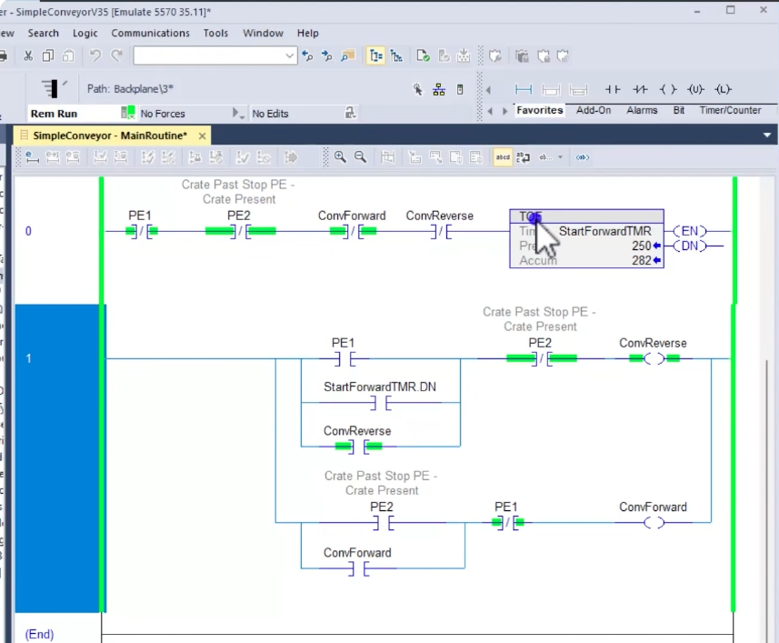
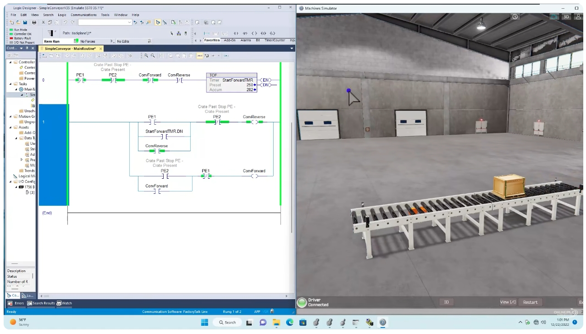
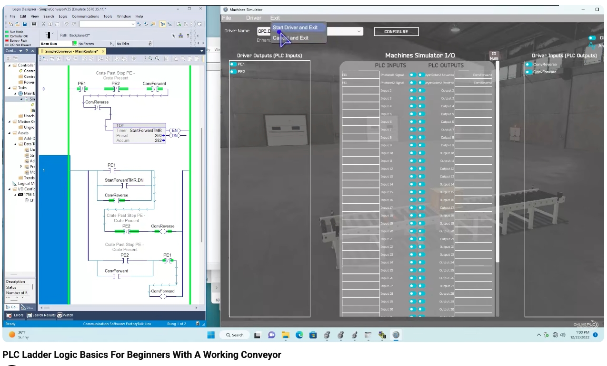

# PLC Ladder Logic Basics for Beginners – A Working Conveyor
# PLC 梯形圖入門：往返輸送帶實作（中英對照教程）

> Source / 來源: <https://www.youtube.com/watch?v=GhgFdLDdUIY> — *PLC Ladder Logic Basics For Beginners With A Working Conveyor*
>
> Software in the video / 影片使用軟體: Rockwell **Studio 5000 Logix Designer**（Emulate 5570 模擬控制器，通訊透過 FactoryTalk Linx）＋ OnlinePLC **Machines Simulator**（3D 輸送帶模型，透過 OPC 驅動連接）。

---

## 1. Overview / 概述

**EN:** This is a very simple beginner example: a **conveyor that moves a crate back and forth** between two photoeyes (**PE1** and **PE2**). The program has only **two rungs** (rung 0 and rung 1) and uses basic instructions:

- **XIC** – Examine If Closed (normally-open contact)
- **XIO** – Examine If Open (normally-closed contact)
- **OTE** – Output Energize (coil)
- **TOF** – Timer Off-Delay

The goal is to give you a clear picture of how real machine logic works, and a 3D working model shows the result live.

**中文：** 這是一個非常簡單的入門範例：**輸送帶讓箱子在兩個光電感測器（PE1 與 PE2）之間來回移動**。程式只有**兩條梯級**（rung 0、rung 1），使用的基本指令為：

- **XIC** – 檢查為閉合（常開接點）
- **XIO** – 檢查為開啟（常閉接點）
- **OTE** – 輸出激磁（線圈）
- **TOF** – 斷電延遲計時器

目的是讓你清楚理解實際機台邏輯如何運作，並用 3D 模型即時展示結果。

---

## 2. Tags / 標籤（變數）

**EN:** Studio 5000 is a **tag-based** system: you can name tags anything you like. The author chose these names so that they match the OPC tags of the 3D simulator.

**中文：** Studio 5000 是**以標籤（Tag）為基礎**的系統，標籤名稱可自行命名。作者刻意採用這些名稱，是為了與 3D 模擬器的 OPC 標籤對應。

| Tag 標籤 | Type 類型 | Description 說明 |
|---|---|---|
| **PE1** | Input 輸入 | Photoeye 1 – crate detected at end 1 光電感測器 1，箱子到達第 1 端 |
| **PE2** | Input 輸入 | Photoeye 2 – crate detected at end 2 光電感測器 2，箱子到達第 2 端 |
| **ConvForward** | Output 輸出 | Conveyor forward 輸送帶正轉 |
| **ConvReverse** | Output 輸出 | Conveyor reverse 輸送帶反轉 |
| **StartForwardTMR** | TOF timer 計時器 | Preset 250 (ms) = **0.25 s**；使用其 `.DN`（Done）位元作為啟動條件 |

---

## 3. Simulator and Driver Setup / 模擬器與驅動程式設定

**EN:** To see the program drive a 3D conveyor:
1. Open the Machines Simulator, load the **driver** and go to **Configure driver**.
2. Add the photoeye and conveyor signals so that the PLC and the simulator exchange data.
3. Choose **Start Driver and Exit**. Once the driver is running, the logic starts to control the conveyor.

**中文：** 要讓程式驅動 3D 輸送帶：
1. 開啟 Machines Simulator，載入**驅動程式（driver）**，進入 **Configure driver（設定驅動）**。
2. 加入光電感測器與輸送帶訊號，讓 PLC 與模擬器互相交換資料。
3. 選擇 **Start Driver and Exit**。驅動啟動後，邏輯就會開始控制輸送帶。



*Figure 1 / 圖 1：左側為 Logix Designer 程式；右側 Machines Simulator 的 I/O 對應——Driver Outputs（PLC 輸入）：PE1、PE2；Driver Inputs（PLC 輸出）：ConvReverse、ConvForward。選單中可見 "Start Driver and Exit"。*

---

## 4. The Ladder Logic / 梯形圖邏輯



*Figure 2 / 圖 2：MainRoutine 的兩條梯級——rung 0 為 TOF 計時器，rung 1 為 ConvReverse／ConvForward 的自保持控制。*

### Rung 0 – Start-up timer (TOF) / 第 0 條梯級：啟動計時器（TOF）

```
 |--[/ PE1 ]--[/ PE2 ]--[/ ConvForward ]--[/ ConvReverse ]--[ TOF StartForwardTMR  Preset 250 ]--|
```

**EN:** All four conditions are **XIO** contacts, so the timer rung is **true only when nothing is happening**: no photoeye is blocked and the conveyor is not running in either direction.

How a **TOF (off-delay)** timer behaves:
- As soon as the rung is true, the timer is **enabled**, the accumulator is **zeroed** and the **done bit (.DN) turns ON**.
- When the rung goes false, the accumulator starts counting; the **.DN bit stays ON until the timer has timed out** (here 250 ms = a quarter of a second), then drops out.

So `StartForwardTMR.DN` is ON while the system is idle, and remains ON for 0.25 s after the conveyor starts moving.

**中文：** 四個條件全為 **XIO** 接點，所以計時器梯級**只有在「什麼都沒動」時才成立**：沒有任何光電感測器被遮擋，輸送帶也沒有往任一方向運轉。

**TOF（斷電延遲）** 計時器的行為：
- 梯級一成立，計時器即**致能**，累計值**歸零**，**完成位元（.DN）變 ON**。
- 梯級變為不成立時，累計值開始計時；**.DN 會維持 ON 直到計時結束**（此例 250 ms＝四分之一秒）才掉落。

因此 `StartForwardTMR.DN` 在系統閒置時為 ON，輸送帶開始動作後仍會再維持 0.25 秒。

### Rung 1 – Conveyor control with seal-in / 第 1 條梯級：輸送帶控制（自保持）

```
        +--[ PE1 ]----------------+
        |                         |
 |------+--[ StartForwardTMR.DN ]-+--[/ PE2 ]--------( ConvReverse )--+
 |      |                         |                                   |
        +--[ ConvReverse ]--------+                                   |
 |                                                                    |
 |------+--[ PE2 ]---------------+--[/ PE1 ]--------( ConvForward )---+
        |                       |
        +--[ ConvForward ]------+
```

**EN:**
- **ConvReverse** turns on when **PE1 is made** (or at start-up via `StartForwardTMR.DN`), and **PE2 is not made**. The `ConvReverse` contact in parallel **seals it in**, and it **drops out when PE2 is made**.
- **ConvForward** turns on when **PE2 is made and PE1 is not made**. The `ConvForward` contact in parallel **seals it in**, and it **drops out when PE1 is made**.
- Both coils are **OTE** outputs. Because an OTE tag can also be used as a contact elsewhere (XIC/XIO), the output bits themselves are used for the **seal-in** circuits and for the timer rung.

**中文：**
- **ConvReverse**：當 **PE1 成立**（或開機時由 `StartForwardTMR.DN` 觸發），且 **PE2 未成立**時動作。並聯的 `ConvReverse` 接點使其**自保持**，**PE2 成立時掉落**。
- **ConvForward**：當 **PE2 成立且 PE1 未成立**時動作。並聯的 `ConvForward` 接點使其**自保持**，**PE1 成立時掉落**。
- 兩個線圈都是 **OTE** 輸出。OTE 的標籤也可以在別處當作接點（XIC/XIO）使用，因此輸出位元本身被用於**自保持**電路與計時器梯級。

> **Note on the comments / 註解說明:** 梯級上的註解 "Crate Past Stop PE – Crate Present" 標示該光電感測器代表「箱子已到達停止位置」。

---

## 5. Running It: One Full Cycle / 執行：完整一個循環



*Figure 3 / 圖 3：左側為即時運轉中的梯形圖（綠色表示導通），右側 3D 模擬器顯示箱子在輸送帶上移動，左下角為 "Driver Connected"。*

**EN:**
1. **Start-up:** the system is idle, rung 0 is true, so `StartForwardTMR.DN` is ON and **ConvReverse** turns on (and seals in). The conveyor starts running; rung 0 goes false and the timer's DN drops after 0.25 s — the seal-in keeps ConvReverse running.
2. **Crate reaches PE2:** PE2 breaks the ConvReverse rung (XIO PE2 opens) → reverse stops. At the same time PE2 is made and PE1 is not, so **ConvForward** turns on and seals in.
3. **Crate reaches PE1:** PE1 breaks the ConvForward rung (XIO PE1 opens) → forward stops. PE1 is made and PE2 is not, so **ConvReverse** turns on again.
4. The cycle repeats: the crate keeps travelling **back and forth**.

**中文：**
1. **開機：** 系統閒置，rung 0 成立，`StartForwardTMR.DN` 為 ON，使 **ConvReverse** 動作（並自保持）。輸送帶開始運轉；rung 0 變為不成立，計時器 DN 在 0.25 秒後掉落——但自保持讓 ConvReverse 持續運轉。
2. **箱子到達 PE2：** PE2 切斷 ConvReverse 梯級（XIO PE2 打開）→ 反轉停止。同時 PE2 成立、PE1 未成立，**ConvForward** 動作並自保持。
3. **箱子到達 PE1：** PE1 切斷 ConvForward 梯級（XIO PE1 打開）→ 正轉停止。PE1 成立、PE2 未成立，**ConvReverse** 再度動作。
4. 循環重複：箱子持續**來回移動**。

---

## 6. Instruction Recap / 指令回顧

| Instruction 指令 | Symbol 符號 | Meaning 說明 |
|---|---|---|
| **XIC** | `]  [` | True when the bit is **1 (ON)** 位元為 1（ON）時成立 |
| **XIO** | `]/[` | True when the bit is **0 (OFF)** 位元為 0（OFF）時成立 |
| **OTE** | `( )` | Sets the bit ON while the rung is true 梯級成立時將位元設為 ON |
| **TOF** | Timer Off-Delay 斷電延遲 | DN stays ON for the preset time after the rung goes false 梯級不成立後，DN 再維持預設時間 |

---

## 7. Summary / 總結

**EN:**
- Two photoeyes and two OTE outputs are enough to move a crate back and forth.
- Each direction **seals itself in** and is **dropped by the opposite photoeye**.
- A **TOF timer** provides a start-up condition when the conveyor is idle.
- Seeing a 3D working model helps you understand "what is happening under the hood" of a PLC program.

**中文：**
- 兩個光電感測器加上兩個 OTE 輸出，就足以讓箱子來回移動。
- 每個方向都**自保持**，並由**另一端的光電感測器切斷**。
- **TOF 計時器**在輸送帶閒置時提供啟動條件。
- 透過 3D 實作模型，更容易理解 PLC 程式「背後實際發生什麼事」。
