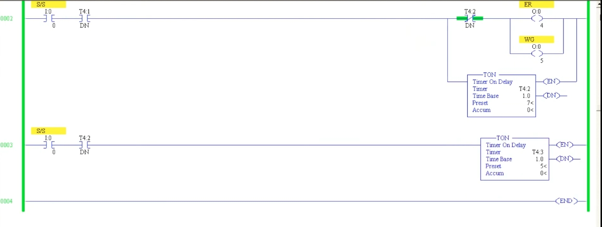
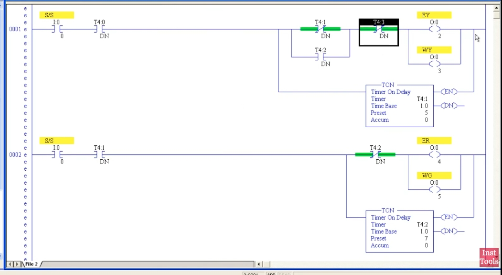
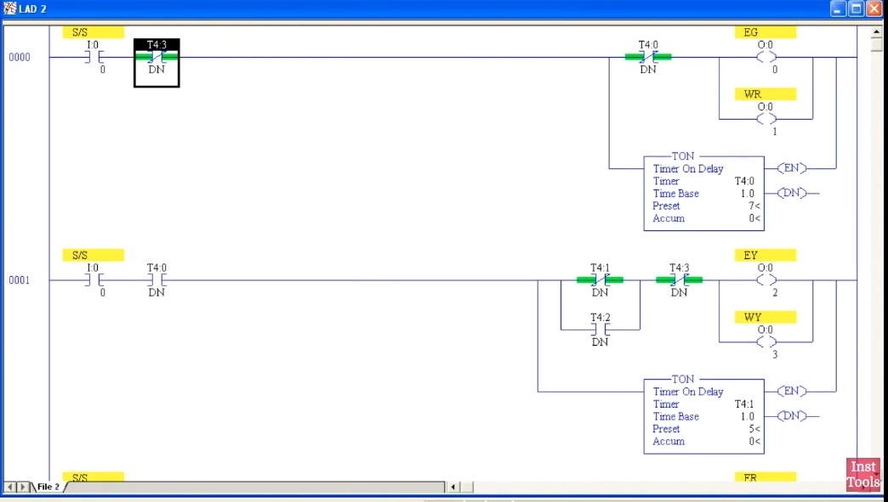
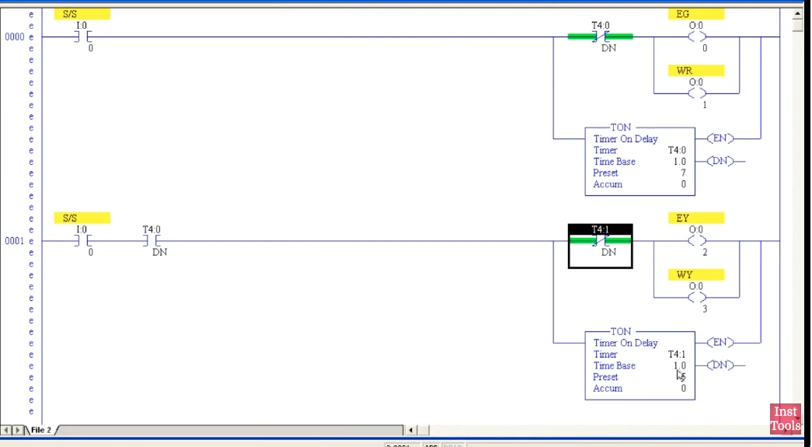
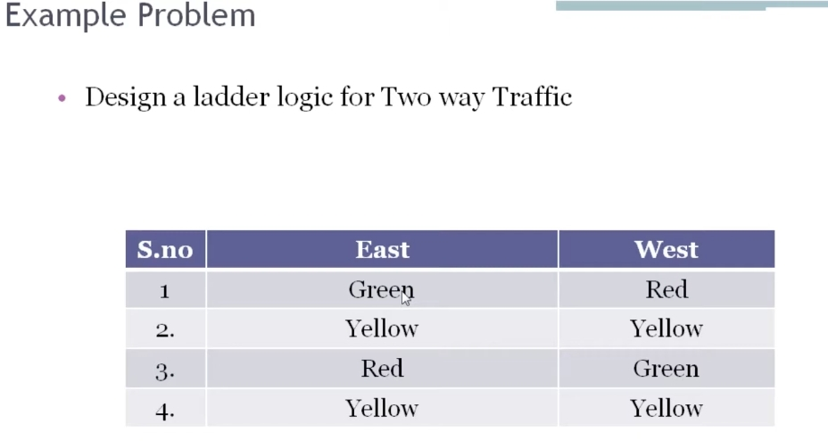

# PLC 教程 52:交通號誌控制(雙向路口)梯形圖範例
# PLC Training 52: Two-Way Traffic Light Control – Ladder Logic Example

> 來源 Source:<https://www.youtube.com/watch?v=zGV3TwOsJVY&list=PLI78ZBihrkE3nnGIj2WmHb_GoWjFlfFIu&index=52>
> 平台 Platform:Allen-Bradley(RSLogix 500 Pro / SLC 500 風格 Style)

---

## 目錄 Contents

1. [簡介 Introduction](#1-簡介--introduction)
2. [題目 The Problem](#2-題目--the-problem)
3. [位址分配 Address Assignment](#3-位址分配--address-assignment)
4. [設計思路 Design Idea](#4-設計思路--design-idea)
5. [逐步建立程式 Building the Program Step by Step](#5-逐步建立程式--building-the-program-step-by-step)
6. [完成的程式 The Finished Program](#6-完成的程式--the-finished-program)
7. [運作過程與測試 Operation and Testing](#7-運作過程與測試--operation-and-testing)
8. [重點整理 Summary](#8-重點整理--summary)

---

## 1. 簡介 | Introduction

**中文**
這是本系列的**最後一個綜合範例(第四個)**:用**ON 延時計時器(TON)** 設計**雙向交通號誌控制**。這是梯形圖中的經典題目,**號誌的順序與時間可依客戶需求自行設計**。影片中的設計包含黃燈,你也可以省略黃燈或改變時間。影片最後建議以類似題目(如**三向路口**)自行練習。

**English**
This is the **last (fourth) worked example** of the series: a **two-way traffic light controller** built with **ON-delay timers (TON)**. It is a classic ladder logic exercise, and **the sequence and timing can be designed to meet the customer's requirements**. The design in the video includes yellow lights; you may omit them or change the times. The video ends by suggesting similar exercises (such as a **three-way intersection**) for practice.

---

## 2. 題目 | The Problem

**中文**
設計一個**雙向(東、西)交通號誌**的梯形圖。每個方向有**三個輸出**(紅、黃、綠)。依序循環如下:

| 順序 S.no | 東 East | 西 West |
|:---:|:---:|:---:|
| 1 | 綠 Green | 紅 Red |
| 2 | 黃 Yellow | 黃 Yellow |
| 3 | 紅 Red | 綠 Green |
| 4 | 黃 Yellow | 黃 Yellow |

說明:東向綠燈時,西向必須是紅燈;過了一段時間,兩邊都變黃燈;再過一段時間,東向變紅、西向變綠;再兩邊同時黃燈,然後**回到第 1 步,不斷重複**。



*圖 1:投影片:Design a ladder logic for Two way Traffic。*
*Fig. 1: Slide: Design a ladder logic for Two way Traffic.*

**English**
Design a ladder program for a **two-way (East / West) traffic light**. Each direction has **three outputs** (red, yellow, green). The cycle runs as in the table above.

Explanation: when East is green, West must be red; after some time both go yellow; after more time East turns red and West turns green; both go yellow again, and then the cycle **returns to step 1 and repeats forever**.

---

## 3. 位址分配 | Address Assignment

**中文**

| 名稱 Name | 意義 Meaning | 位址 Address |
|------|------|------|
| `S/S` | 啟動 / 停止開關 Start / Stop switch | `I:0/0` |
| `EG` | 東綠 East Green | `O:0/0` |
| `WR` | 西紅 West Red | `O:0/1` |
| `EY` | 東黃 East Yellow | `O:0/2` |
| `WY` | 西黃 West Yellow | `O:0/3` |
| `ER` | 東紅 East Red | `O:0/4` |
| `WG` | 西綠 West Green | `O:0/5` |
| `T4:0` | TON,7 秒(階段 1) | Time Base 1.0 s |
| `T4:1` | TON,5 秒(階段 2) | Time Base 1.0 s |
| `T4:2` | TON,7 秒(階段 3) | Time Base 1.0 s |
| `T4:3` | TON,5 秒(階段 4) | Time Base 1.0 s |

**English**
(See the table above.)

---

## 4. 設計思路 | Design Idea

**中文**
整個循環分成 **4 個階段**,每個階段用一個計時器控制,**前一個計時器完成(DN)後,才開始下一階段**:

| 階段 Phase | 亮的燈 Lights ON | 長度 Duration | 計時器 Timer |
|:---:|------|:---:|:---:|
| 1 | 東綠 EG + 西紅 WR | 7 秒 s | `T4:0` |
| 2 | 東黃 EY + 西黃 WY | 5 秒 s | `T4:1` |
| 3 | 東紅 ER + 西綠 WG | 7 秒 s | `T4:2` |
| 4 | 東黃 EY + 西黃 WY | 5 秒 s | `T4:3` |

一個循環共 **24 秒**(7 + 5 + 7 + 5,補充計算)。每個階段各用**一個 Rung**:

- Rung 0:階段 1(EG、WR、`T4:0`)
- Rung 1:階段 2 與階段 4 的黃燈(EY、WY、`T4:1`)
- Rung 2:階段 3(ER、WG、`T4:2`)
- Rung 3:階段 4 的計時(`T4:3`)

**English**
The cycle is split into **4 phases**, each controlled by a timer; **the next phase starts only when the previous timer is done (DN)**: see the table above.

One cycle takes **24 seconds** (7 + 5 + 7 + 5, supplementary calculation). Each phase uses **one rung**:

- Rung 0: phase 1 (EG, WR, `T4:0`)
- Rung 1: the yellow lights of phases 2 and 4 (EY, WY, `T4:1`)
- Rung 2: phase 3 (ER, WG, `T4:2`)
- Rung 3: the timing of phase 4 (`T4:3`)

---

## 5. 逐步建立程式 | Building the Program Step by Step

### 5.1 Rung 0:東綠 + 西紅 | Rung 0: East Green + West Red

**中文**
- `S/S`(`I:0/0`)導通後:輸出 **EG** 與 **WR**(並聯的兩個線圈)亮起,同時啟動 **TON `T4:0`**(Time Base 1.0 秒,Preset **7**)。
- 在輸出前串聯 **`T4:0` 的 DN 常閉接點**:7 秒後計時器完成,這兩個輸出熄滅。
- 計時器與輸出是**並聯的分支**,所以兩者同時動作。

**English**
- When `S/S` (`I:0/0`) is ON: the outputs **EG** and **WR** (two coils in parallel) turn ON, and **TON `T4:0`** (Time Base 1.0 s, Preset **7**) starts at the same time.
- A **`T4:0` DN normally closed contact** is in series before the outputs: after 7 seconds the timer is done and these two outputs turn OFF.
- The timer and the outputs are **parallel branches**, so they act at the same time.

### 5.2 Rung 1:東黃 + 西黃 | Rung 1: East Yellow + West Yellow

**中文**
- 條件:`S/S` + **`T4:0` DN(常開)**,也就是階段 1 結束後才執行。
- 輸出 **EY** 與 **WY** 並聯,同時啟動 **TON `T4:1`**(Preset **5**)。
- 串聯 **`T4:1` DN 常閉接點**:5 秒後黃燈熄滅。



*圖 2:Rung 0:`S/S` → [`T4:0` DN(常閉)→ `EG`、`WR`] 並聯 `TON T4:0`(Preset 7)。Rung 1:`S/S` + `T4:0` DN → [`T4:1` DN(常閉)→ `EY`、`WY`] 並聯 `TON T4:1`(Preset 5)。*
*Fig. 2: Rung 0: `S/S` → [`T4:0` DN (NC) → `EG`, `WR`] in parallel with `TON T4:0` (Preset 7). Rung 1: `S/S` + `T4:0` DN → [`T4:1` DN (NC) → `EY`, `WY`] in parallel with `TON T4:1` (Preset 5).*

**English**
- Condition: `S/S` + **`T4:0` DN (NO)**, i.e. it runs only after phase 1 has finished.
- The outputs **EY** and **WY** are in parallel, and **TON `T4:1`** (Preset **5**) starts together with them.
- A **`T4:1` DN normally closed contact** in series turns the yellows OFF after 5 seconds.

### 5.3 Rung 2:東紅 + 西綠 | Rung 2: East Red + West Green

**中文**
- 條件:`S/S` + **`T4:1` DN(常開)**,階段 2 結束後執行。
- 輸出 **ER**(`O:0/4`)與 **WG**(`O:0/5`)並聯,同時啟動 **TON `T4:2`**(Preset **7**)。
- 串聯 **`T4:2` DN 常閉接點**:7 秒後這兩個輸出熄滅。



*圖 3:Rung 1(`EY`、`WY`、`T4:1` Preset 5)與 Rung 2(`S/S` + `T4:1` DN → `T4:2` DN(常閉)→ `ER`、`WG`;`TON T4:2` Preset 7)。*
*Fig. 3: Rung 1 (`EY`, `WY`, `T4:1` Preset 5) and Rung 2 (`S/S` + `T4:1` DN → `T4:2` DN (NC) → `ER`, `WG`; `TON T4:2` Preset 7).*

**English**
- Condition: `S/S` + **`T4:1` DN (NO)**, running after phase 2 has finished.
- The outputs **ER** (`O:0/4`) and **WG** (`O:0/5`) are in parallel, and **TON `T4:2`** (Preset **7**) starts with them.
- A **`T4:2` DN normally closed contact** in series turns these two outputs OFF after 7 seconds.

### 5.4 Rung 3:最後一個計時器 | Rung 3: The Last Timer

**中文**
- 條件:`S/S` + **`T4:2` DN(常開)**。
- 啟動 **TON `T4:3`**(Preset **5**),負責**第二次黃燈的 5 秒**。


*圖 4:Rung 2(ER、WG、`T4:2`)與 Rung 3:`S/S` + `T4:2` DN → `TON T4:3`(Preset 5),之後是 END。*
*Fig. 4: Rung 2 (ER, WG, `T4:2`) and Rung 3: `S/S` + `T4:2` DN → `TON T4:3` (Preset 5), followed by END.*

**English**
- Condition: `S/S` + **`T4:2` DN (NO)**.
- It starts **TON `T4:3`** (Preset **5**), which times **the 5 seconds of the second yellow period**.

### 5.5 補上第二次黃燈與循環重啟 | Adding the Second Yellow Period and the Restart

**中文**
基本結構完成後,還需要三處修改:

1. **第二次黃燈**(階段 4):EY、WY 已在 Rung 1 使用,所以**不要再另寫線圈**,而是在 Rung 1 的 **`T4:1` DN 常閉接點旁邊並聯一個 `T4:2` DN 常開接點**。當 `T4:2` 完成(階段 3 結束),黃燈就再次亮起。
2. **黃燈結束**:在 Rung 1 的輸出前再**串聯 `T4:3` DN 常閉接點**,`T4:3` 完成(第二次黃燈的 5 秒結束)時黃燈熄滅。

3. **循環重新開始**:在 Rung 0 的 `S/S` 後串聯 **`T4:3` DN 常閉接點**。最後一個計時器完成時,Rung 0 變為假,**所有計時器依序被重置**,下一次掃描 Rung 0 又為真,整個循環從頭開始。

**English**
Once the basic structure is done, three more changes are needed:

1. **The second yellow period** (phase 4): EY and WY are already used in Rung 1, so **do not write new coils**. Instead, **add a `T4:2` DN normally open contact in parallel with the `T4:1` DN normally closed contact** in Rung 1. When `T4:2` is done (end of phase 3), the yellows turn ON again.
2. **End of yellow:** add a **`T4:3` DN normally closed contact in series** before the Rung 1 outputs, so the yellows turn OFF when `T4:3` is done (5 seconds after the second yellow period began).
3. **Restarting the cycle:** add a **`T4:3` DN normally closed contact in series** after `S/S` in Rung 0. When the last timer is done, Rung 0 becomes false and **all timers reset in turn**; on the next scan Rung 0 is true again and the whole cycle starts over.

---

## 6. 完成的程式 | The Finished Program

**中文**
完成後的梯形圖如下(文字示意):

```
Rung 0: S/S ── T4:3.DN(NC) ──┬── T4:0.DN(NC) ──┬──( EG  O:0/0 )
                              │                 └──( WR  O:0/1 )
                              └──[ TON T4:0, 1.0 s, Preset 7 ]

Rung 1: S/S ── T4:0.DN(NO) ──┬── [ T4:1.DN(NC) ∥ T4:2.DN(NO) ] ── T4:3.DN(NC) ──┬──( EY  O:0/2 )
                              │                                                    └──( WY  O:0/3 )
                              └──[ TON T4:1, 1.0 s, Preset 5 ]

Rung 2: S/S ── T4:1.DN(NO) ──┬── T4:2.DN(NC) ──┬──( ER  O:0/4 )
                              │                 └──( WG  O:0/5 )
                              └──[ TON T4:2, 1.0 s, Preset 7 ]

Rung 3: S/S ── T4:2.DN(NO) ──[ TON T4:3, 1.0 s, Preset 5 ]

Rung 4: END
```



*圖 5:Rung 0:`S/S` + `T4:3` DN(常閉)→ [`T4:0` DN(常閉)→ `EG`、`WR`] 並聯 `TON T4:0`(Preset 7)。Rung 1:`S/S` + `T4:0` DN → [`T4:1` DN(常閉)並聯 `T4:2` DN(常開)] → `T4:3` DN(常閉)→ `EY`、`WY`;`TON T4:1`(Preset 5)。*
*Fig. 5: Rung 0: `S/S` + `T4:3` DN (NC) → [`T4:0` DN (NC) → `EG`, `WR`] in parallel with `TON T4:0` (Preset 7). Rung 1: `S/S` + `T4:0` DN → [`T4:1` DN (NC) in parallel with `T4:2` DN (NO)] → `T4:3` DN (NC) → `EY`, `WY`; `TON T4:1` (Preset 5).*



*圖 6:Rung 1 的黃燈條件(`T4:1` DN 常閉 ∥ `T4:2` DN 常開,再串聯 `T4:3` DN 常閉)與 Rung 2(`S/S` + `T4:1` DN → `T4:2` DN(常閉)→ `ER`、`WG`;`TON T4:2` Preset 7)。*
*Fig. 6: The yellow condition of Rung 1 (`T4:1` DN NC ∥ `T4:2` DN NO, then `T4:3` DN NC in series) and Rung 2 (`S/S` + `T4:1` DN → `T4:2` DN (NC) → `ER`, `WG`; `TON T4:2` Preset 7).*

**English**
The finished ladder is shown in the text diagram above.

---

## 7. 運作過程與測試 | Operation and Testing

**中文**
儲存、下載並進入 Run 模式,導通 `S/S`:

| 時間 Time | 計時器狀態 Timer state | 亮的燈 Lights ON |
|:---:|------|------|
| 0 到 7 秒 | `T4:0` 計時中 timing | **EG + WR**(東綠、西紅) |
| 7 到 12 秒 | `T4:0` 完成;`T4:1` 計時中 | **EY + WY**(兩邊黃) |
| 12 到 19 秒 | `T4:1` 完成;`T4:2` 計時中 | **ER + WG**(東紅、西綠) |
| 19 到 24 秒 | `T4:2` 完成;`T4:3` 計時中 | **EY + WY**(兩邊黃) |
| 24 秒 | `T4:3` 完成 → 全部重置 | 從頭開始 restart |

- 畫面中可以看到:階段 1 時 **EG 與 WR 導通(綠色)**,`T4:0` 的 Accum 逐秒上升(圖中為 2 / 7),EN 位元導通。
- 循環會**不斷重複**,直到把 `S/S` 關閉。
- **關閉 `S/S`**:所有 Rung 都變成假,**所有計時器重置、所有輸出熄滅**。
- 要改變各階段時間,切到 Offline,修改計時器的 Preset,再重新下載。


*圖 7:線上狀態:`EG`、`WR` 導通(綠色),`T4:0` Preset 7、Accum 2。Rung 1 尚未導通,黃燈與其他輸出都熄滅。*
*Fig. 7: Online: `EG` and `WR` are ON (green), `T4:0` Preset 7, Accum 2. Rung 1 is not yet true, so the yellows and other outputs are OFF.*

**English**
Save, download, go to Run mode and turn `S/S` ON: see the table above.

- On screen you can see that in phase 1 **EG and WR are ON (green)**, `T4:0`'s Accum rises second by second (2 / 7 in the figure) and the EN bit is ON.
- The cycle **repeats continuously** until `S/S` is turned OFF.
- **Turning `S/S` OFF:** every rung becomes false, **all timers reset and all outputs turn OFF**.
- To change the duration of a phase, go Offline, edit the timer Preset and download again.

---

## 8. 重點整理 | Summary

**中文**
1. 雙向路口循環為:**東綠西紅 → 雙黃 → 東紅西綠 → 雙黃 → 重複**。
2. 用 **4 個 ON 延時計時器**對應 4 個階段(本例 7、5、7、5 秒),後一階段以**前一個計時器的 DN 常開接點**啟動。
3. 每個階段的輸出以**並聯分支**與計時器同時動作,並串聯**自己計時器的 DN 常閉接點**,時間到就熄滅。
4. 同一組輸出(EY、WY)要在兩個時段亮起時,**不要重複寫線圈**,而是**並聯接點**(`T4:1` DN 常閉 ∥ `T4:2` DN 常開)。
5. 在 Rung 0 串聯 **最後一個計時器的 DN 常閉接點**,即可讓整個循環**自動重新開始**。
6. 所有 Rung 都串聯 `S/S`,**關閉 `S/S` 會讓所有計時器重置、輸出全部熄滅**。
7. 號誌的順序、是否使用黃燈、各階段時間,都可以**依需求修改**。
8. 練習建議:改寫成**三向路口**等類似題目。

**English**
1. The two-way cycle is: **East green / West red → both yellow → East red / West green → both yellow → repeat**.
2. Use **4 ON-delay timers** for the 4 phases (7, 5, 7, 5 s here); each later phase is started by the **previous timer's DN normally open contact**.
3. The outputs of each phase act **in a parallel branch** with the timer and are blocked by a series **DN normally closed contact of their own timer**, so they turn off when the time is up.
4. When the same outputs (EY, WY) must be ON in two time slots, **do not write the coils twice**; use **parallel contacts** (`T4:1` DN NC ∥ `T4:2` DN NO).
5. A **DN normally closed contact of the last timer** in series in Rung 0 makes the whole cycle **restart automatically**.
6. Every rung has `S/S` in series, so **turning `S/S` OFF resets all timers and turns all outputs OFF**.
7. The order, whether to use yellow lights, and the duration of each phase can all be **changed to suit requirements**.
8. Practice suggestion: adapt it to a similar problem such as a **three-way intersection**.

---

## 附:檔案結構 | Appendix: File Layout

```
PLC_52_Traffic_Light_Control.md
images/
├── ab52_01.jpg   # Finished Rung 1 and Rung 2 (offline)
├── ab52_02.jpg   # Finished Rung 0 and Rung 1 (offline)
├── ab52_03.jpg   # Online: phase 1 running (EG, WR ON, T4:0 Accum 2)
├── ab52_04.jpg   # Building Rungs 0-1 (offline)
├── ab52_05.jpg   # Rung 1 and Rung 2 (offline)
├── ab52_06.jpg   # Rung 2, Rung 3 (T4:3), END
└── ab52_07.jpg   # Problem table: East / West sequence
```
