# Motor Control Ladder Logic: The Start/Stop Diagram
# 馬達控制梯形圖：啟動／停止（Start/Stop）電路（中英對照教程）

> Source / 來源: <https://www.youtube.com/watch?v=k7fFJ0oaUdo> — *Motor Control Ladder Logic (Start/Stop Diagram)*

---

## 1. Introduction / 簡介

**EN:** This is the classic **motor start/stop circuit**, with a **seal-in contact** already doing its job. By the end you will be able to **draw this exact rung from memory** and **explain every contact on it**. It is the single most important circuit in industrial control: a motor that **starts when you tap a button, keeps running when you let go, and stops the instant you hit stop**.

**中文：** 這是經典的**馬達啟動／停止電路**，其中的**自保持（seal-in）接點**已在發揮作用。學完後，你能**憑記憶畫出這條梯級**，並**解釋上面每一個接點**。它是工業控制中最重要的單一電路：馬達**輕按按鈕就啟動、放手後持續運轉、按下停止立即停機**。

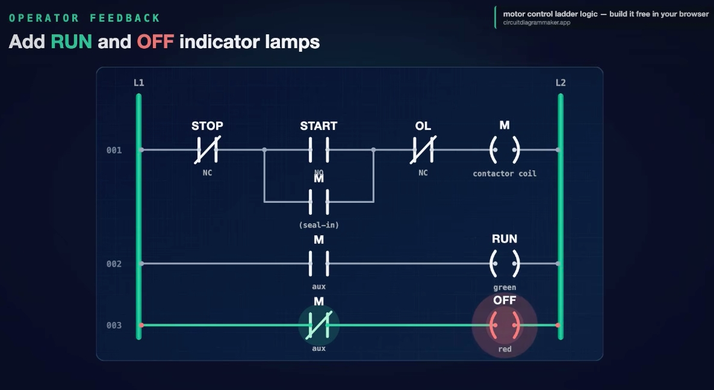

*Figure 1 / 圖 1：完整的啟停梯級——STOP（NC）→ START（NO）並聯 M 自保持 → OL（NC）→ 接觸器線圈 M。*

---

## 2. The Cast: Four Parts / 四個基本元件

**EN:** The video rewinds and builds the rung **one contact at a time**. The four parts:

| Part 元件 | Type 類型 | Description 說明 |
|---|---|---|
| **START button** | Input, **NO** 輸入，常開 | Normally open — closes **only while you press it** 常開，**只在按住時閉合** |
| **STOP button** | Input, **NC** 輸入，常閉 | Normally closed — **breaks the path** the moment you push it 常閉，一按下就**切斷路徑** |
| **Contactor coil M** | Output 輸出 | The part that actually pulls in and powers the motor 實際吸合並為馬達供電的元件 |
| **Seal-in contact M** | The trick 關鍵 | A normally-open **auxiliary contact driven by the same coil M**, wired **in parallel with START** 由同一個線圈 M 驅動的常開**輔助接點**，與 **START 並聯** |

**中文：** 影片先倒帶，再**一個接點一個接點**地重建這條梯級。四個元件如上表。

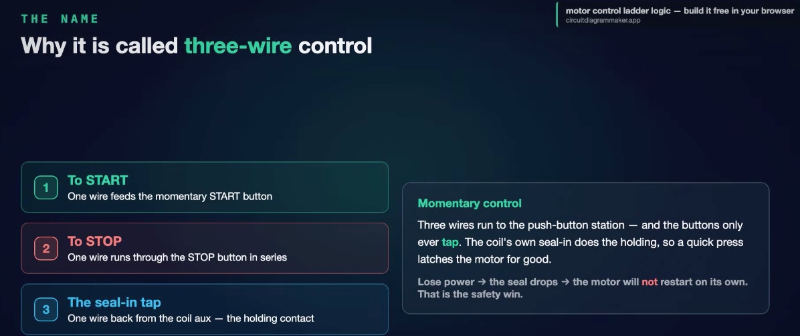

*Figure 2 / 圖 2：三線式啟停控制的四個部分——START（NO）、STOP（NC）、接觸器線圈 M、自保持接點 M。底部標語：Momentary buttons · a coil that holds itself on（按鈕是瞬時的，線圈自己保持）。*

---

## 3. Building the Rung Step by Step / 逐步建立梯級

### Step 1 – The skeleton / 步驟 1：骨架

**EN:** From the left rail, place the **STOP** button first (**normally closed**, so power flows straight through it while nobody touches it). Then, **in series**, the **START** button (normally open, blocking the path until pressed), and on the right the **contactor coil M**.

Three things in a line, in series, means **AND**: the STOP contact **must be closed** AND the START button **must be pressed** before the coil can pull in. Press START → power runs across the whole rung and the coil energizes.

**中文：** 從左側電源軌開始，先放 **STOP** 按鈕（**常閉**，沒人碰時電流直接通過）。接著**串聯** **START** 按鈕（常開，按下前路徑是斷的），最右邊是**接觸器線圈 M**。

三者串聯在一條線上，代表 **AND（且）**：STOP 接點**必須閉合**，而且 START **必須被按下**，線圈才會吸合。按下 START → 電流通過整條梯級，線圈激磁。

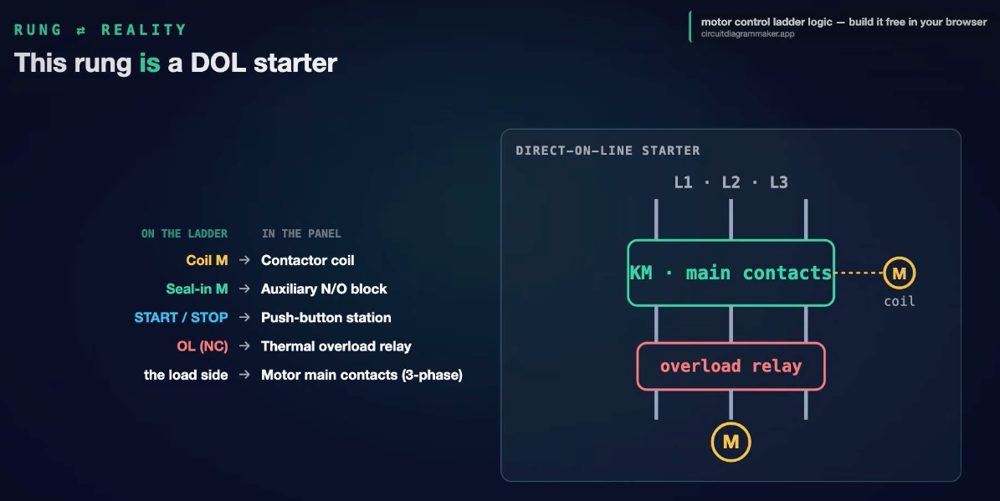

*Figure 3 / 圖 3：Series means AND（串聯代表 AND）——STOP 必須閉合，且按下 START，線圈才會動作。*

### Step 2 – The problem / 步驟 2：問題

**EN:** So far so simple — but there is a big problem. **Release the START button** and the normally-open START contact springs back open, the path breaks, and the **coil drops out instantly**. Press again → run; release → dead again. This is useless on a real machine: nobody stands holding a button down for an eight-hour shift. The circuit needs to **remember** that it was started.

**中文：** 目前看似簡單，卻有個大問題：**放開 START 按鈕**，常開的 START 接點彈回斷開，路徑中斷，**線圈立刻失電**。再按又運轉，放手又停止。這在實際機器上毫無用處——沒有人會在八小時班次中一直按著按鈕。電路必須能**記住**自己已被啟動。

### Step 3 – The seal-in / 步驟 3：加入自保持

**EN:** The fix: add **one normally-open contact driven by the coil M**, wired **in parallel with the START button** — a little bypass around START. This is the **seal-in** (also called the **holding contact** or the **latch**).

Watch the sequence:
1. Tap START → power flows and **coil M pulls in**.
2. The instant M energizes, **its own seal-in contact snaps closed** — a **second path around START**.
3. When the button springs back open, it no longer matters: current keeps flowing through the seal-in to the coil.
4. The rung now **holds itself on**, hands-free. One tap and it stays latched.

**中文：** 解法：加入**一個由線圈 M 驅動的常開接點**，並**與 START 按鈕並聯**——相當於繞過 START 的小旁路。這就是**自保持（seal-in）**，也稱為**保持接點**或**閂鎖（latch）**。

動作順序：
1. 輕按 START → 電流通過，**線圈 M 吸合**。
2. M 一激磁，**它自己的自保持接點立即閉合**——形成**繞過 START 的第二條路徑**。
3. 按鈕彈回斷開時已無關緊要：電流經由自保持接點持續流向線圈。
4. 梯級現在**自己保持導通**，完全免持。輕按一下就維持閂鎖。

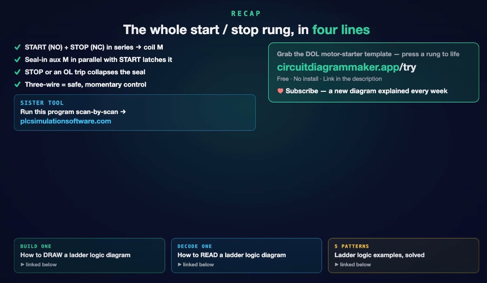

*Figure 4 / 圖 4：The whole trick——線圈輔助接點 M（seal-in）與 START 並聯。*

### Step 4 – Stopping: why STOP is normally closed / 步驟 4：停止——為什麼 STOP 是常閉

**EN:** The motor is latched on. Press **STOP**: the normally-closed contact **opens**. Because it sits **in series with everything**, it breaks the one path that feeds the coil. The coil drops out, and the moment M de-energizes, **its seal-in contact opens too** — the latch collapses.

Now release STOP: it closes again, but the seal-in is already open and START is open, so **nothing flows**. The motor **stays off** until somebody presses START. That is the full **latch / unlatch** cycle.

**中文：** 馬達已被閂鎖運轉。按下 **STOP**：常閉接點**打開**。因為它與**所有路徑串聯**，就切斷了供電給線圈的唯一路徑。線圈失電，而 M 一釋放，**自保持接點也跟著打開**——閂鎖解除。

此時放開 STOP：它重新閉合，但自保持接點已打開、START 也是開的，所以**沒有電流**。馬達**維持停止**，直到有人再按 START。這就是完整的**閂鎖／解除**循環。

---

## 4. Why It Is Called "Three-Wire" Control / 為什麼稱為「三線式」控制

**EN:** This pattern is called **three-wire control**. Three wires run to the push-button station:
1. **To START** – one wire feeds the momentary START button.
2. **To STOP** – one wire runs through the STOP button in series.
3. **The seal-in tap** – one wire comes back from the coil's auxiliary (holding) contact.

The buttons only ever **tap**; the coil's own seal-in does the holding.

**中文：** 這種模式稱為**三線式控制**。有三條線連到按鈕站：
1. **接 START**：一條線供電給瞬時型 START 按鈕。
2. **接 STOP**：一條線串聯經過 STOP 按鈕。
3. **自保持引線**：一條線從線圈的輔助（保持）接點拉回。

按鈕只需**輕按**；保持動作由線圈自己的自保持接點完成。

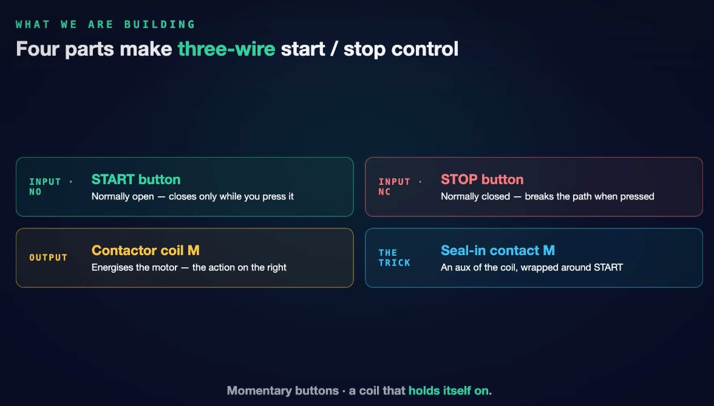

*Figure 5 / 圖 5：三線式的三條線，以及 Momentary control（瞬時控制）說明——斷電後自保持釋放，馬達**不會**自行重新啟動，這是安全上的優點。*

**EN – The safety win:** if power fails while the motor is running, the coil drops out and the **seal-in opens**. When power returns, the seal-in is open and START is open, so the motor **stays put** and will not lurch back to life on its own. This is a huge deal on anything with moving parts.

**中文 – 安全優勢：** 馬達運轉時若斷電，線圈釋放，**自保持接點打開**。電力恢復時，自保持與 START 皆為開路，馬達**保持停止**，不會自行突然重新啟動。對任何有運動部件的設備而言，這都非常重要。

---

## 5. Protecting the Motor: Overload (OL) / 保護馬達：過載（OL）

**EN:** A real starter always has an **overload relay**. It watches the motor current; if the motor draws too much for too long (a jam, a failing bearing, a stalled load) it heats up. We represent it with a **normally-closed contact labeled OL**, placed **in series with the coil**. Normally it just passes power. When the overload trips, its NC contact **snaps open** — just like pressing STOP, it breaks the path, the coil drops out, and the seal-in collapses. The motor shuts down **before it burns out**: protection built right into the control logic.

**中文：** 實際的起動器一定有**過載保護繼電器**。它監測馬達電流；若馬達長時間電流過大（卡死、軸承損壞、負載堵轉），就會發熱。我們用標示為 **OL 的常閉接點**表示，並**與線圈串聯**。正常時只是讓電流通過；過載跳脫時，常閉接點**彈開**——就像按下 STOP 一樣切斷路徑，線圈釋放，自保持解除。馬達在**燒毀之前**就停機：保護直接內建在控制邏輯中。

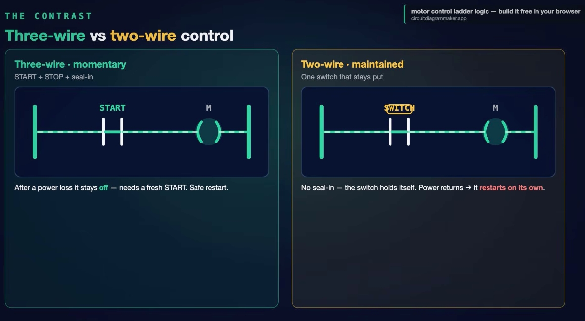

*Figure 6 / 圖 6：OL（NC）串聯在 START／自保持並聯組與線圈 M 之間。*

---

## 6. Indicator Lamps: RUN and OFF / 指示燈：RUN 與 OFF

**EN:** Let the panel talk back to the operator with two new rungs, both using **auxiliary contacts of the coil M**:

| Rung 梯級 | Contact 接點 | Lamp 燈 | Behavior 行為 |
|---|---|---|---|
| 002 | **NO** aux of M 常開輔助接點 | **RUN** (green 綠) | Contact closes when the motor runs → lamp ON 馬達運轉時接點閉合 → 燈亮 |
| 003 | **NC** aux of M 常閉輔助接點 | **OFF** (red 紅) | Contact is closed while the motor is stopped → lamp ON; the instant the motor starts it opens → lamp goes dark 馬達停止時接點閉合 → 燈亮；馬達一啟動即打開 → 燈熄 |

Same auxiliary of the coil, read **two different ways** — normally open says "running", normally closed says "stopped". That is how **one signal drives two lamps**.

**中文：** 讓控制面板回饋操作員，新增兩條梯級，都使用**線圈 M 的輔助接點**（見上表）。同一個輔助接點，用**兩種方式解讀**——常開表示「運轉中」，常閉表示「已停止」。這就是**一個訊號驅動兩盞燈**的方法。

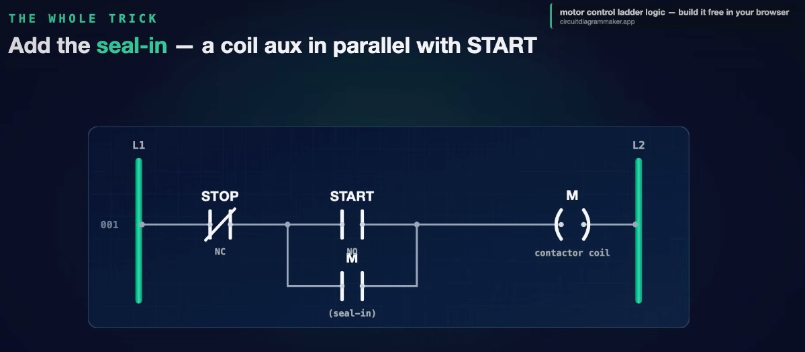

*Figure 7 / 圖 7：梯級 001 為啟停＋過載；梯級 002：M 常開輔助接點 → RUN（綠）；梯級 003：M 常閉輔助接點 → OFF（紅，目前馬達停止所以點亮）。*

---

## 7. Variation: JOG (Inch) / 變化型：寸動（JOG／Inch）

**EN:** Sometimes you do **not** want the motor to latch — you want it to run **only while you hold the button**, to nudge a machine a few degrees into position, line up a coupling, or clear a jam on a belt. To do this, **take the seal-in out of the circuit**. Nothing holds the coil, so the coil **follows the button exactly**: press and hold → runs; release → stops dead. No latch, no memory. Motor starters often wire both modes in with a **selector switch (RUN / JOG)** — one contact makes all the difference.

**中文：** 有時你**不希望**馬達閂鎖，而是希望它**只在按住按鈕時運轉**，例如把機器微調幾度到定位、對準聯軸器，或清除皮帶上的卡料。做法是**把自保持接點從電路中移除**。沒有東西保持線圈，線圈就**完全跟隨按鈕**：按住 → 運轉；放開 → 立即停止。沒有閂鎖、沒有記憶。馬達起動器常用**選擇開關（RUN／JOG）** 同時接入兩種模式——只差一個接點。

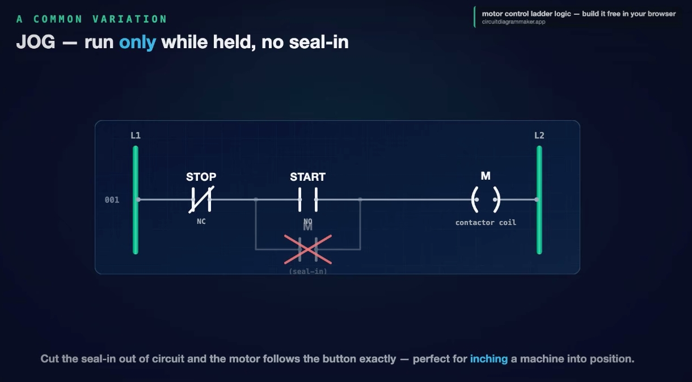

*Figure 8 / 圖 8：JOG——自保持接點被劃掉；馬達只在按住時運轉，適合把機器「寸動」到定位。*

---

## 8. Three-Wire vs Two-Wire Control / 三線式與二線式控制

**EN:**
- **Three-wire (momentary):** START + STOP + seal-in. After a power loss it **stays off** until someone presses START — a **safe restart**.
- **Two-wire (maintained):** a **single maintained device** — a float switch, thermostat or toggle that stays where you put it. There is **no seal-in** because the switch holds itself. Simpler and great for automatic control, **but when power returns the switch is still closed, so the motor restarts on its own** — no human required. That could be exactly what you want, or exactly what you fear.

The seal-in is what makes three-wire control **fail-safe**.

**中文：**
- **三線式（瞬時）：** START + STOP + 自保持。斷電後**保持停止**，直到有人按 START——**安全重啟**。
- **二線式（維持型）：** 使用**單一維持型裝置**——浮球開關、恆溫器或會停在原位的切換開關。**沒有自保持**，因為開關本身就會保持。結構更簡單，適合自動控制，**但電力恢復時開關仍是閉合的，馬達會自行重新啟動**——不需要人為操作。這可能正是你要的，也可能正是你擔心的。

自保持接點讓三線式控制具備**故障安全（fail-safe）** 特性。

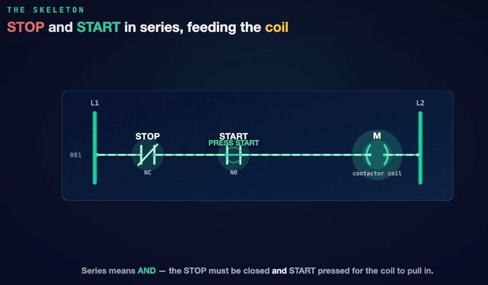

*Figure 9 / 圖 9：左：Three-wire · momentary（START + STOP + seal-in），斷電後保持關閉；右：Two-wire · maintained（單一 SWITCH），電力恢復時會自行重新啟動。*

---

## 9. The Rung Is a Real Motor Starter (DOL) / 梯級就是真實的直接起動器（DOL）

**EN:** This ladder rung is **not an abstraction** — it is a **direct-on-line (DOL) motor starter** drawn as logic. Every symbol is a part you can put your hand on inside the cabinet; the ladder diagram is just the wiring drawn so you can **read the logic instead of chasing wires**.

| On the ladder 梯形圖上 | In the panel 控制盤內 |
|---|---|
| **Coil M** | Contactor coil 接觸器線圈 |
| **Seal-in M** | Auxiliary N/O block clipped onto the contactor 夾在接觸器上的常開輔助接點組 |
| **START / STOP** | Push-button station on the enclosure door 盤面門上的按鈕站 |
| **OL (NC)** | Thermal overload relay bolted onto the contactor 鎖在接觸器下方的熱過載繼電器 |
| The load side 負載側 | Motor main contacts (3-phase) 馬達主接點（三相） |

**中文：** 這條梯級**不是抽象概念**，而是把**直接起動式（DOL）馬達起動器**畫成邏輯。每個符號都是你在配電盤內能摸到的實體零件；梯形圖只是把接線畫成**讓你讀邏輯、而不必追線**的形式。

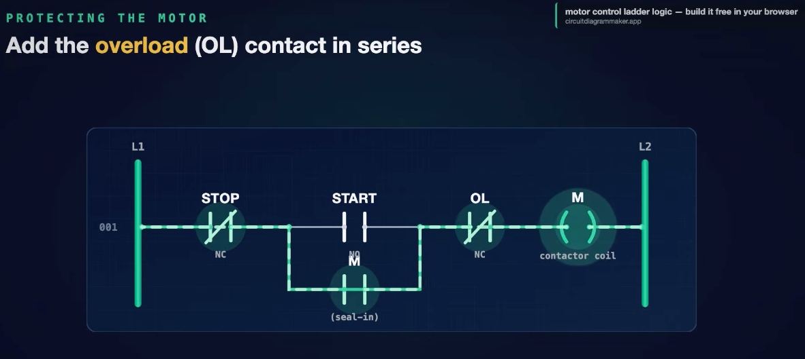

*Figure 10 / 圖 10：Direct-on-line starter——KM 主接點（L1·L2·L3）、過載繼電器、馬達 M；虛線連到線圈 M。*

---

## 10. Recap: The Whole Rung in Four Lines / 重點回顧：整條梯級四句話

**EN:**
1. **START (NO) + STOP (NC) in series → coil M.**
2. **Seal-in aux M in parallel with START latches it on.**
3. **STOP or an OL trip collapses the seal.**
4. **Three-wire = safe, momentary control** (it will not restart itself after a power loss).

**中文：**
1. **START（NO）與 STOP（NC）串聯 → 線圈 M。**
2. **輔助接點 M 與 START 並聯，形成自保持。**
3. **按下 STOP 或 OL 跳脫會使自保持解除。**
4. **三線式＝安全的瞬時控制**（斷電後不會自行重新啟動）。

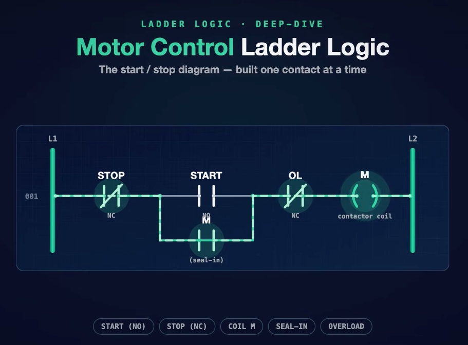

*Figure 11 / 圖 11：Recap——The whole start/stop rung, in four lines。右側提到免費的 DOL 馬達起動器範本（circuitdiagrammaker.app/try），左側為可逐掃描週期執行此程式的模擬工具（plcsimulationsoftware.com）；底部另有三支相關影片：如何**畫**梯形圖、如何**讀**梯形圖、5 個梯形圖範例。*

---

## 11. Glossary / 名詞對照

| English | 中文 |
|---|---|
| Rung | 梯級 |
| Rail (L1 / L2) | 電源軌 |
| Seal-in / holding contact / latch | 自保持／保持接點／閂鎖 |
| Contactor coil | 接觸器線圈 |
| Normally open (NO) / normally closed (NC) | 常開／常閉 |
| Overload relay (OL) | 過載繼電器 |
| Jog / inch | 寸動 |
| Three-wire / two-wire control | 三線式／二線式控制 |
| Direct-on-line (DOL) starter | 直接起動器 |
