# What Is Ladder Logic in PLC Programming?
# 什麼是 PLC 梯形圖（Ladder Logic）？（中英對照教程）

> Source / 來源: <https://www.youtube.com/watch?v=MK2-LD0q0kY> — *What Is Ladder Logic in PLC Programming?* (RealPars)

---

## 1. Introduction / 簡介

**EN:** Ladder logic is one of the **five PLC programming languages** defined in the **IEC 61131-3** standard. By the end of this tutorial you will be able to **read a standard industrial ladder program** and understand how the machine "thinks".

**中文：** 梯形圖是 **IEC 61131-3** 標準定義的**五種 PLC 程式語言**之一。學完本教程後，你就能**看懂一般工業用梯形圖程式**，並了解機器是如何「思考」的。

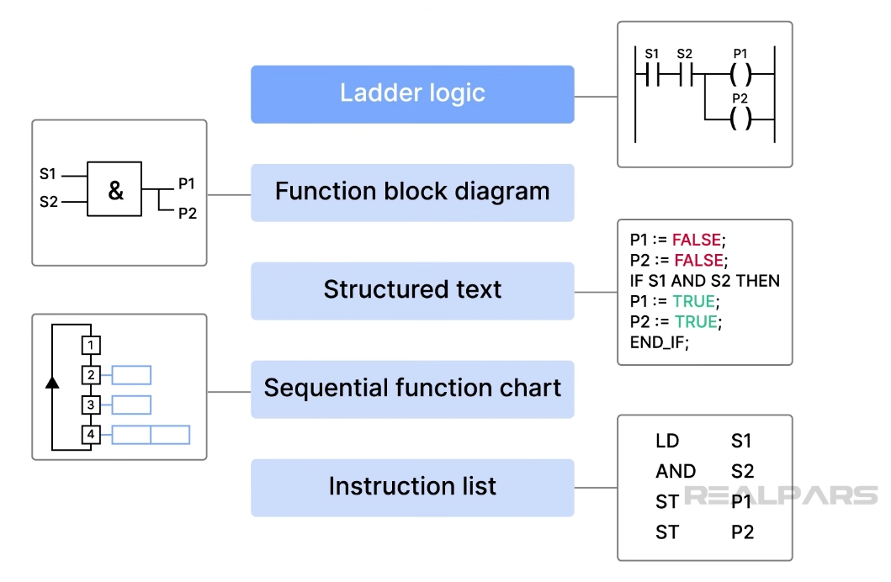

*Figure 1 / 圖 1：同一個邏輯（S1 AND S2 → P1、P2）用五種語言表示——梯形圖（Ladder logic）、功能方塊圖（Function block diagram）、結構化文字（Structured text）、順序功能圖（Sequential function chart）、指令表（Instruction list）。*

**EN:** Ladder logic was the **first PLC language** and is still the **most widely used**. It was designed to look like the **electrical schematics of hard-wired relay logic**, which made it very popular with non-programmers such as electricians and maintenance staff.

**中文：** 梯形圖是**最早出現的 PLC 語言**，至今仍是**使用最廣泛**的語言。它被設計成類似**硬接線繼電器邏輯的電氣原理圖**，因此深受電工與維修人員等非程式設計背景者的歡迎。

**EN:** Ladder logic is not only about looking like a schematic — it helps you **understand system operation** and **troubleshoot in real time**. On a factory floor, watching rungs go **true or false** is much faster than debugging lines of code.

**中文：** 梯形圖不只是外觀像電氣圖，更有助於**理解系統運作**與**即時故障排除**。在工廠現場，直接觀察梯級變為**真（true）或假（false）**，比逐行除錯程式碼快得多。

---

## 2. The Hard-Wired Motor Start/Stop Circuit / 硬接線馬達啟動／停止電路

**EN:** Start with a classic **motor start/stop** circuit. A stop switch, a start switch and a **control relay (CR1)** are wired together to run a motor. For ease of understanding and standardization, this kind of circuit is drawn to look like a **ladder** — and it still is today.

**中文：** 先看經典的**馬達啟動／停止**電路：停止開關、啟動開關與**控制繼電器（CR1）**接線在一起來驅動馬達。為了容易理解與標準化，這類電路被畫成**梯子**的樣子，至今仍是如此。

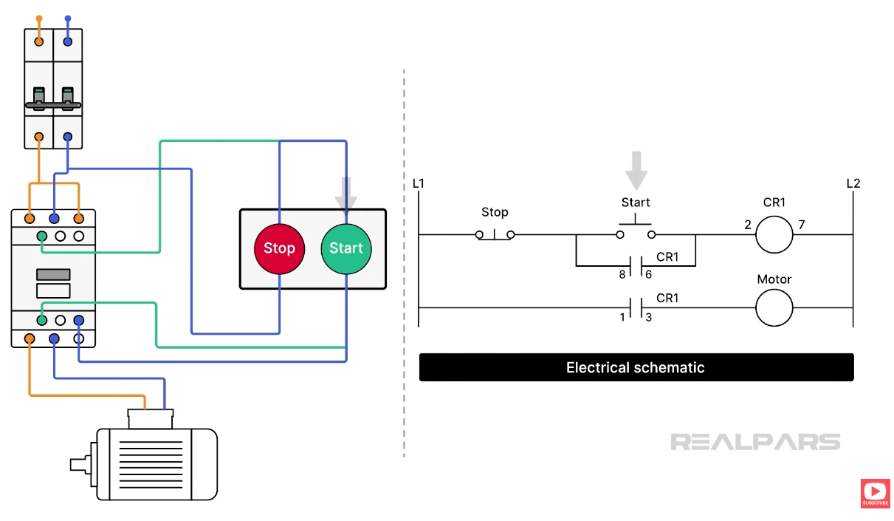

*Figure 2 / 圖 2：左為實際接線（斷路器、接觸器、Stop/Start 按鈕、馬達），右為電氣原理圖；箭頭表示按下 Start。*

### How it works / 動作原理

**EN:**
1. Pressing the **Start** button **energizes CR1**.
2. CR1 contacts **8–6 close** and keep CR1 energized after the Start button is released (**seal-in**).
3. CR1 contacts **1–3 close** and the **motor starts**.
4. Pressing the **Stop** switch breaks the CR1 energizing path, and the motor stops.

**中文：**
1. 按下 **Start** 按鈕，**CR1 激磁**。
2. CR1 的接點 **8–6 閉合**，在放開 Start 後仍使 CR1 保持激磁（**自保持**）。
3. CR1 的接點 **1–3 閉合**，**馬達啟動**。
4. 按下 **Stop** 開關會切斷 CR1 的激磁路徑，馬達停止。

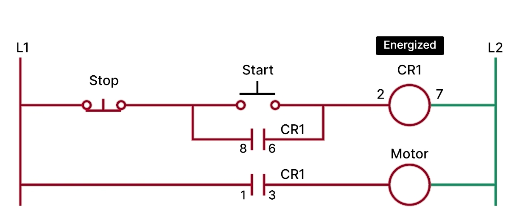

*Figure 3 / 圖 3：CR1 激磁狀態（Energized）——Stop 常閉導通、CR1 自保持接點 8–6 與馬達接點 1–3 皆閉合。*

**EN – Two ways to draw the same circuit:** the version below shows the relay and its contacts drawn as physical components; the **relay-ladder version** is the clear winner for interpreting circuit action.

**中文 – 同一電路的兩種畫法：** 下圖把繼電器及其接點畫成實體元件的樣子；而**繼電器梯形圖版本**在解讀電路動作上明顯更勝一籌。

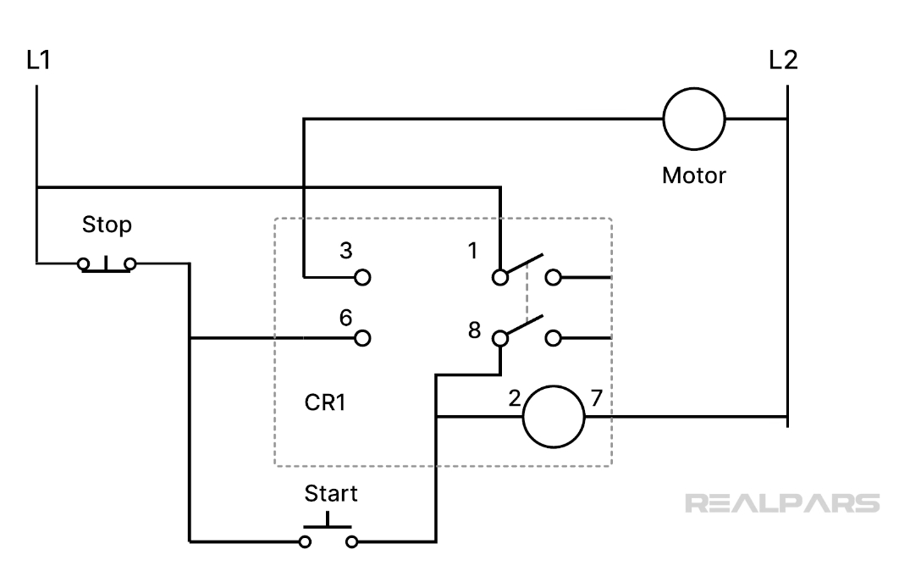

*Figure 4 / 圖 4：同一電路的「接線圖」畫法——CR1 方框內有線圈（2–7）與接點（1–3、6–8），線路交錯，不易閱讀。*

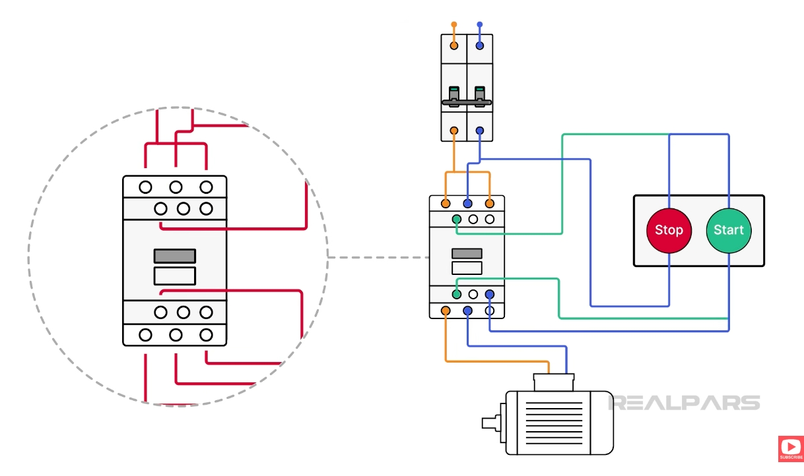

*Figure 5 / 圖 5：放大接觸器端子的接線（左側圓圈為細節）。*

### What changes with a PLC? / 使用 PLC 之後有什麼改變？

**EN:** Changing or replacing components in a hard-wired system means cutting or removing wires and rewiring. **PLCs made this much easier**: the hard wiring and many components disappeared.

**中文：** 在硬接線系統中更改或更換元件，必須剪線或拆線並重新配線。**PLC 讓這件事簡單許多**：硬接線與許多元件都不再需要。

---

## 3. The Same Function with a PLC / 用 PLC 實現相同功能

**EN:** We still need the **Start** and **Stop** buttons, but the control relay CR1 is gone. The two switches are **no longer wired together**: each is connected to a **separate PLC input**, and the motor is connected to a **PLC output**. (This is simplified — PLCs usually do not drive motors directly.)

**中文：** 仍然需要 **Start** 與 **Stop** 按鈕，但控制繼電器 CR1 不見了。兩個開關**不再接在一起**：各自接到**獨立的 PLC 輸入**，馬達則接到 **PLC 輸出**。（此為簡化說明——實際上 PLC 通常不直接驅動馬達。）

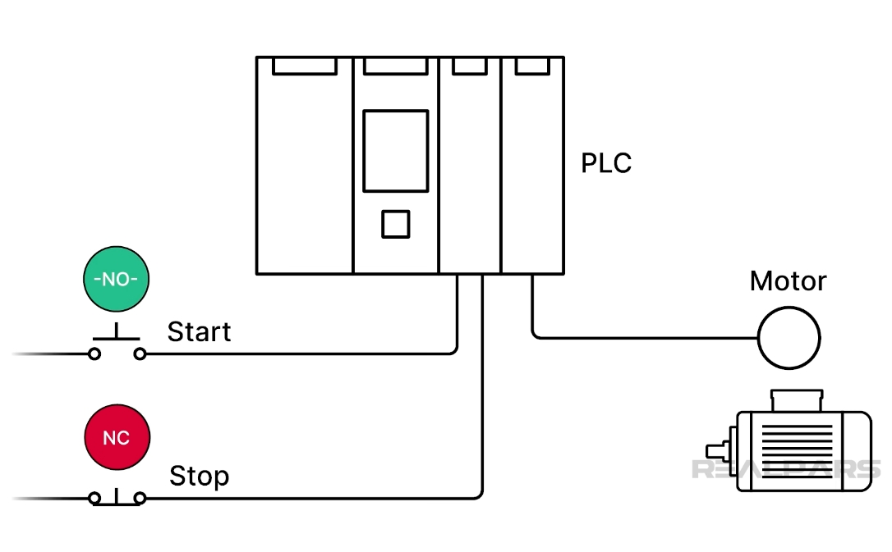

*Figure 6 / 圖 6：Start 為常開（NO）按鈕、Stop 為常閉（NC）按鈕，皆接到 PLC 輸入；馬達接到 PLC 輸出。*

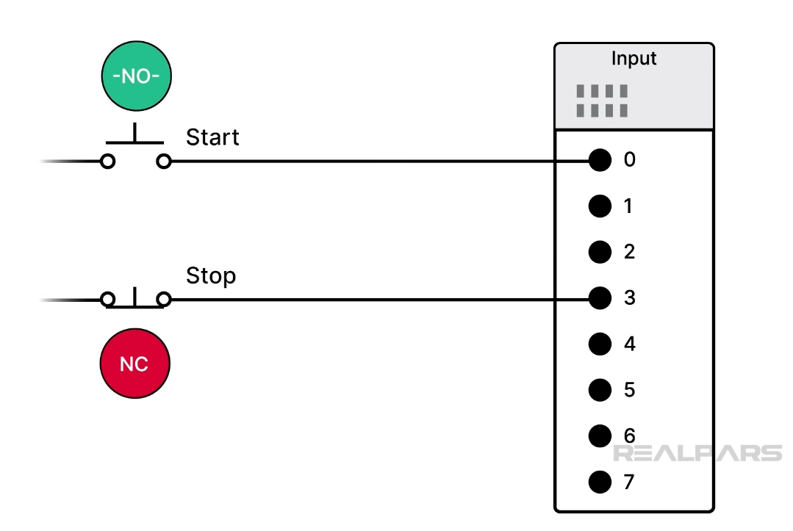

*Figure 7 / 圖 7：Start 接輸入端子 **0**，Stop 接輸入端子 **3**。*

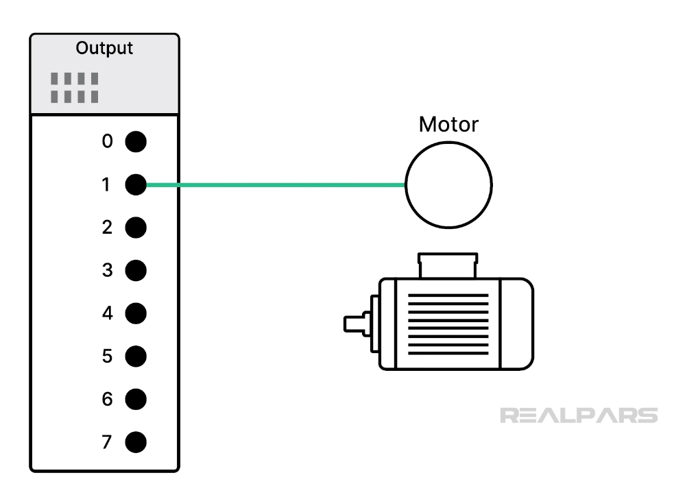

*Figure 8 / 圖 8：馬達接輸出端子 **1**。*

**EN:** The purpose of the **ladder logic program** is to **decide the motor status based on the switch status**: the program examines the switches and then decides what to do with the motor.

**中文：** **梯形圖程式**的目的，就是**根據開關狀態決定馬達狀態**：程式檢查各開關的狀況，再決定馬達該怎麼動作。

---

## 4. The Three Most Common Instructions / 三個最常用的指令

**EN:** Every vendor's ladder language uses **graphical symbols** to represent instructions. The symbols are almost identical across vendors, but the **names differ**. There are **two input instructions** and **one output instruction**.

**中文：** 各家廠商的梯形圖語言都用**圖形符號**代表指令。符號在各廠牌間幾乎相同，但**名稱不同**。最常用的有**兩個輸入指令**與**一個輸出指令**。

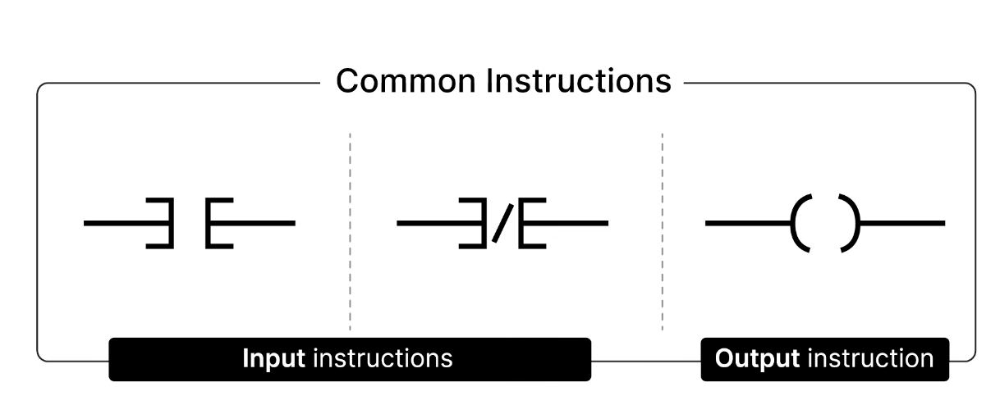

*Figure 9 / 圖 9：Common Instructions——兩個輸入指令（常開、常閉接點）與一個輸出指令（線圈）。*

### 4.1 Normally-open contact / 常開接點

**EN:** Looks like a **normally-open relay contact**, and it works that way in ladder logic. **Siemens** calls it an **NO contact**; **Allen-Bradley** calls it **XIC** (Examine If Closed).

**中文：** 外形類似**常開繼電器接點**，在梯形圖中的作用也相同。**Siemens** 稱為 **NO contact**；**Allen-Bradley** 稱為 **XIC**（Examine If Closed，檢查為閉合）。

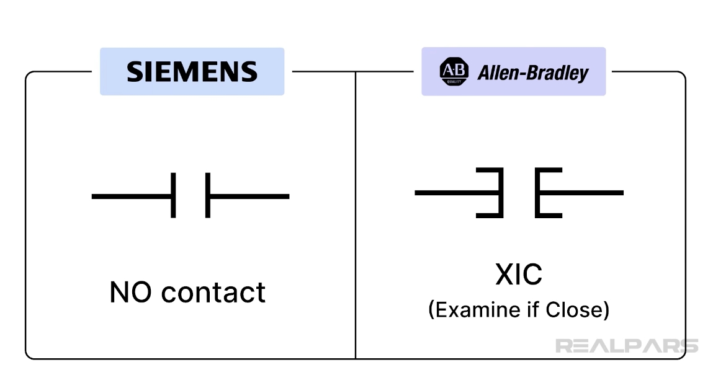

*Figure 10 / 圖 10：Siemens 的 NO contact 與 Allen-Bradley 的 XIC（Examine If Closed）。*

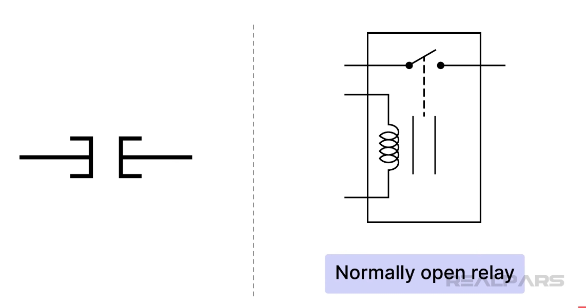

*Figure 11 / 圖 11：左為梯形圖的常開接點符號，右為常開繼電器。*

### 4.2 Normally-closed contact / 常閉接點

**EN:** Looks like a **normally-closed relay contact**. **Siemens**: **NC contact**; **Allen-Bradley**: **XIO** (Examine If Open).

**中文：** 外形類似**常閉繼電器接點**。**Siemens** 稱為 **NC contact**；**Allen-Bradley** 稱為 **XIO**（Examine If Open，檢查為開啟）。

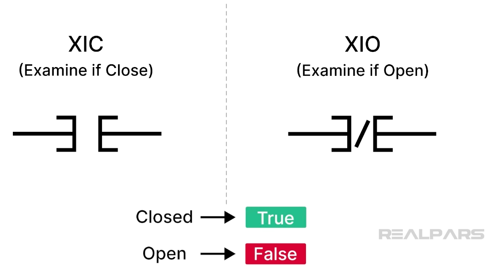

*Figure 12 / 圖 12：XIC 與 XIO 符號；**閉合（Closed）→ 真（True）**，**開啟（Open）→ 假（False）**。*

### 4.3 Coil / 線圈

**EN:** The output instruction looks like a **coil**. **Phoenix Contact** calls it a **coil**; **Allen-Bradley** calls it **OTE** (Output Energize).

**中文：** 輸出指令外形類似**線圈**。**Phoenix Contact** 稱為 **coil**；**Allen-Bradley** 稱為 **OTE**（Output Energize，輸出激磁）。

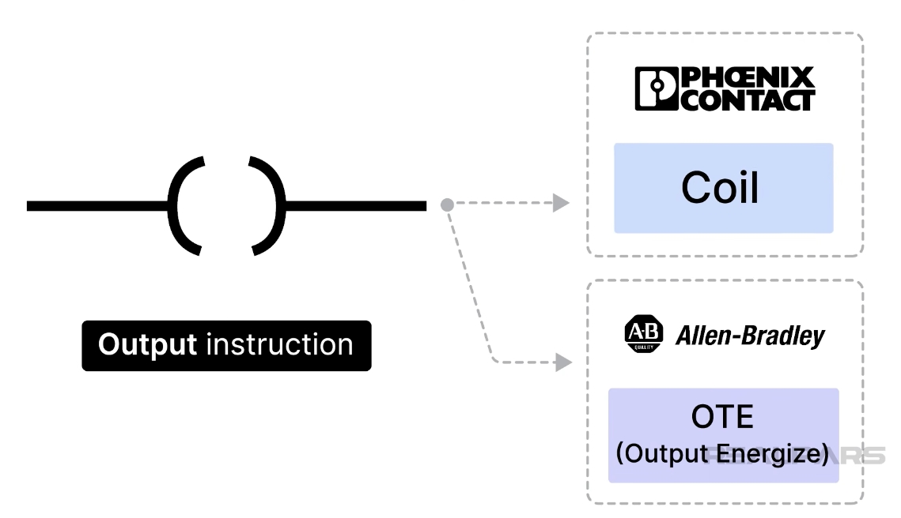

*Figure 13 / 圖 13：輸出指令——Phoenix Contact 稱為 Coil，Allen-Bradley 稱為 OTE（Output Energize）。*

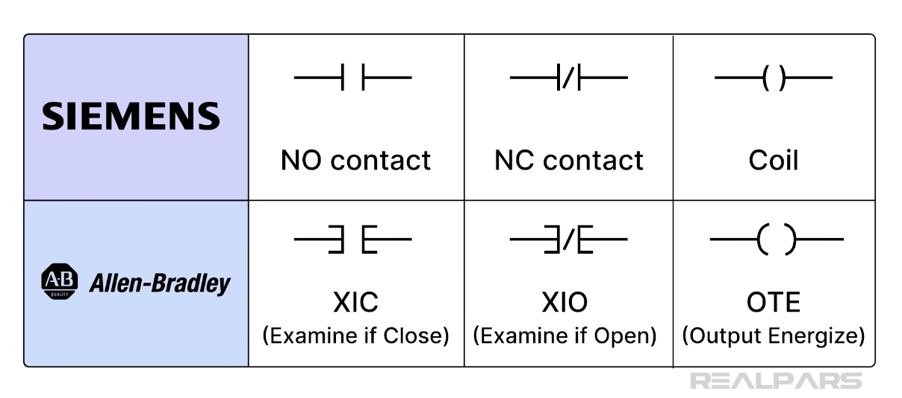

*Figure 14 / 圖 14：命名對照表（此表把線圈歸在 Siemens 欄；影片旁白則是以 Phoenix Contact 為例）。*

| Function 功能 | Siemens | Allen-Bradley |
|---|---|---|
| Normally-open contact 常開接點 | NO contact | **XIC** (Examine If Closed) |
| Normally-closed contact 常閉接點 | NC contact | **XIO** (Examine If Open) |
| Output 輸出 | Coil（旁白以 Phoenix Contact 為例） | **OTE** (Output Energize) |

> **Tip / 提示：** **EN:** These are **graphical instructions on a screen, not physical components** — they do not click shut or pop open. For both contacts, **closed = true** and **open = false**; in Allen-Bradley software a small **green bar** indicates **true**.
> **中文：** 這些是螢幕上的**圖形指令，不是實體元件**——不會「喀」一聲閉合或彈開。對兩種接點而言，**閉合＝真（true）、開啟＝假（false）**；在 Allen-Bradley 軟體中，**綠色小條**表示**真**。

---

## 5. Reading a Ladder Program / 如何閱讀梯形圖程式

**EN:** These instructions are **graphical representations of computer code**. In a ladder program:
- The **vertical lines** on the left and right are the **power rails**.
- **Rungs** connect the two rails and are populated with instructions.
- **Input instructions** connect to the **left** rail; **output instructions** connect to the **right** rail.
- The left rail is the **source of logical power**. For an output to turn on, there must be a **continuous path of true instructions** carrying logical power from the left rail to the right.

**中文：** 這些指令是**電腦程式碼的圖形化表示**。在梯形圖程式中：
- 左右兩條**垂直線**是**電源軌（power rails）**。
- **梯級（rung）** 連接兩條電源軌，上面放置指令。
- **輸入指令**接在**左側**電源軌；**輸出指令**接在**右側**電源軌。
- 左側電源軌是**邏輯電力的來源**。要讓輸出動作，必須有一條**由真（true）指令組成的連續路徑**，把邏輯電力從左軌傳到右軌。

**EN – A typical ladder logic program:** the video uses the program below as its example.

**中文 – 典型的梯形圖程式：** 影片以下面的程式作為範例說明。

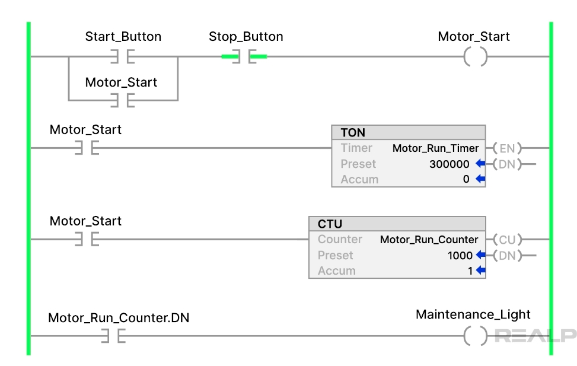

*Figure 15 / 圖 15：典型梯形圖——左右為電源軌，中間是各條梯級。*

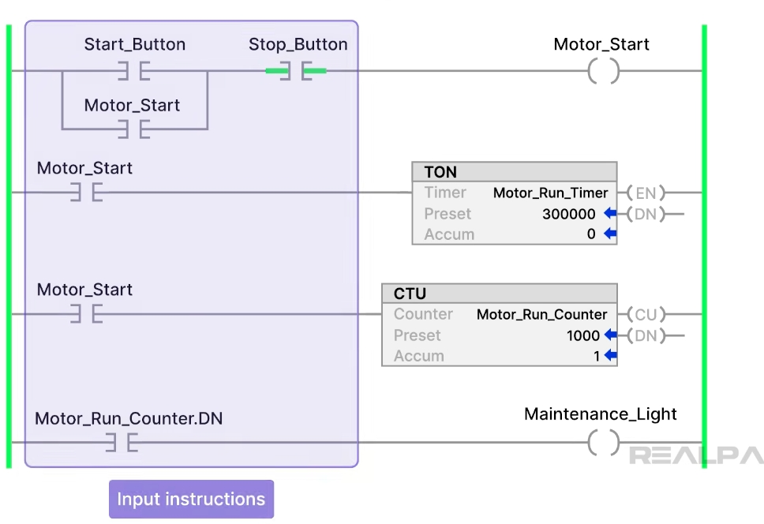

*Figure 16 / 圖 16：紫色區塊為**輸入指令**，位於**左側**。*

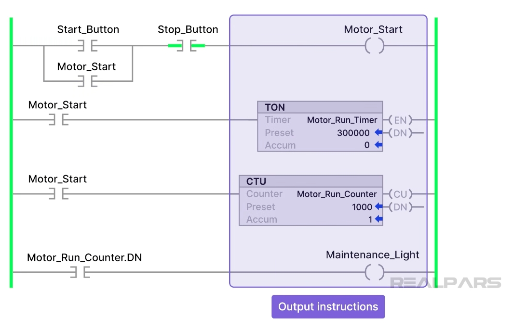

*Figure 17 / 圖 17：紫色區塊為**輸出指令**，位於**右側**。*

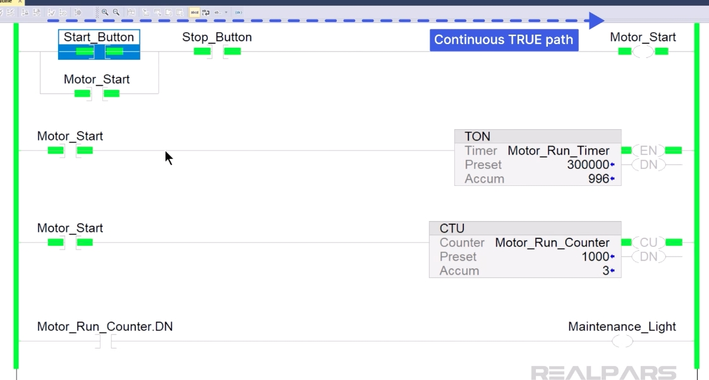

*Figure 18 / 圖 18：軟體中的實際畫面——從左軌到 `Motor_Start` 形成「Continuous TRUE path（連續真路徑）」，輸出因此動作。*

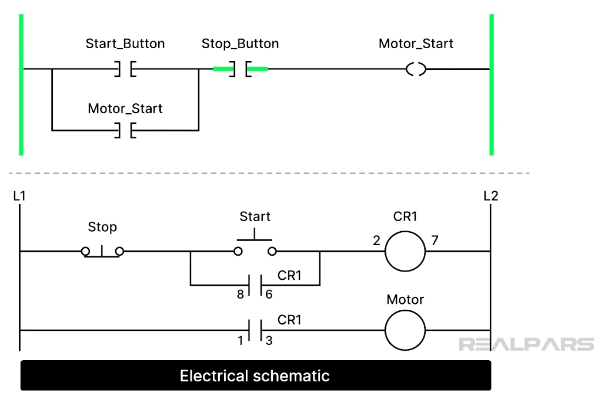

*Figure 19 / 圖 19：上為 PLC 梯形圖（`Start_Button` 並聯 `Motor_Start` 自保持，串聯 `Stop_Button`，輸出 `Motor_Start`）；下為對應的硬接線電氣原理圖（Stop、Start、CR1）。*

---

## 6. Analyzing the Motor Start/Stop Rung / 分析馬達啟停梯級

**EN – Why is Start false and Stop true at the beginning?** Each input instruction takes its status from the **physical device** connected to the PLC:
- The **Start_Button** instruction monitors **input terminal 0**.
- The **Stop_Button** instruction monitors **input terminal 3**.
- An **open path** to a terminal gives **logic 0**; a **closed path** gives **logic 1**. These values are stored in specific **PLC memory locations**.
- **Logic 0** → the associated instruction **stays in its present (default) state**.
- **Logic 1** → the associated instruction **changes to its opposite state**.

**中文 – 為什麼一開始 Start 為假、Stop 為真？** 每個輸入指令的狀態，都來自接在 PLC 上的**實體裝置**：
- **Start_Button** 指令監看**輸入端子 0**。
- **Stop_Button** 指令監看**輸入端子 3**。
- 端子的路徑**開路**得到**邏輯 0**；路徑**閉合**得到**邏輯 1**，這些值存放在特定的 **PLC 記憶體位址**。
- **邏輯 0** → 對應指令**維持目前（預設）狀態**。
- **邏輯 1** → 對應指令**變成相反狀態**。

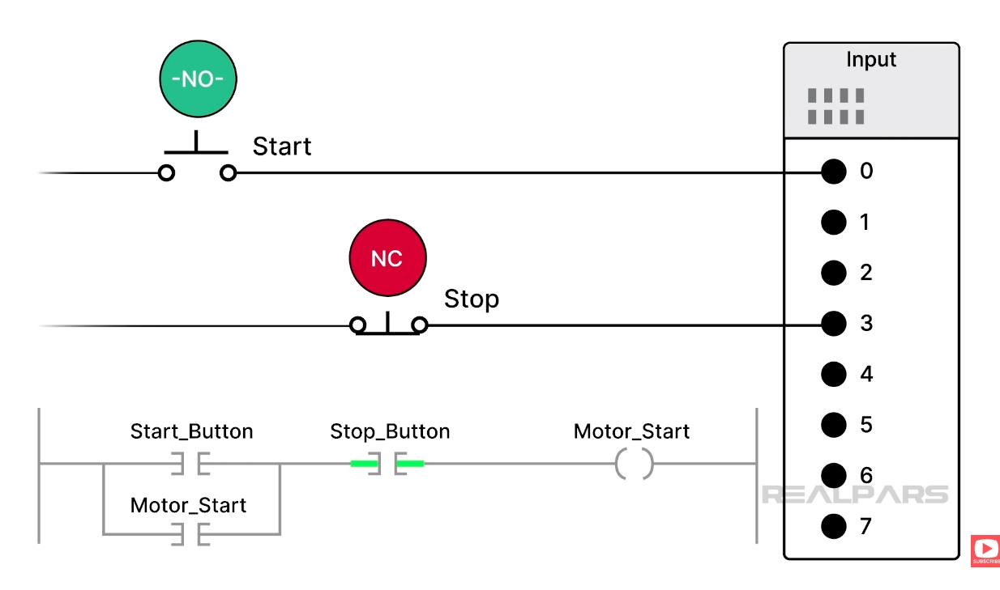

*Figure 20 / 圖 20：Start（NO）接端子 0、Stop（NC）接端子 3，下方為對應梯級。*

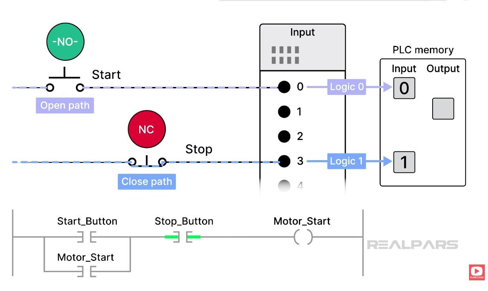

*Figure 21 / 圖 21：Start 為**開路（Open path）**→ 邏輯 0；Stop 為**閉路（Close path）**→ 邏輯 1；數值存入 PLC 記憶體的輸入區。*

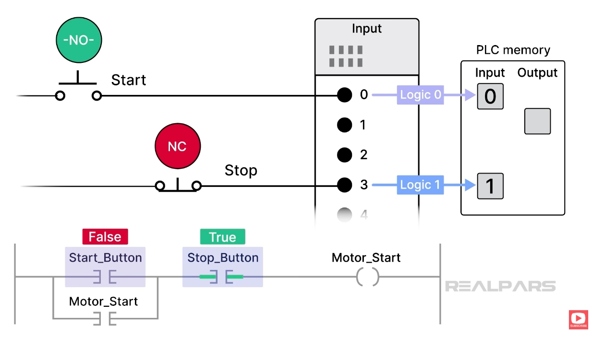

*Figure 22 / 圖 22：`Start_Button` 維持**假（False）**，`Stop_Button` 變為**真（True）**。*

| Situation 情況 | Terminal 端子 | Logic 邏輯值 | Instruction 指令狀態 |
|---|---|---|---|
| Start not pressed 未按 Start（NO 按鈕開路） | 0 | 0 | `Start_Button` stays **false** 維持為假 |
| Stop not pressed 未按 Stop（NC 按鈕閉合） | 3 | 1 | `Stop_Button` changes to **true** 變為真 |

**EN – Running the motor:**
1. **Press Start** → `Start_Button` becomes true → a **continuous path of true instructions** reaches the `Motor_Start` output → **the output turns on**, a logic 1 is written to a memory location, and the PLC runs the motor.
2. The `Motor_Start` contact in parallel also turns true, providing a path **around** `Start_Button` — so the motor **keeps running after the Start switch is released** (seal-in).
3. **Press Stop** → `Stop_Button` becomes **false**, breaking the continuous path → `Motor_Start` goes false and the **motor stops**.

**中文 – 讓馬達運轉：**
1. **按下 Start** → `Start_Button` 變為真 → 形成通往 `Motor_Start` 輸出的**連續真路徑** → **輸出動作**，邏輯 1 寫入記憶體位址，PLC 使馬達運轉。
2. 並聯的 `Motor_Start` 接點也變為真，提供一條**繞過** `Start_Button` 的路徑——因此**放開 Start 後馬達仍持續運轉**（自保持）。
3. **按下 Stop** → `Stop_Button` 變為**假**，連續路徑中斷 → `Motor_Start` 變為假，**馬達停止**。

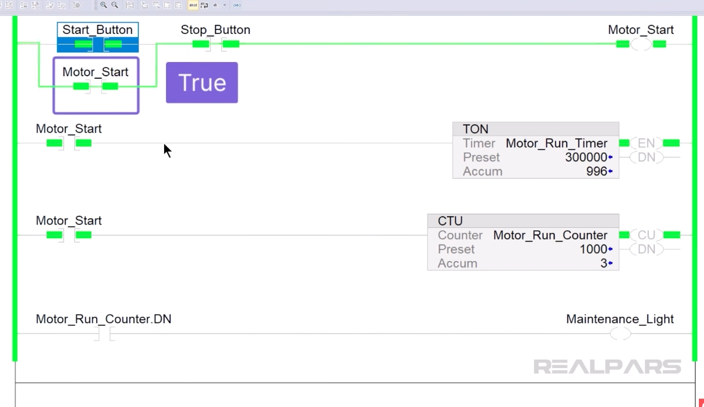

*Figure 23 / 圖 23：按下 Start 後，`Start_Button` 為真；並聯的 `Motor_Start` 接點亦為真（標示 True），形成繞過 Start 的自保持路徑。*

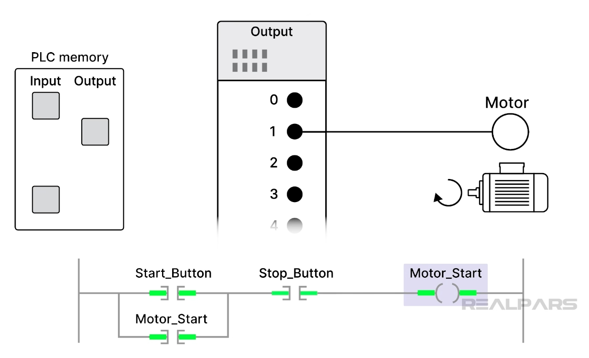

*Figure 24 / 圖 24：整條梯級皆為綠色（真），`Motor_Start` 輸出動作，輸出模組端子 1 使馬達運轉。*

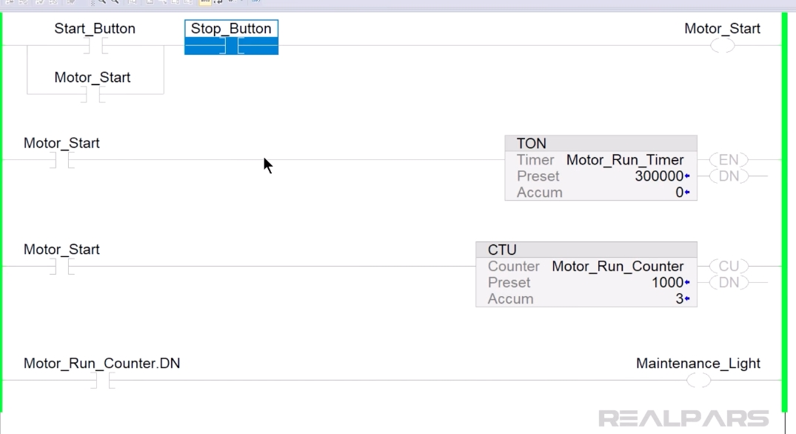

*Figure 25 / 圖 25：按下 Stop 後，`Stop_Button`（藍色選取）為假，連續路徑中斷，`Motor_Start` 熄滅，馬達停止。*

---

## 7. A Larger Program Seen in the Video / 影片中出現的較完整程式

> **Note / 備註：** **EN:** This is the same program the narrator uses to explain rails, rungs, inputs and outputs. The narration, however, only covers the first rung (Start/Stop/Motor_Start); the timer, counter and maintenance-light rungs are described here from the screenshots only. / **中文：** 這就是旁白用來說明電源軌、梯級、輸入與輸出的同一個程式。但旁白只講解第一條梯級（Start／Stop／Motor_Start）；計時器、計數器與維護燈的梯級，此處僅依截圖描述。

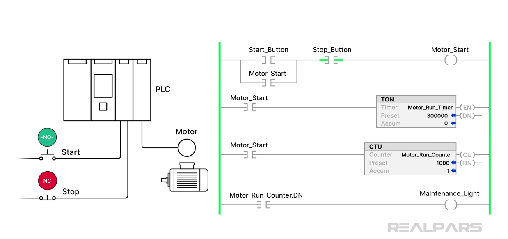

*Figure 26 / 圖 26：左為 PLC 接線，右為對應梯形圖。*

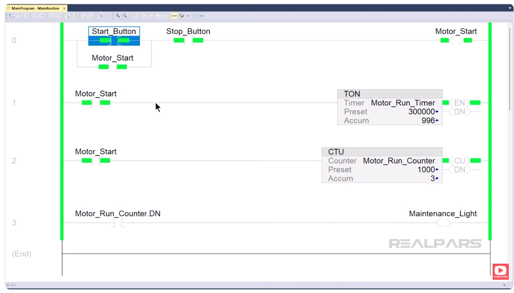

*Figure 27 / 圖 27：同一程式於軟體（MainProgram - MainRoutine）中執行的畫面，綠色代表導通。*

| Rung 梯級 | Logic 邏輯 |
|---|---|
| 0 | `Start_Button` ∥ `Motor_Start`，串聯 `Stop_Button` → `Motor_Start` |
| 1 | `Motor_Start` → **TON** `Motor_Run_Timer`（Preset 300000，單位 ms＝5 分鐘） |
| 2 | `Motor_Start` → **CTU** `Motor_Run_Counter`（Preset 1000） |
| 3 | `Motor_Run_Counter.DN` → `Maintenance_Light` |

**EN:** In other words: besides running the motor, the program times the run, **counts motor starts**, and turns on a **maintenance light** when the counter reaches its preset (the screenshot shows an accumulated value of 3 of 1000).

**中文：** 也就是說：除了驅動馬達，程式還會計時、**累計馬達啟動次數**，並在計數達到預設值時點亮**維護燈**（截圖中累計值為 3／1000）。

---

## 8. Example: Overhead Door Control / 範例：車庫捲門控制

**EN:** Now let's analyze a ladder program for an **overhead door**. The control console has **push buttons** (OPEN, CLOSE, STOP) and **three indicator lamps** (AJAR, OPEN, SHUT).

**中文：** 接著分析**捲門**的梯形圖程式。控制面板有**按鈕**（OPEN、CLOSE、STOP）與**三個指示燈**（AJAR、OPEN、SHUT）。

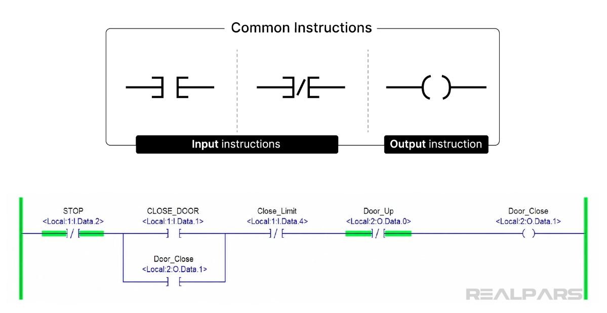

*Figure 28 / 圖 28：常用指令（輸入指令與輸出指令）；下方為捲門程式的一條梯級（STOP、CLOSE_DOOR、Close_Limit、Door_Up → Door_Close）。*

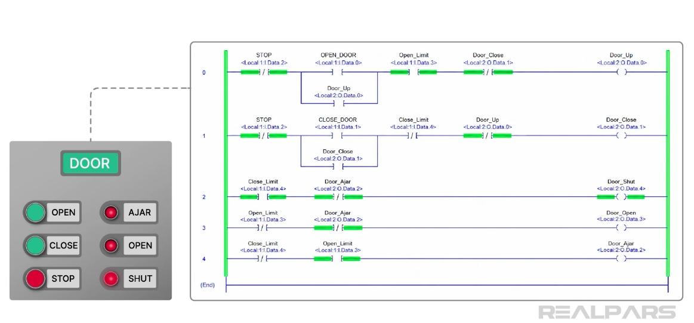

*Figure 29 / 圖 29：左為控制面板；右為梯形圖（Rung 0–4，輸出為 Door_Up、Door_Close、Door_Shut、Door_Open、Door_Ajar）。*

**EN – Reading the program:**
- The **Door_Shut** output instruction is **true**, so the **SHUT** light should be on — and it is.
- The **Door_Ajar** output instruction is **false**, so the **AJAR** light should be off — and it is.

**中文 – 閱讀程式：**
- **Door_Shut** 輸出指令為**真**，所以 **SHUT** 燈應該亮——確實亮著。
- **Door_Ajar** 輸出指令為**假**，所以 **AJAR** 燈應該熄滅——確實熄滅。

**EN – A tougher question: what type of switch is the STOP switch?**
- The STOP instruction is an **XIO (normally-closed)** instruction, and it is currently **true** (green bar).
- An XIO is true when its memory bit is **logic 0**.
- So there is a **logic 0** in its allocated PLC memory location, which means the **physical STOP switch must be a normally-open type**.

**中文 – 進階問題：STOP 開關是哪一種類型？**
- STOP 指令是 **XIO（常閉）** 指令，且目前為**真**（綠色條）。
- XIO 在其記憶體位元為**邏輯 0** 時為真。
- 因此其分配的 PLC 記憶體位址中存放的是**邏輯 0**，代表**實體 STOP 開關必定是常開型**。

---

## 9. Summary / 總結

**EN:**
- Ladder logic is one of the five IEC 61131-3 languages; it was the first and is still the most widely used.
- It resembles relay schematics, so electricians and maintenance staff can read it and troubleshoot quickly by watching rungs go true or false.
- Core instructions: **NO contact / XIC**, **NC contact / XIO**, **coil / OTE**.
- An output turns on only when there is a **continuous path of true instructions** from the left rail to the right.
- Each input instruction reflects the logic value (0 or 1) of the physical device connected to the PLC input.
- A parallel output contact creates a **seal-in** (hold-on) circuit — the heart of motor start/stop logic.
- Whether you see a Siemens NO contact, an Allen-Bradley XIC or a Phoenix Contact coil, **the logic is the same**: follow the true and false instructions and you will find the answer.

**中文：**
- 梯形圖是 IEC 61131-3 的五種語言之一；它最早出現，至今仍最廣泛使用。
- 它類似繼電器原理圖，電工與維修人員能讀懂，並透過觀察梯級真假快速排除故障。
- 核心指令：**NO contact／XIC**、**NC contact／XIO**、**coil／OTE**。
- 只有當左軌到右軌存在**由真指令組成的連續路徑**時，輸出才會動作。
- 每個輸入指令反映的是接在 PLC 輸入端的實體裝置之邏輯值（0 或 1）。
- 並聯的輸出接點可形成**自保持**電路——馬達啟停邏輯的核心。
- 不論你看到的是 Siemens 的 NO contact、Allen-Bradley 的 XIC，還是 Phoenix Contact 的 coil，**邏輯都相同**：沿著真與假的指令追下去，就能找到答案。
