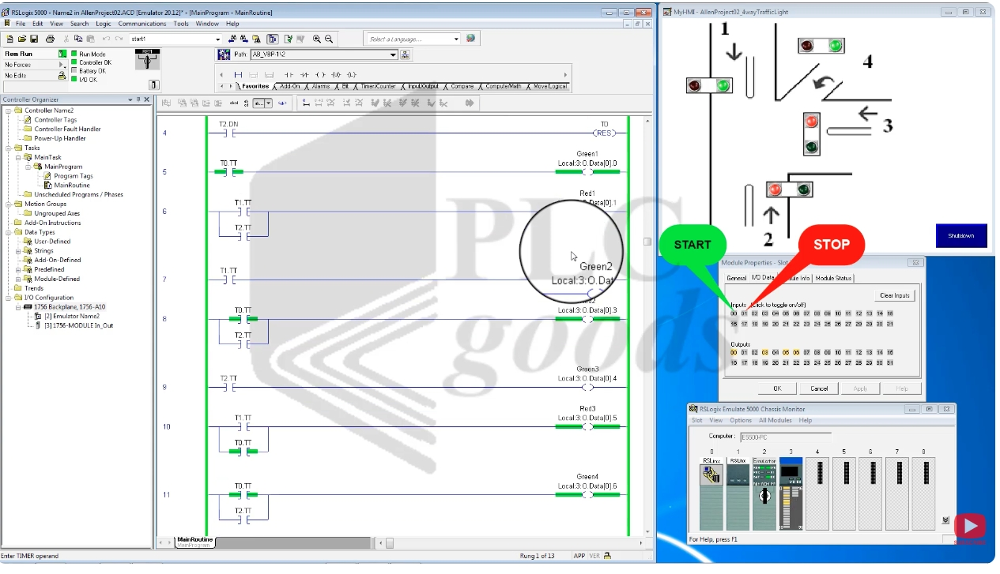
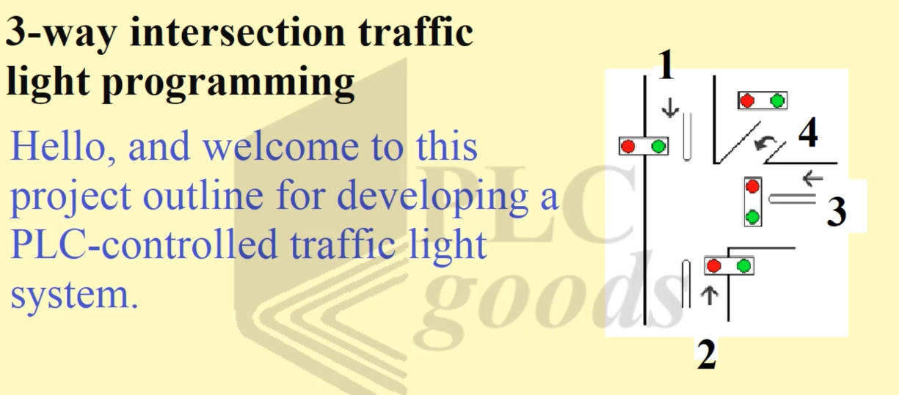
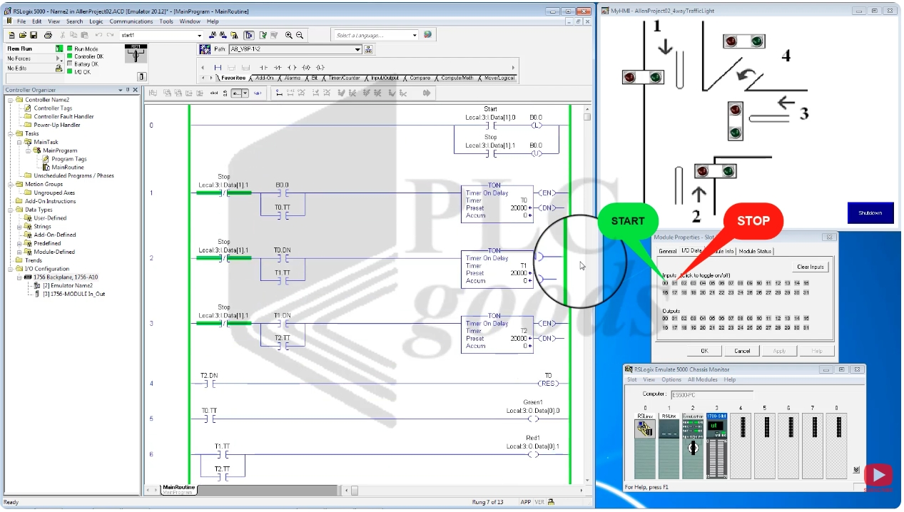

# PLC 3-Way Intersection Traffic Light Control – Ladder Logic Timer Sequence
# PLC 三向路口紅綠燈控制——梯形圖計時器順序控制（中英對照教程）

> Source / 來源: <https://www.youtube.com/watch?v=dsbLCPHHdNc> — *PLC 3-Way Traffic Light Control System | Ladder Logic Timer Sequence* (PLC Goods)
>
> Software in the video / 影片使用軟體: **RSLogix 5000**（Emulate 5000 虛擬 Allen-Bradley 控制器）＋ HMI 畫面 *AllenProject02_4wayTrafficLight*。

---

## 1. Project Requirements / 專案需求

**EN:** Design a program to control the traffic lights of a **three-way intersection** with these rules:

1. **Directions 1, 2 and 3** each get a green phase of **20 seconds**, one after another.
2. **Direction 4** stops **only when direction 2 is active**.
3. The system is **started and stopped** with a **Start** and a **Stop** button.

**中文：** 設計一個控制**三向路口**紅綠燈的程式，規則如下：

1. **方向 1、2、3** 依序各通行 **20 秒**。
2. **方向 4** 僅在**方向 2 通行時**才停止。
3. 系統以 **Start** 與 **Stop** 按鈕**啟動與停止**。



*Figure 1 / 圖 1：路口示意圖——方向 1（由上往下）、方向 2（由下往上）、方向 3（由右往左）、方向 4（右轉彎道），每個方向各有一組紅／綠燈。*

---

## 2. I/O List / I/O 點位表

| Tag 標籤 | Address 位址 | Type 類型 | Description 說明 |
|---|---|---|---|
| Start | `Local:3:I.Data[1].0` | Input 輸入 | Start button 啟動按鈕 |
| Stop | `Local:3:I.Data[1].1` | Input 輸入 | Stop button 停止按鈕 |
| B0.0 | Bit 位元 | Internal 內部 | System-running latch 系統運轉閂鎖 |
| T0 / T1 / T2 | TON timers | Timer 計時器 | Phase timers, preset 20000 ms (=20 s) 各相位計時器，預設 20000 ms（20 秒） |
| Green1 / Red1 | `Local:3:O.Data[0].0` / `.1` | Output 輸出 | Direction 1 lights 方向 1 號誌 |
| Green2 / Red2 | `Local:3:O.Data[0].2` / `.3` | Output 輸出 | Direction 2 lights 方向 2 號誌 |
| Green3 / Red3 | `Local:3:O.Data[0].4` / `.5` | Output 輸出 | Direction 3 lights 方向 3 號誌 |
| Green4 | `Local:3:O.Data[0].6` | Output 輸出 | Direction 4 green 方向 4 綠燈 |

> **Note / 備註：** **EN:** Direction 4's red lamp is on a rung below the visible part of the screenshots, so it is not listed with a confirmed address. / **中文：** 方向 4 的紅燈梯級位於截圖可見範圍之外，因此未列出已確認的位址。

---

## 3. Program Overview / 程式概述



*Figure 2 / 圖 2：RSLogix 5000 主程式（MainRoutine）梯級 0–6；右側為 HMI 與 I/O 資料視窗，標示 **START**（輸入位元 00）與 **STOP**（輸入位元 01）。*

### Rung 0 – Start/Stop latch / 梯級 0：啟動／停止閂鎖

```
 |--[ Start ]--------------------( L  B0.0 )--|
 |--[ Stop  ]--------------------( U  B0.0 )--|
```

**EN:** Pressing **Start** **latches** (OTL) bit `B0.0`, which means "system running". Pressing **Stop** **unlatches** (OTU) `B0.0`.

**中文：** 按下 **Start** 會**閂鎖**（OTL）位元 `B0.0`，代表「系統運轉中」。按下 **Stop** 則**解除閂鎖**（OTU）`B0.0`。

### Rungs 1–3 – The three phase timers / 梯級 1–3：三個相位計時器

```
 Rung 1:  |--[/ Stop ]--+--[ B0.0 ]--+--( TON T0  Preset 20000 )--|
                        +--[ T0.TT ]-+
 Rung 2:  |--[/ Stop ]--+--[ T0.DN ]-+--( TON T1  Preset 20000 )--|
                        +--[ T1.TT ]-+
 Rung 3:  |--[/ Stop ]--+--[ T1.DN ]-+--( TON T2  Preset 20000 )--|
                        +--[ T2.TT ]-+
```

**EN:**
- **T0** starts when the system is running (`B0.0`).
- **T1** starts when **T0 is done** (`T0.DN`).
- **T2** starts when **T1 is done** (`T1.DN`).
- Each timer is a **TON (Timer On-Delay)** with a preset of **20000 ms = 20 seconds**.
- The **Stop** contact is **XIO (normally closed)** in series with every timer rung: pressing Stop **immediately drops all timers**, so the whole system shuts down at once.
- `.TT` (timer timing) contacts in parallel keep each rung true while that timer is timing.

**中文：**
- **T0** 在系統運轉（`B0.0`）時啟動。
- **T1** 在 **T0 完成**（`T0.DN`）後啟動。
- **T2** 在 **T1 完成**（`T1.DN`）後啟動。
- 每個計時器都是 **TON（接通延遲計時器）**，預設值 **20000 ms ＝ 20 秒**。
- **Stop** 接點是 **XIO（常閉）**，與每一條計時器梯級串聯：按下 Stop 會**立即中斷所有計時器**，整個系統同時關閉。
- 並聯的 `.TT`（計時中）接點，讓該計時器計時期間梯級保持成立。

### Rung 4 – Loop back / 梯級 4：循環回到起點

```
 |--[ T2.DN ]----------------------( RES  T0 )--|
```

**EN:** When **T2 finishes**, `T2.DN` **resets T0** (RES), so the sequence **loops back to T0** and repeats.

**中文：** **T2 結束**時，`T2.DN` 會**重置 T0**（RES），讓順序**回到 T0** 並重複進行。

### Rungs 5–12 – Light outputs / 梯級 5–12：號誌輸出

**EN:** The lamps are driven directly by the timers' **timing bits (`.TT`)**. A timer is "timing" during its own 20-second phase:

| Rung 梯級 | Condition 條件 | Output 輸出 |
|---|---|---|
| 5 | `T0.TT` | **Green1** |
| 6 | `T1.TT` **or** `T2.TT` | **Red1** |
| 7 | `T1.TT` | **Green2** |
| 8 | `T0.TT` **or** `T2.TT` | **Red2** |
| 9 | `T2.TT` | **Green3** |
| 10 | `T1.TT` **or** `T0.TT` | **Red3** |
| 11 | `T0.TT` **or** `T2.TT` | **Green4** |

**中文：** 號誌直接由各計時器的**計時中位元（`.TT`）** 驅動；計時器只在自己的 20 秒相位期間處於「計時中」（見上表）。



*Figure 3 / 圖 3：執行中——T0 相位：`Green1`、`Red2`、`Red3`、`Green4` 為綠色導通；HMI 顯示方向 1 與 4 綠燈、方向 2 與 3 紅燈。*

---

## 4. Operation Sequence / 動作順序

**EN:** The video starts the system and shows the sequence: **T0 runs for 20 s, then T1 for 20 s, then T2 for 20 s, then the program loops back to T0**, repeating forever.

| Phase 相位 | Timer 計時器 | Time 時間 | Dir 1 | Dir 2 | Dir 3 | Dir 4 |
|---|---|---|---|---|---|---|
| 1 | T0 | 0–20 s | **Green 綠** | Red 紅 | Red 紅 | **Green 綠** |
| 2 | T1 | 20–40 s | Red 紅 | **Green 綠** | Red 紅 | Red 紅 *(inferred 推論)* |
| 3 | T2 | 40–60 s | Red 紅 | Red 紅 | **Green 綠** | **Green 綠** |
| — | T2 done → RES T0 | — | loop back to phase 1 回到相位 1 | | | |

**EN:** **Direction 4** is green during phases 1 and 3 and **stops only during phase 2**, exactly as the requirement says ("stops only when direction 2 is active"). The red state of direction 4 in phase 2 is inferred from this rule, as its rung is off-screen.

**中文：** 影片啟動系統並展示順序：**T0 運行 20 秒 → T1 運行 20 秒 → T2 運行 20 秒 → 回到 T0**，無限重複。

**方向 4** 在相位 1 與 3 為綠燈，**只在相位 2 停止**，與需求「僅在方向 2 通行時停止」一致。相位 2 時方向 4 的紅燈是依此規則推論，因為其梯級不在截圖範圍內。

### Stop and restart / 停止與重新啟動

**EN:**
- **Stop** pressed → `B0.0` is unlatched and the Stop XIO contacts break all timer rungs → **the system shuts down immediately** (all lights go out).
- **Start** pressed again → the system **turns on again** and starts from phase 1 (T0).

**中文：**
- 按下 **Stop** → `B0.0` 解除閂鎖，Stop 的 XIO 接點切斷所有計時器梯級 → **系統立即停機**（所有燈熄滅）。
- 再按 **Start** → 系統**重新啟動**，從相位 1（T0）開始。

---

## 5. Key Concepts Used / 使用的關鍵概念

| Concept 概念 | Where used 使用位置 |
|---|---|
| **OTL / OTU (latch / unlatch)** 閂鎖／解除閂鎖 | Rung 0 – system start/stop 梯級 0 啟停 |
| **TON timers in a chain** 串接的 TON 計時器 | Rungs 1–3 – each timer starts when the previous is done 每個計時器在前一個完成後啟動 |
| **`.DN` and `.TT` bits** | `.DN` triggers the next timer；`.TT` drives lamps `.DN` 觸發下一個計時器；`.TT` 驅動號誌 |
| **RES (reset)** 重置 | Rung 4 – loops the sequence 梯級 4 使順序循環 |
| **XIO Stop in series** 串聯的 XIO Stop | Immediate shutdown 立即停機 |
| **Interlocking by phase** 依相位互鎖 | Each direction's red/green comes from different timer bits 各方向的紅／綠燈來自不同計時器位元 |

---

## 6. Summary / 總結

**EN:**
- Three TON timers (20 s each) are chained: **T0 → T1 → T2**, and `T2.DN` **resets T0** to repeat the cycle.
- The lights are driven by the timers' **timing bits**, so each direction's green appears only in its own phase.
- Direction 4 follows directions 1 and 3 and **stops only while direction 2 is green**.
- **Start** latches the system on; **Stop** unlatches it and cuts all timers, shutting everything down at once.
- The project was successfully tested on a **virtual Allen-Bradley PLC**.

**中文：**
- 三個 TON 計時器（各 20 秒）串接：**T0 → T1 → T2**，並由 `T2.DN` **重置 T0** 使循環重複。
- 號誌由計時器的**計時中位元**驅動，因此每個方向的綠燈只在自己的相位出現。
- 方向 4 跟隨方向 1 與 3 通行，**只在方向 2 綠燈時停止**。
- **Start** 使系統閂鎖運轉；**Stop** 解除閂鎖並切斷所有計時器，使一切立即停止。
- 本專案已在**虛擬 Allen-Bradley PLC** 上測試成功。
