# 電梯梯形圖教學(中英對照)
# Elevator Ladder Logic Tutorial (Chinese–English)

> 來源 Source: https://www.youtube.com/watch?v=L79lrvXrB-s — *Elevator Ladder Logic Diagram (Real PLC Example)*

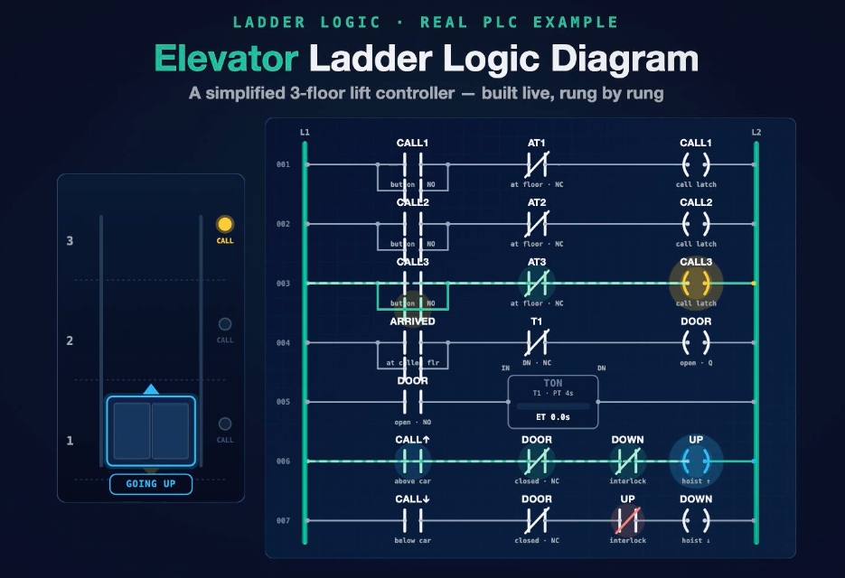

**中文**:這是一個簡化的 3 層電梯控制程式,以 PLC 梯形圖實際運行。呼叫按鈕會亮燈、車廂在樓層間移動、門有倒數計時。學完本教學,你將能自己建立這個程式、執行它,並解釋每一個接點。它是 PLC 入門的經典範例,因為七個梯級就涵蓋了三大核心概念。

**English**: This is a simplified 3‑floor lift running live as a PLC ladder program: a call button lights up, the car moves between floors, and a door timer counts down. By the end you will be able to build this exact program, run it, and explain every contact. It is a favorite PLC training example because seven rungs pack in three big ideas.

---

## 1. 三大重點 / The Three Big Ideas

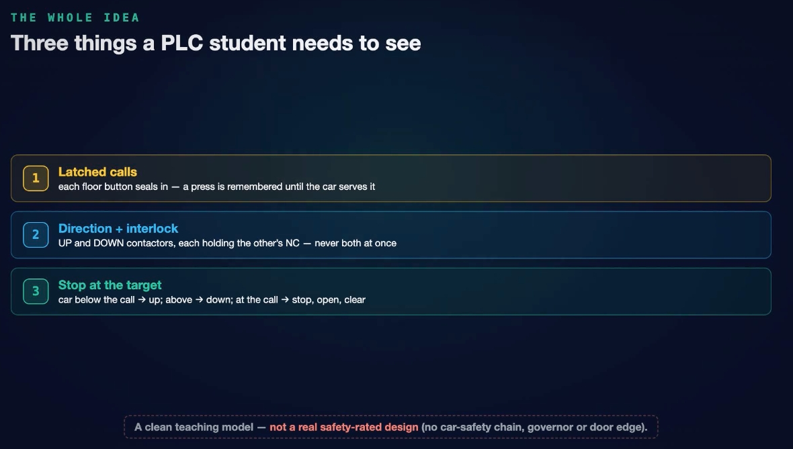

| # | 中文 | English |
|---|------|---------|
| 1 | **呼叫自保持(閂鎖)**:每個樓層按鈕以自保持接點封住自己,輕按一下也會被記住,直到車廂真正服務該樓層。 | **Latched calls**: every floor button seals itself in, so a quick tap is remembered until the car serves it. |
| 2 | **方向互鎖**:上行與下行接觸器各自串入對方的常閉接點,因此永遠不會同時激磁。 | **Direction with interlock**: the UP and DOWN contactors each hold the other's NC contact, so they can never be energized together. |
| 3 | **到達目標即停**:程式比較車廂位置與呼叫樓層,決定上行、下行,或停止並開門。 | **Stop at the target**: the program compares the car's floor with the call and decides go up, go down, or stop and open the door. |

> ⚠️ **中文**:這是乾淨的教學模型,**不是**符合安全規範的真實設計。真正的電梯還需要車廂安全迴路、超速限速器、門邊緣偵測等許多機制。
> ⚠️ **English**: This is a clean teaching model, **not** a real safety‑rated design. A genuine lift adds a car safety chain, an overspeed governor, door edge detection, and much more.

---

## 2. 機器與 I/O / The Machine and I/O

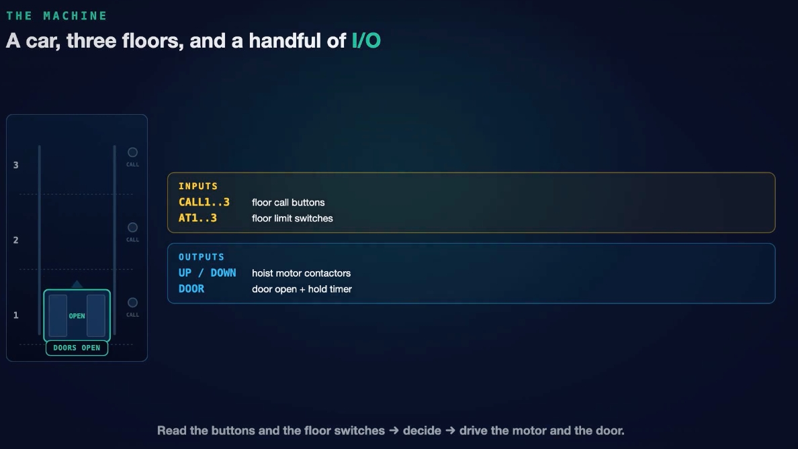

**中文**:單一車廂、一個井道、三個樓層。

**English**: A single car, one shaft, three floors.

| | 中文 | English |
|---|---|---|
| **輸入 Inputs** | `CALL1..3` 樓層呼叫按鈕(每層一個) | `CALL1..3` floor call buttons (one per floor) |
| | `AT1..3` 樓層限位開關,告知車廂目前位置 | `AT1..3` floor limit switches telling the PLC where the car is |
| **輸出 Outputs** | `UP / DOWN` 曳引機馬達接觸器 | `UP / DOWN` hoist motor contactors |
| | `DOOR` 開門輸出與門保持計時器 | `DOOR` door output with hold timer |

**中文**:梯形圖的工作就是:讀取按鈕與樓層開關 → 做出決定 → 驅動馬達與門。
**English**: The job of the ladder: read the buttons and floor switches → decide → drive the motor and the door.

---

## 3. 梯級 001–003:呼叫閂鎖 / Rungs 001–003: Latched Calls

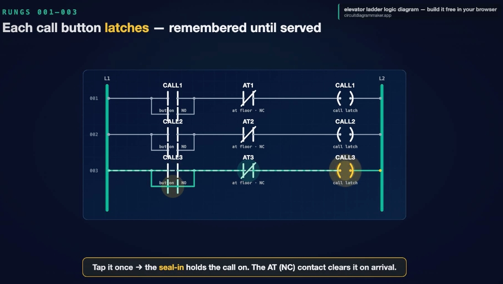

**中文**:三個樓層的梯級完全相同。以第 3 層為例:左側電源線接 `CALL3` 按鈕常開接點,並聯 `CALL3` 線圈自己的常開接點(自保持),再串聯 `AT3` 樓層開關的**常閉**接點,最後接 `CALL3` 線圈。

按下按鈕,線圈得電,其自保持接點閉合,形成繞過按鈕的第二條通路,所以放開按鈕後呼叫仍保持,車廂「記住」了它。唯一的清除方式:車廂抵達 3 樓時,`AT3` 開關動作,常閉接點斷開,線圈失電,自保持接點彈開——呼叫已被服務並忘記。

**English**: The three floor rungs are identical. Take floor 3: from the left rail, the `CALL3` button NO contact, in parallel with the `CALL3` coil's own NO contact (the seal‑in), in series with the `AT3` floor switch as a **normally closed** contact, feeding the `CALL3` coil.

Tap the button and the coil energizes; its seal‑in contact closes, giving a second path around the button, so the call stays latched after you let go. It clears only one way: when the car reaches floor 3, the `AT3` switch opens its NC contact, the coil drops, and the seal‑in springs open: served and forgotten.

---

## 4. 決策:比較位置與呼叫 / The Decision: Compare Car vs. Call

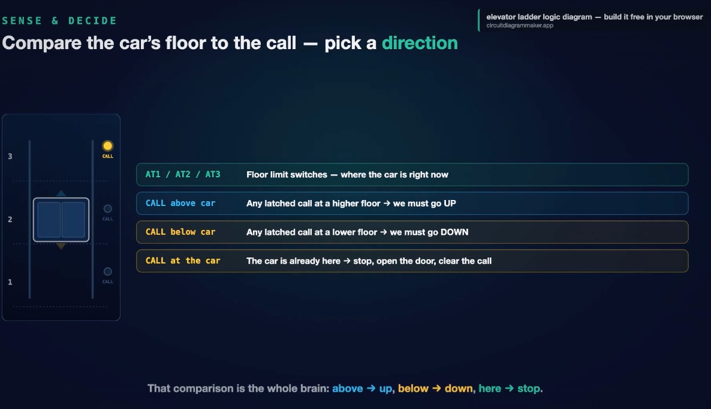

| 中文 | English |
|------|---------|
| `AT1 / AT2 / AT3`:樓層限位開關,車廂此刻的位置 | `AT1 / AT2 / AT3`: floor limit switches, where the car is right now |
| `CALL above car`:較高樓層有已閂鎖的呼叫 → 必須**上行** | `CALL above car`: a latched call at a higher floor → go **UP** |
| `CALL below car`:較低樓層有已閂鎖的呼叫 → 必須**下行** | `CALL below car`: a latched call at a lower floor → go **DOWN** |
| `CALL at the car`:車廂已在此層 → 停止、開門、清除呼叫 | `CALL at the car`: the car is already here → stop, open the door, clear the call |

**中文**:這個比較就是整部電梯的大腦:**上方 → 上行,下方 → 下行,同層 → 停止。**其餘只是把決定接線到兩個馬達接觸器與門。
**English**: That comparison is the whole brain: **above → up, below → down, here → stop.** Everything else is wiring that decision into two motor contactors and a door.

---

## 5. 梯級 006–007:上行與下行接觸器 / Rungs 006–007: UP and DOWN Contactors

**中文**
- **梯級 006(上行)**:串聯「上方有呼叫」接點 → `DOOR` 常閉接點(門開時不得移動)→ `DOWN` 常閉接點 → `UP` 線圈。
- **梯級 007(下行)**:為其鏡像:「下方有呼叫」接點 → `DOOR` 常閉 → `UP` 常閉 → `DOWN` 線圈。

**English**
- **Rung 006 (UP)**: a contact true when there is a call above the car → NC `DOOR` contact (no moving with the door open) → NC `DOWN` contact → `UP` coil.
- **Rung 007 (DOWN)**: the mirror image: call below the car → NC `DOOR` contact → NC `UP` contact → `DOWN` coil.

**上行中 / Going up:**

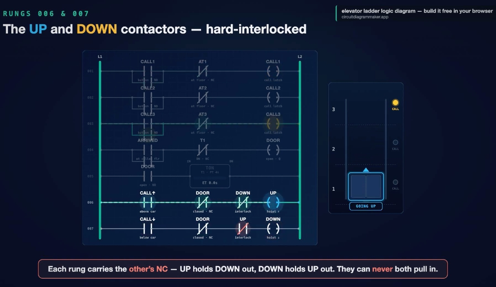

**下行中 / Going down:**

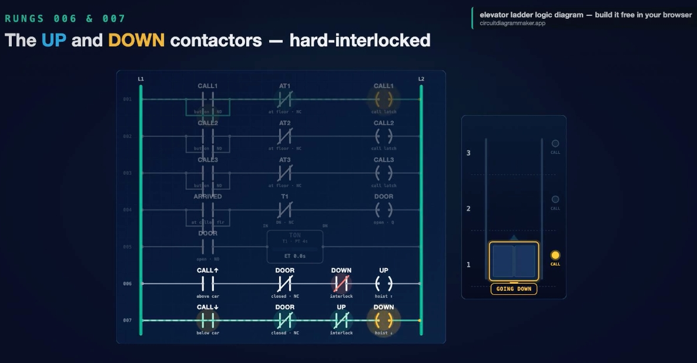

**中文**:上行梯級帶著下行的常閉接點,下行梯級帶著上行的常閉接點;誰先吸合,其常閉接點就斷開並擋住另一個。上行擋住下行,下行擋住上行,兩者永遠不會同時接通。

**English**: The UP rung carries DOWN's NC contact and the DOWN rung carries UP's NC contact. Whichever pulls in first opens its NC contact and blocks the other. UP holds DOWN out, DOWN holds UP out: they can never both be on.

---

## 6. 完整動作流程 / Watching It Run

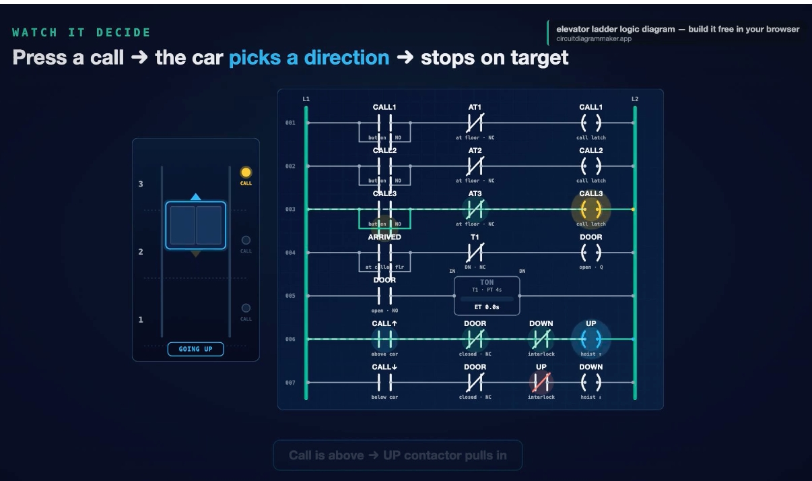

**中文**:車廂閒置在 1 樓,有人在 3 樓按下呼叫。呼叫閂鎖、指示燈持續亮。程式比較後發現呼叫在上方、門已關、`DOWN` 未激磁,於是 `UP` 接觸器吸合,車廂上升,經過 2 樓繼續前進,直到 `AT3` 開關閉合。

**English**: The car idles on floor 1. Someone on floor 3 presses their call button; it latches and the lamp stays lit. The program compares: the call is above the car, the doors are closed, `DOWN` is not energized, so the `UP` contactor pulls in and the car rises, passing floor 2 until the `AT3` switch closes.

---

## 7. 到達即停 / Stop at the Target

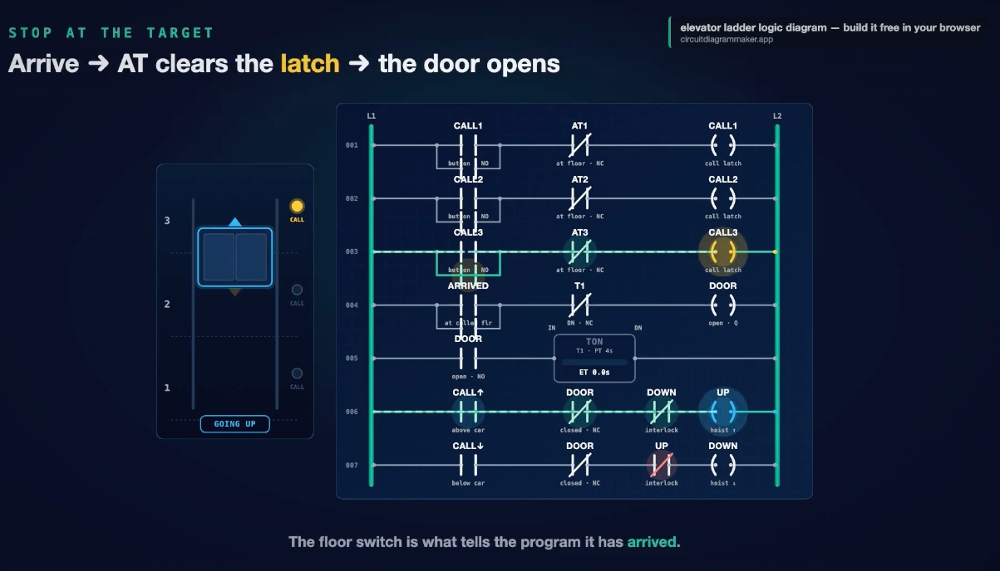

**中文**:車廂爬向 3 樓,`AT3` 閉合。同一個掃描週期內發生兩件事:

1. 呼叫梯級中 `AT3` 的常閉接點斷開,`CALL3` 閂鎖被清除。
2. 呼叫消失後,上行梯級失去條件,`UP` 接觸器釋放,馬達停止;同時門梯級偵測到「到達」並開門。

樓層開關是唯一把「朝目標移動」轉換為「已到達:停止並開門」的輸入。

**English**: The car climbs toward floor 3 and `AT3` closes. In the same scan, two things happen:

1. The NC `AT3` contact on the call rung opens and the `CALL3` latch clears: the call is served.
2. With the call gone, the UP rung loses its condition, `UP` releases and the motor stops; the door rung sees the arrival and opens the door.

The floor switch is the single input that turns "moving toward a target" into "arrived, stop and open."

---

## 8. 梯級 004–005:門與 TON 計時器 / Rungs 004–005: Door and TON Timer

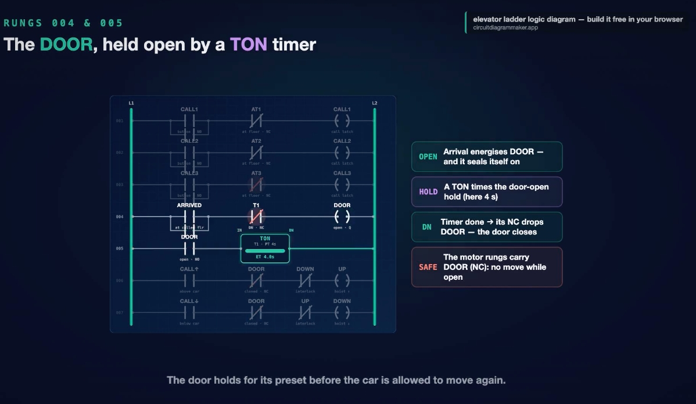

| 標籤 Tag | 中文 | English |
|---|---|---|
| **OPEN** | 到達時 `DOOR` 輸出得電,並自保持。 | Arrival energizes `DOOR`, and it seals itself on. |
| **HOLD** | 梯級 005:`DOOR` 常開接點驅動接通延遲計時器 `TON T1`,預設值數秒(此例 4 秒),即開門保持時間。 | Rung 005: a NO `DOOR` contact feeds an on‑delay timer `TON T1` with a preset of a few seconds (4 s here), the door hold time. |
| **DN** | 計時到達預設值,完成位(DN)動作,梯級 004 中 T1 的常閉接點斷開,`DOOR` 失電,門關閉。 | When elapsed time reaches the preset, the Done bit fires, its NC contact on rung 004 opens, `DOOR` drops, and the door closes. |
| **SAFE** | 兩條馬達梯級都帶 `DOOR` 常閉接點:門開著時車廂無法移動。 | Both motor rungs carry `DOOR` as a normally closed contact: the car cannot move while the door is open. |

**中文**:門必須關閉、保持時間必須走完,上行或下行才能再次吸合。
**English**: The door has to close and the hold has to finish before UP or DOWN can pull in again.

---

## 9. 最重要的規則:互鎖 / The Rule That Matters Most: Interlock

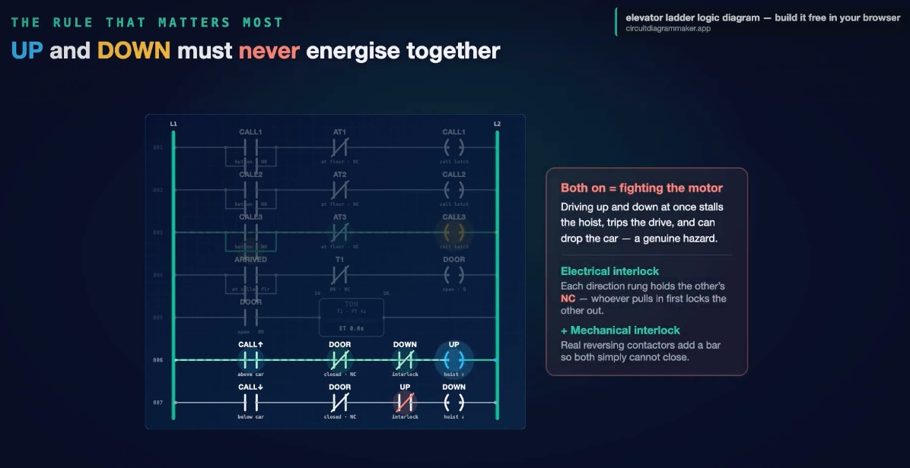

**中文**:上行與下行同時通電,等於命令曳引機朝兩個方向驅動:馬達堵轉、驅動器跳脫,在真實機器上甚至可能造成車廂墜落,是真正的危險。因此以電氣方式互鎖:

- **電氣互鎖**:每個方向梯級都串入對方的常閉輔助接點,如同正反轉馬達啟動器;先吸合者鎖住另一個。
- **+ 機械互鎖**:真實的正反轉接觸器還會加一根實體連桿,使兩者根本無法同時閉合(雙重保險)。

**English**: Driving up and down at once means fighting the motor: it stalls the hoist, trips the drive, and on a real machine can drop the car, a genuine hazard. So we interlock them:

- **Electrical interlock**: each direction rung carries the other's NC auxiliary contact, exactly like a reversing motor starter; whoever pulls in first locks the other out.
- **+ Mechanical interlock**: real reversing contactors add a physical bar so both simply cannot close (belt and braces).

---

## 10. 全部整合 / Everything Together

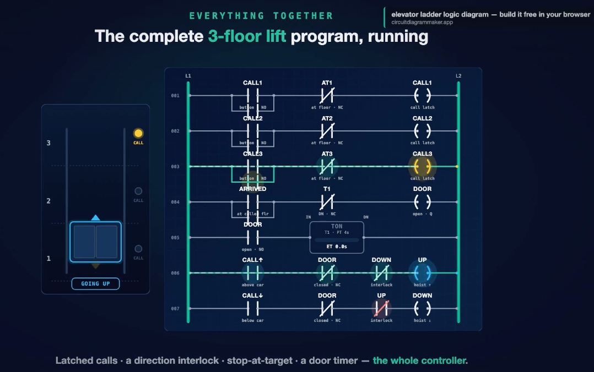

**中文**:情境:車廂在 1 樓。呼叫來自 3 樓並閂鎖 → 呼叫在上方 → `UP` 吸合 → 車廂上升 → 到達後呼叫清除、`UP` 釋放、門開啟,計時器開始計時。門保持期間,1 樓有人呼叫,該呼叫被閂鎖並等待。計時完成、門關閉後,呼叫位於車廂下方,`DOWN` 吸合,車廂下降到 1 樓,呼叫清除,門再次開啟,車廂回到閒置。

**English**: Scenario: the car is on floor 1. A call from floor 3 latches → call above → `UP` pulls in → car rises → on arrival the call clears, `UP` drops and the door opens while the timer counts. Mid‑hold, someone calls from floor 1; that call latches and waits. The timer finishes, the door closes, and now the call is below the car, so `DOWN` pulls in; the car reaches floor 1, the call clears, the door opens again, and the car settles back to idle.

> **中文**:閂鎖呼叫、方向互鎖、到達即停、門計時器,共同協作。
> **English**: Latched calls, direction interlock, stop at target, and the door timer, all working together.

---

## 11. 梯形圖符號對應真實面板 / Rung ⇄ Reality

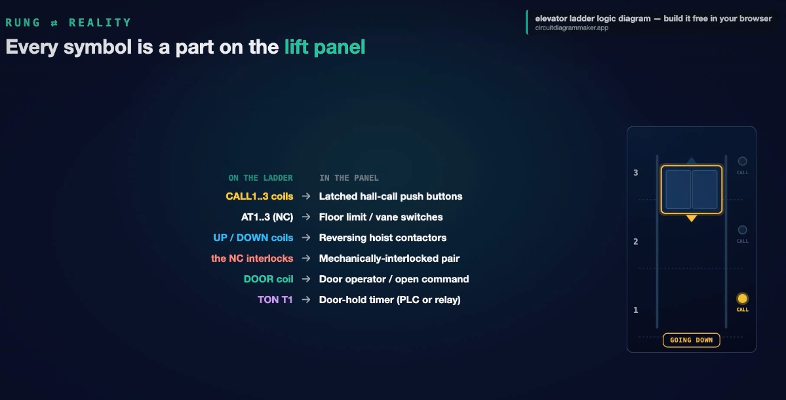

| 梯形圖 On the ladder | 實際面板 In the panel |
|---|---|
| `CALL1..3` 線圈 coils | 閂鎖式樓層呼叫按鈕 / Latched hall‑call push buttons |
| `AT1..3`(常閉 NC) | 樓層限位 / 葉片開關 / Floor limit or vane switches |
| `UP / DOWN` 線圈 coils | 正反轉曳引機接觸器 / Reversing hoist contactors |
| 常閉互鎖 NC interlocks | 機械互鎖接觸器組 / Mechanically‑interlocked pair |
| `DOOR` 線圈 coil | 門機/開門指令 / Door operator / open command |
| `TON T1` | 門保持計時器(PLC 內或繼電器)/ Door‑hold timer (PLC or relay) |

**中文**:讀懂梯形圖,就是讀懂控制面板的接線。
**English**: Read the ladder and you are reading the wiring of the panel.

---

## 12. 總結:五個重點 / Recap: Five Ideas

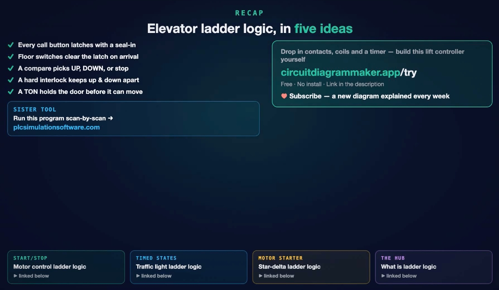

1. ✅ **每個呼叫按鈕以自保持閂鎖** / Every call button latches with a seal‑in
2. ✅ **樓層開關在到達時清除閂鎖** / Floor switches clear the latch on arrival
3. ✅ **比較邏輯選擇上行、下行或停止** / A compare picks UP, DOWN, or stop
4. ✅ **硬互鎖讓上下行互相隔離** / A hard interlock keeps up and down apart
5. ✅ **TON 在車廂可再移動前保持門開** / A TON holds the door before the car can move again

**中文**:整個簡化電梯控制器只用七個梯級。想進一步學習,可看同系列的啟停馬達控制、紅綠燈狀態機、星三角啟動器等範例。

**English**: The whole simplified lift controller fits in seven rungs. To go deeper, see the same series' start/stop motor control, traffic‑light state machine, and star‑delta starter examples.

**工具 Tools**
- 免費線上梯形圖編輯器 / Free online ladder editor: circuitdiagrammaker.app/try
- 逐掃描週期模擬 PLC 程式 / Scan‑by‑scan PLC simulator: plcsimulationsoftware.com

---

## 附錄:梯級總表 / Appendix: Rung Summary

| 梯級 Rung | 功能 Function | 邏輯 Logic |
|---|---|---|
| 001 | 1 樓呼叫閂鎖 / Floor 1 call latch | `(CALL1 ∥ CALL1) — /AT1 — (CALL1)` |
| 002 | 2 樓呼叫閂鎖 / Floor 2 call latch | `(CALL2 ∥ CALL2) — /AT2 — (CALL2)` |
| 003 | 3 樓呼叫閂鎖 / Floor 3 call latch | `(CALL3 ∥ CALL3) — /AT3 — (CALL3)` |
| 004 | 開門並自保持 / Door open + seal‑in | `(ARRIVED ∥ DOOR) — /T1.DN — (DOOR)` |
| 005 | 門保持計時 / Door hold timer | `DOOR — TON T1 (PT = 4 s)` |
| 006 | 上行 / Hoist up | `CALL↑ — /DOOR — /DOWN — (UP)` |
| 007 | 下行 / Hoist down | `CALL↓ — /DOOR — /UP — (DOWN)` |
