# Xcode 多目標（Flavor）建立教學 — 第一部分
# How to Create Multiple Targets (Flavors) in Xcode — Part 1

> 影片來源 / Source video: https://www.youtube.com/watch?v=ylxVO3IMuJU
> 本篇為教學上集，共 13 張截圖 / This is Part 1 of the tutorial, containing 13 screenshots (m01_01–m01_13).

---

## 前言 / Introduction

| 中文 | English |
|---|---|
| 假設我們有兩個非常相似的 App，例如一個是「User（使用者）App」，另一個是「Provider（服務提供者）App」。兩者的畫面、大小幾乎一樣，只是品牌、圖示、Bundle ID 等細節不同。與其分別維護兩個獨立的 Xcode 專案，不如在**同一個專案**裡建立**多個 Target（也稱 Flavor）**，共用同一套畫面與程式碼。 | Suppose we have two very similar apps — for example, a "User" app and a "Provider" app. Their screens and size are almost identical; only branding, icons, and the Bundle ID differ. Instead of maintaining two completely separate Xcode projects, we can create **multiple targets (also called "flavors")** inside a **single project**, sharing the same screens and code. |
| 這樣做的好處是：畫面共用、不用重複開發；上架 App Store 時，兩個 App 仍然是完全獨立、分開上架的兩個產品。 | The benefit: shared screens with no duplicated development effort. When publishing to the App Store, the two apps are still completely separate, independently listed products. |

---

## 步驟一：建立新專案 / Step 1: Create a New Project

| 中文 | English |
|---|---|
| 開啟 Xcode，選擇「Create a new Xcode project」，在範本畫面中選擇 **App**，然後按 **Next**。 | Open Xcode and choose "Create a new Xcode project." On the template screen, select **App**, then click **Next**. |

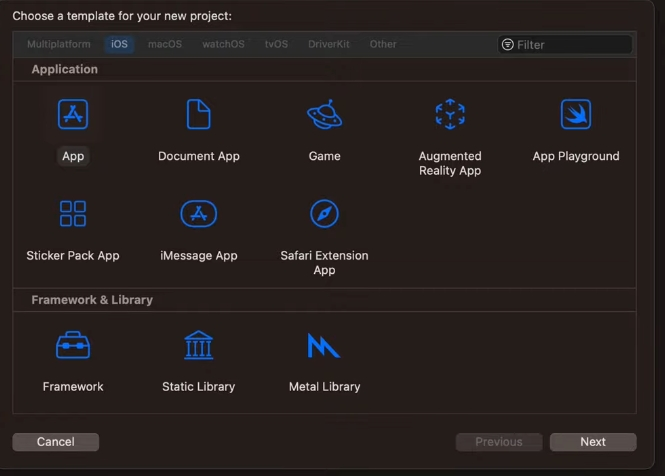

| 中文 | English |
|---|---|
| 接著設定專案基本資訊：**Product Name**（此例輸入 `FalvorApp`）、Team、**Organization Identifier**（`com.aait.com`），Xcode 會自動組合出 **Bundle Identifier**（`com.aait.com.FalvorApp`）。Interface 選擇 Storyboard，語言選擇 Swift，其餘選項可依需求勾選後按 **Next** 建立專案。 | Next, set the basic project info: **Product Name** (here `FalvorApp`), Team, and **Organization Identifier** (`com.aait.com`) — Xcode automatically combines these into the **Bundle Identifier** (`com.aait.com.FalvorApp`). Choose Storyboard for Interface and Swift for Language, check any other options as needed, then click **Next** to create the project. |

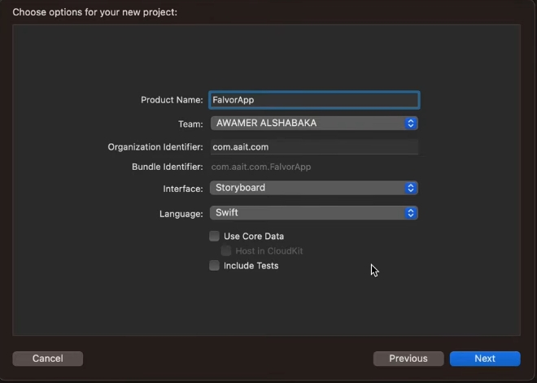

| 中文 | English |
|---|---|
| 專案建立完成後，可以在專案設定的 **General** 頁籤看到目前只有一個 Target：`FalvorApp`。這裡可以看到 Bundle Identifier、支援的裝置（iPhone / iPad / Mac）、最低支援的 iOS 版本等資訊。這就是我們接下來要「複製」出第二個 Target 的起點。 | Once the project is created, open the **General** tab of the project settings — you'll see there is currently only one target: `FalvorApp`. Here you can see the Bundle Identifier, supported destinations (iPhone / iPad / Mac), minimum iOS deployment version, and more. This is our starting point for "duplicating" a second target. |

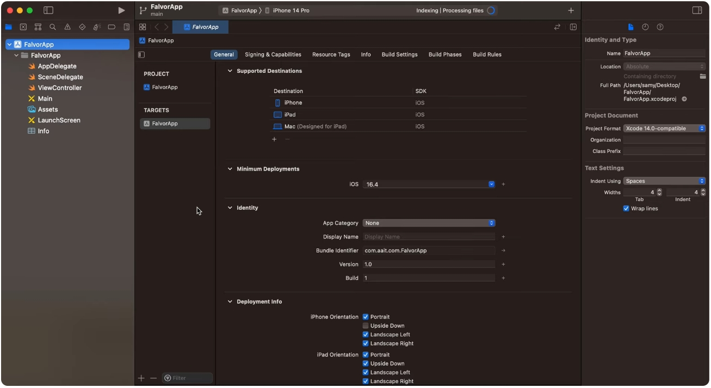

---

## 步驟二：複製出第二個 Target（Provider App）/ Step 2: Duplicate a Second Target (Provider App)

| 中文 | English |
|---|---|
| 在左側 **TARGETS** 清單中，對著 `FalvorApp` 這個 Target 按右鍵（或 Control+點擊），選單會出現 **Duplicate**（複製）與 **Delete**（刪除）兩個選項。點選 **Duplicate**，Xcode 會以現有 Target 為範本，建立一個一模一樣設定的新 Target。 | In the **TARGETS** list on the left, right-click (or Control-click) the `FalvorApp` target. A context menu appears with **Duplicate** and **Delete** options. Click **Duplicate** — Xcode will create a new target with identical settings, based on the existing one. |

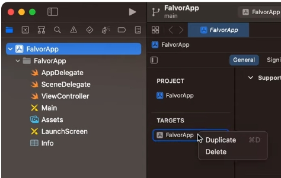

| 中文 | English |
|---|---|
| 複製完成後，TARGETS 清單多出一個新的 Target（此例暫時命名為 `ProviderApp`）。同時，Xcode 也會自動產生一份對應的 Info.plist 檔案，預設命名類似 `FalvorApp copy-Info`，出現在專案導覽列中，並標示 **A**（Added，代表新增的檔案）。 | After duplicating, a new target appears in the TARGETS list (here temporarily named `ProviderApp`). Xcode also automatically generates a corresponding Info.plist file, by default named something like `FalvorApp copy-Info`, which shows up in the project navigator marked with an **A** (Added). |

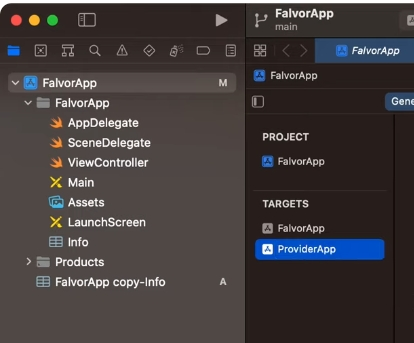

| 中文 | English |
|---|---|
| 為了避免混淆，建議立即把這個新增的 Info.plist 重新命名成有意義的名稱，例如 `ProviderApp-Info`，方便之後在 Build Settings 中對應到正確的 Target。此步驟直接在檔案清單中對檔名雙擊即可重新命名。 | To avoid confusion, it's best to immediately rename this new Info.plist file to something meaningful, such as `ProviderApp-Info`, so it can later be correctly matched to its target in Build Settings. Simply double-click the filename in the navigator to rename it. |

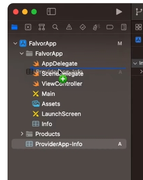

| 中文 | English |
|---|---|
| 重新命名完成後，可以在導覽列中看到檔案已更新為 `ProviderApp-Info`，一樣標示 **A**（新增/尚未加入版本控制）。這個檔案之後會作為第二個 App（Provider App）的專屬 Info.plist。 | After renaming, the navigator shows the file has been updated to `ProviderApp-Info`, still marked with **A** (added / not yet committed to version control). This file will serve as the dedicated Info.plist for the second app (Provider App). |

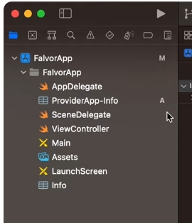

---

## 步驟三：在 Build Settings 中指定正確的 Info.plist / Step 3: Point Build Settings to the Correct Info.plist

| 中文 | English |
|---|---|
| 光是重新命名檔案還不夠，還必須到專案設定的 **Build Settings** 分頁，選取新的 `ProviderApp` Target，在搜尋欄輸入 `pack` 快速篩選找到 **Generate Info.plist File** 這個選項，確認它設為 **Yes**。 | Renaming the file alone isn't enough — you also need to go to the **Build Settings** tab of the project, select the new `ProviderApp` target, and type `pack` in the search box to quickly filter down to the **Generate Info.plist File** setting. Confirm it is set to **Yes**. |

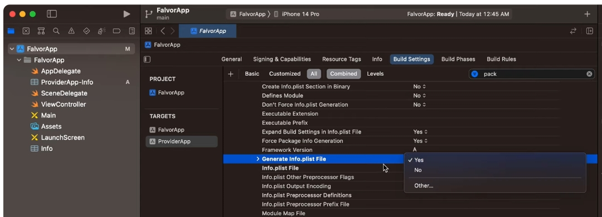

| 中文 | English |
|---|---|
| 接著找到 **Info.plist File** 設定項，把它的路徑改成剛剛重新命名的檔案：`ProviderApp-Info.plist`。這樣一來，`ProviderApp` 這個 Target 在編譯時就會使用專屬的 Info.plist，而不會跟原本的 `FalvorApp` 共用同一份設定。 | Next, find the **Info.plist File** setting and change its path to the file you just renamed: `ProviderApp-Info.plist`. This way, the `ProviderApp` target will use its own dedicated Info.plist when building, instead of sharing the same one as `FalvorApp`. |

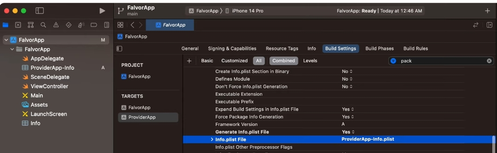

---

## 步驟四：建立與管理 Scheme / Step 4: Create and Manage Schemes

| 中文 | English |
|---|---|
| 有了兩個 Target 之後，還需要對應的 **Scheme** 才能分別執行（Run）不同的 App。點擊工具列上方的 Scheme 選單，會看到目前的 Scheme 清單（例如自動產生的 `FalvorApp` 與 `FalvorApp copy`），選單底部提供 **Edit Scheme…**、**New Scheme…**、**Manage Schemes…** 等選項。 | With two targets in place, we also need corresponding **Schemes** to run each app separately. Click the Scheme menu in the toolbar to see the current list of schemes (e.g., the auto-generated `FalvorApp` and `FalvorApp copy`). At the bottom of the menu are options such as **Edit Scheme…**, **New Scheme…**, and **Manage Schemes…**. |

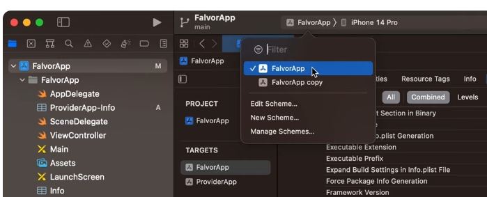

| 中文 | English |
|---|---|
| 選擇 **Edit Scheme…** 可以進一步檢視、調整目前這個 Scheme 對應到哪一個 Target、要用哪一個 Build Configuration（Debug / Release）等設定。 | Choosing **Edit Scheme…** lets you further inspect and adjust which target the current scheme is tied to, and which build configuration (Debug / Release) it uses. |

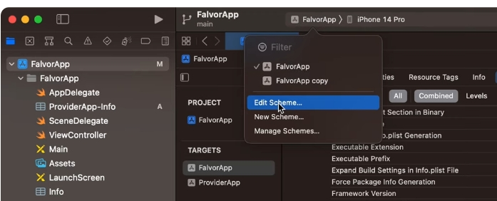

| 中文 | English |
|---|---|
| 在 Scheme 編輯視窗中，左側可看到 Build、Run、Test、Profile、Analyze、Archive 等各階段設定；點進 **Run > Arguments** 分頁，可以在 **Arguments Passed On Launch** 與 **Environment Variables** 中加入啟動參數或環境變數（後續章節會用這裡來區分「目前是哪一個 App 在執行」）。視窗底部也有 **Duplicate Scheme**、**Manage Schemes…** 等按鈕。 | In the scheme editor, the left side lists stages such as Build, Run, Test, Profile, Analyze, and Archive. Clicking into the **Run > Arguments** tab lets you add launch arguments or environment variables under **Arguments Passed On Launch** and **Environment Variables** (used later to determine "which app is currently running"). At the bottom of the window are buttons like **Duplicate Scheme** and **Manage Schemes…**. |

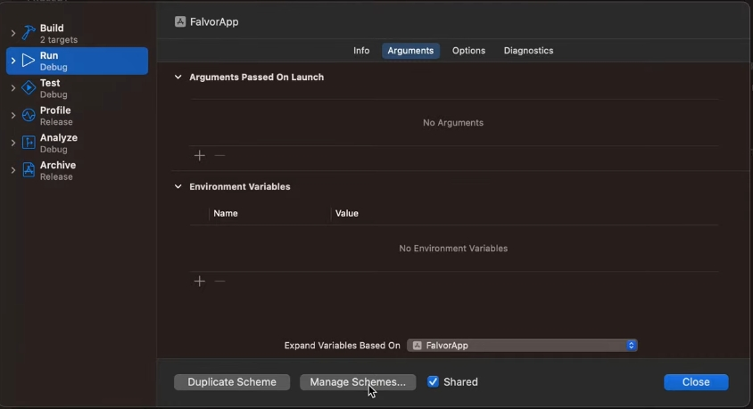

| 中文 | English |
|---|---|
| 最後，在 **Manage Schemes** 視窗中可以看到目前專案內所有的 Scheme（`FalvorApp`、`FalvorApp copy`），並勾選 **Autocreate schemes**，讓 Xcode 依照 Target 自動建立/更新對應的 Scheme，同時可設定每個 Scheme 是否 **Shared**（共用，通常建議打勾以便加入版本控制、團隊共用）。 | Finally, the **Manage Schemes** window shows all schemes currently in the project (`FalvorApp`, `FalvorApp copy`). Check **Autocreate schemes** to let Xcode automatically create/update schemes to match your targets, and set whether each scheme is **Shared** (usually recommended, so it's checked into version control and shared with the team). |

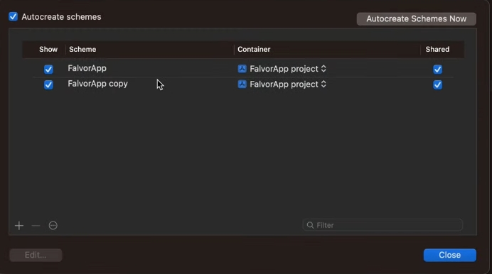

---

> 待續 / To be continued — 下一部分將接續示範：如何在程式碼中依 Target 判斷「目前是哪一個 App」、加入專屬的顏色/文字、以及如何為不同 Target 設定不同的 CocoaPods 依賴與 App Icon。
> The next part will continue with: detecting "which app is currently running" from within the code based on the target, adding target-specific colors/text, configuring different CocoaPods dependencies per target, and setting a different App Icon for each target.
