# Xcode 多目標（Flavor）建立教學 — 第二部分
# How to Create Multiple Targets (Flavors) in Xcode — Part 2

> 影片來源 / Source video: https://www.youtube.com/watch?v=ylxVO3IMuJU
> 本篇為教學下集，共 14 張截圖 / This is Part 2 of the tutorial, containing 14 screenshots (m01_14–m01_27).
> 承接第一部分 / Continuing from Part 1.

---

## 步驟五：整理 Scheme（刪除舊的、為新 Target 建立對應的 Scheme）/ Step 5: Clean Up Schemes (Delete the Old One, Create a New One for the New Target)

| 中文 | English |
|---|---|
| 回到 **Manage Schemes** 視窗，先把自動產生、多餘的 `FalvorApp copy` 這個 Scheme 移除：選取它後按下方的「−」，Xcode 會跳出確認視窗「Do you really want to delete the scheme "FalvorApp copy"? This operation cannot be undone.」，按 **Delete** 確認刪除。 | Back in the **Manage Schemes** window, first remove the redundant auto-generated `FalvorApp copy` scheme: select it and click the "−" button at the bottom. Xcode shows a confirmation dialog — "Do you really want to delete the scheme 'FalvorApp copy'? This operation cannot be undone." Click **Delete** to confirm. |

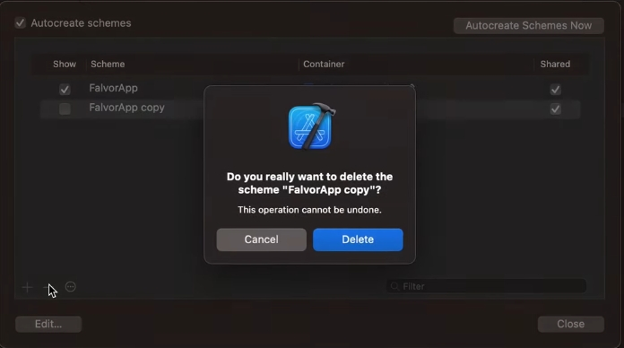

| 中文 | English |
|---|---|
| 接著按左下角的「＋」新增一個 Scheme，在跳出的視窗中把 **Target** 選成剛剛建立的 `ProviderApp`，**Name** 也輸入 `ProviderApp`，按 **OK** 建立。這樣就有一個名稱與 Target 完全對應、清楚好辨識的 Scheme 了。 | Next, click the "＋" button in the lower-left corner to add a new scheme. In the dialog that appears, set **Target** to the `ProviderApp` target you just created, and enter `ProviderApp` for **Name**, then click **OK** to create it. Now you have a scheme whose name clearly and directly matches its target. |

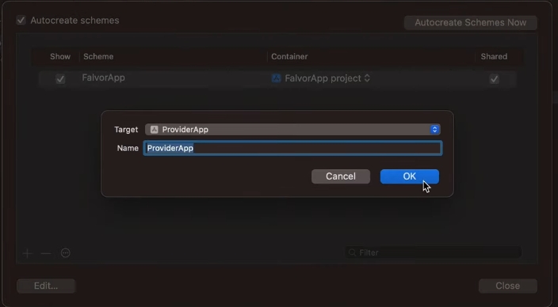

| 中文 | English |
|---|---|
| 整理完成後，**Manage Schemes** 清單就會清爽地只剩下兩個對應目標的 Scheme：`FalvorApp` 與 `ProviderApp`，並且都勾選 **Show** 與 **Shared**，方便日後直接從 Scheme 選單切換執行。 | After cleanup, the **Manage Schemes** list neatly shows only two schemes matching the two targets: `FalvorApp` and `ProviderApp`, both with **Show** and **Shared** checked — making it easy to switch and run either one directly from the scheme menu later. |

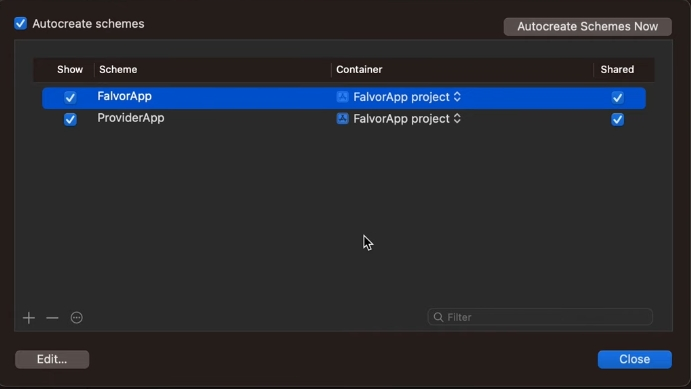

---

## 步驟六：設定 ProviderApp 的簽署與 Bundle Identifier / Step 6: Configure Signing and Bundle Identifier for ProviderApp

| 中文 | English |
|---|---|
| 切到 `ProviderApp` 這個 Target 的 **Signing & Capabilities** 分頁，勾選 **Automatically manage signing**，選擇 Team，並把 **Bundle Identifier** 改成獨立的識別碼，例如 `com.aait.com.ProviderApp`，確保兩個 App 上架時是完全獨立的兩個 App ID。 | Switch to the `ProviderApp` target's **Signing & Capabilities** tab, check **Automatically manage signing**, choose your Team, and change the **Bundle Identifier** to a unique value, e.g. `com.aait.com.ProviderApp` — ensuring the two apps have completely separate App IDs when published. |

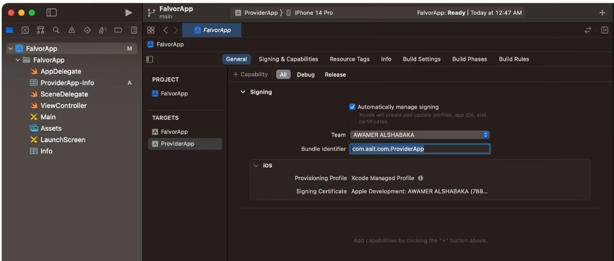

| 中文 | English |
|---|---|
| 這時再打開工具列上方的 Scheme 選單，就能看到清爽的兩個選項：`FalvorApp` 與 `ProviderApp`，並可以直接切換、Edit Scheme、New Scheme 或 Manage Schemes。 | Opening the toolbar's scheme menu now shows a clean pair of options: `FalvorApp` and `ProviderApp`. You can switch between them directly, or choose Edit Scheme, New Scheme, or Manage Schemes. |

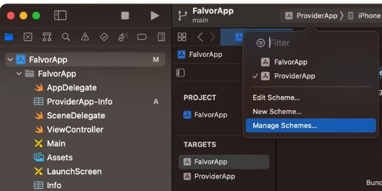

---

## 步驟七：用 Build Settings 的 Custom Flags 區分兩個 Target / Step 7: Distinguish the Two Targets with Custom Compiler Flags

| 中文 | English |
|---|---|
| 到專案的 **Build Settings**，在搜尋欄輸入 `othe`（快速篩選 Other Swift Flags），選取 `FalvorApp` 這個 Target，在 **Swift Compiler - Custom Flags → Other Swift Flags** 底下，對 Debug 與 Release 都加入 `-DUSER`。這個旗標之後會在程式碼中用來判斷「現在編譯／執行的是 User App」。 | In the project's **Build Settings**, type `othe` in the search box (to quickly filter to Other Swift Flags), select the `FalvorApp` target, and under **Swift Compiler - Custom Flags → Other Swift Flags**, add `-DUSER` for both Debug and Release. This flag will later be used in code to determine "this build is the User app." |


| 中文 | English |
|---|---|
| 同樣地，切到 `ProviderApp` 這個 Target，在 **Other Swift Flags** 底下的 Debug 與 Release 都加入 `-DPROVIDER`，作為「現在是 Provider App」的旗標。 | Similarly, switch to the `ProviderApp` target and add `-DPROVIDER` under **Other Swift Flags** for both Debug and Release, marking "this build is the Provider app." |

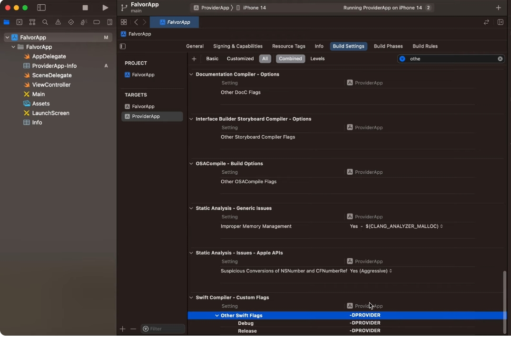

---

## 步驟八：建立 FlavorTarget 列舉，並依編譯旗標判斷目前是哪一個 App / Step 8: Create a FlavorTarget Enum and Detect the Current App via Compiler Flags

| 中文 | English |
|---|---|
| 新增一個檔案 `FlavorTarget.swift`，定義一個簡單的列舉（enum），列出目前所有的 Flavor：`user` 與 `provider`。 | Create a new file called `FlavorTarget.swift` and define a simple enum listing all the current flavors: `user` and `provider`. |

```swift
enum FlavorTarget: String {
    case user
    case provider
}
```

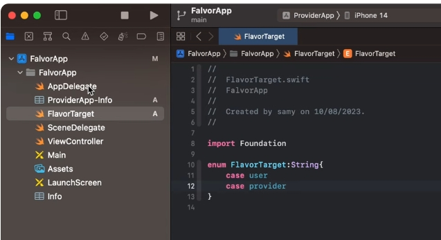

| 中文 | English |
|---|---|
| 接著在 `AppDelegate.swift` 中新增一個靜態屬性 `flavor`，利用先前在 Build Settings 設定的編譯旗標（`USER` / `PROVIDER`）搭配 `#if / #elseif / #else` 條件編譯，回傳目前對應的 `FlavorTarget`；如果兩個旗標都沒有正確設定，就直接 `fatalError` 提醒開發者「Target Flag incorrectly specified」。 | Next, in `AppDelegate.swift`, add a static property called `flavor`. Using the compiler flags set earlier in Build Settings (`USER` / `PROVIDER`) together with `#if / #elseif / #else` conditional compilation, it returns the corresponding `FlavorTarget`. If neither flag is set correctly, it triggers `fatalError` with the message "Target Flag incorrectly specified" to alert the developer. |

```swift
static var flavor: FlavorTarget {
    #if USER
    return .user
    #elseif PROVIDER
    return .provider
    #else
    return fatalError("Target Flag incorrectly specified")
    #endif
}
```

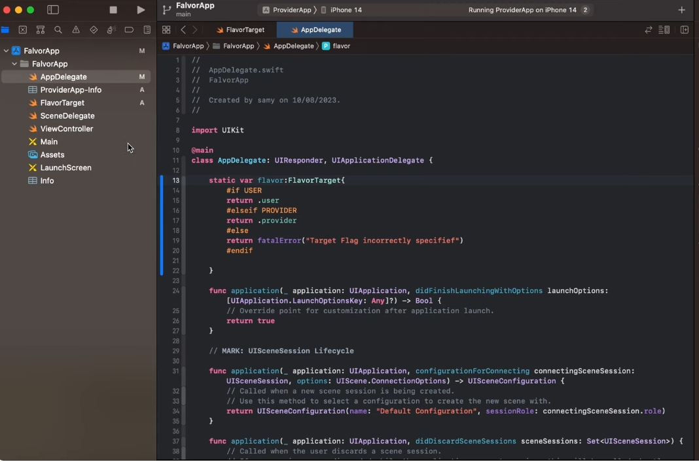

| 中文 | English |
|---|---|
| 最後在 `ViewController.swift` 的 `viewDidLoad()` 裡，透過 `switch AppDelegate.flavor` 依照目前的 Flavor 分別顯示不同文字，例如 User App 顯示 `"User App"`，Provider App 顯示 `"Provider App"`。同一套畫面、同一份程式碼，就能依 Target 顯示不同內容。 | Finally, in `ViewController.swift`'s `viewDidLoad()`, use `switch AppDelegate.flavor` to display different text depending on the current flavor — e.g. `"User App"` for the User app and `"Provider App"` for the Provider app. The same UI and the same codebase can now show different content depending on the target. |

```swift
switch AppDelegate.flavor {
case .user:
    appNameLbl.text = "User App"
case .provider:
    appNameLbl.text = "Provider App"
}
```

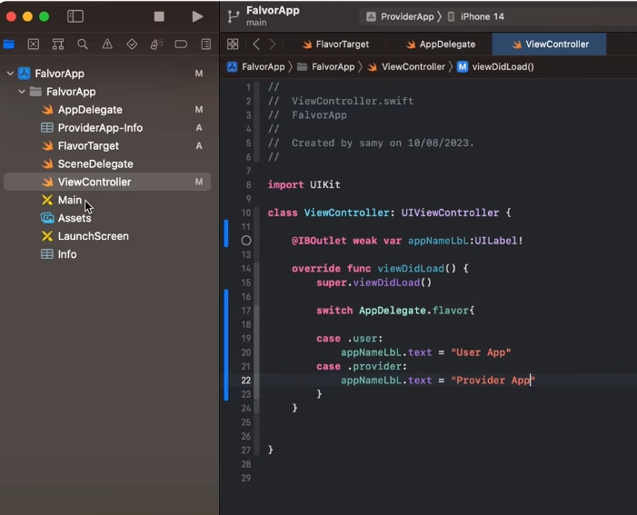

---

## 步驟九：用 Podfile 為不同 Target 設定不同的 CocoaPods 依賴 / Step 9: Configure Different CocoaPods Dependencies per Target via the Podfile

| 中文 | English |
|---|---|
| 如果兩個 App 需要用到不同的第三方套件，可以直接在 **Podfile** 裡，分別在 `target 'FalvorApp' do ... end` 與 `target 'ProviderApp' do ... end` 區塊中各自宣告需要的 Pod。例如 `FalvorApp` 使用 `Alamofire`，`ProviderApp` 使用 `Kingfisher`。 | If the two apps need different third-party libraries, you can declare them separately in the **Podfile**, inside the `target 'FalvorApp' do ... end` and `target 'ProviderApp' do ... end` blocks respectively. For example, `FalvorApp` uses `Alamofire`, while `ProviderApp` uses `Kingfisher`. |

```ruby
target 'FalvorApp' do
  use_frameworks!
  # Pods for FalvorApp
  pod 'Alamofire'
end

target 'ProviderApp' do
  use_frameworks!
  # Pods for ProviderApp
  pod 'Kingfisher'
end
```

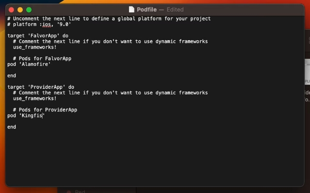

| 中文 | English |
|---|---|
| 打開終端機（Terminal），切換到專案資料夾後，先執行 `pod init` 產生 Podfile（若尚未產生），編輯好 Podfile 內容後，執行 `pod install` 安裝套件。 | Open Terminal, navigate to the project folder, run `pod init` to generate a Podfile if it doesn't already exist, edit the Podfile's content as shown above, then run `pod install` to install the pods. |

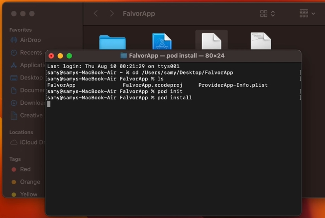

| 中文 | English |
|---|---|
| 安裝完成後，Xcode 專案導覽列會多出 **Pods** 專案，底下依照 Podfile 分別列出各 Target 所安裝的套件，Podfile 也會直接出現在導覽列中方便之後編輯。切記日後要改用 `.xcworkspace` 而不是 `.xcodeproj` 來開啟專案。 | After installation, the Xcode project navigator gains a **Pods** project, listing the packages installed for each target as declared in the Podfile; the Podfile itself also appears in the navigator for easy future editing. Remember to open the project via the `.xcworkspace` file from now on, instead of `.xcodeproj`. |

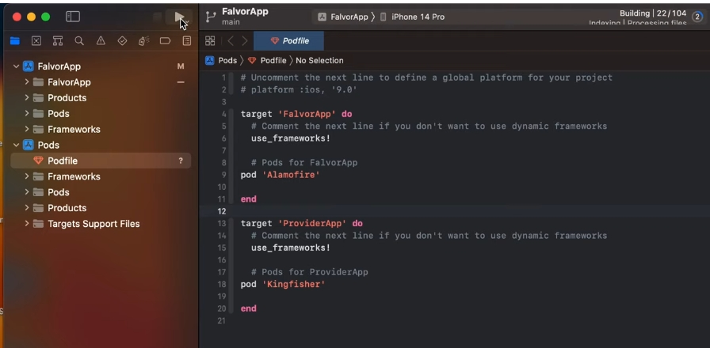

---

## 步驟十：實際執行，驗證兩個 Target 各自運作 / Step 10: Run and Verify That Each Target Works Independently

| 中文 | English |
|---|---|
| 選擇 `FalvorApp` 這個 Scheme 並在模擬器上執行，畫面上的標籤（Label）會依照前面在 `ViewController.swift` 寫的邏輯，正確顯示 **"User App"**。若切換到 `ProviderApp` 這個 Scheme 重新執行，同一套畫面、同一份程式碼會顯示 **"Provider App"**，且會使用各自獨立的 Bundle Identifier、Info.plist、Pods 與（依需求可再加上的）App Icon，兩個完全獨立的 App 就完成了。 | Select the `FalvorApp` scheme and run it in the simulator — the label on screen correctly shows **"User App"**, following the logic written in `ViewController.swift`. If you switch to the `ProviderApp` scheme and run again, the same UI and the same codebase will show **"Provider App"** instead, using its own independent Bundle Identifier, Info.plist, Pods, and (optionally) App Icon. With that, you have two fully independent apps built from a single project. |

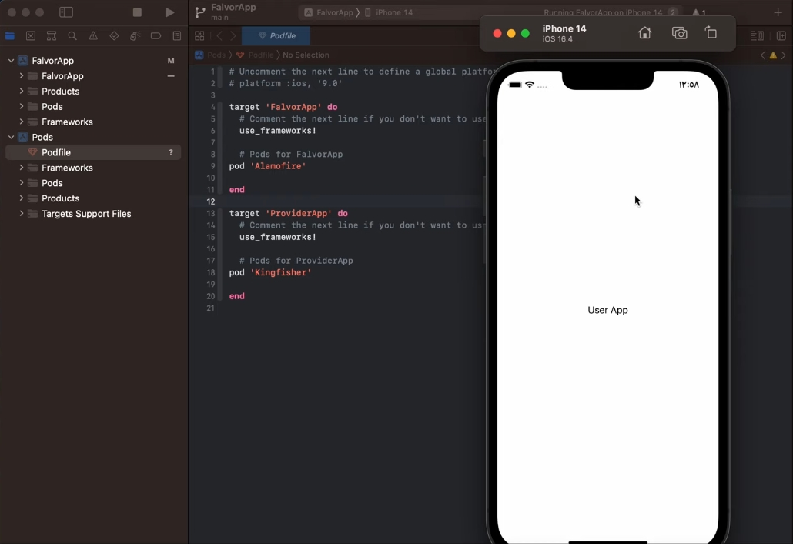

---

## 補充：如何為不同 Target 設定不同的 App Icon / Bonus: Setting a Different App Icon per Target

| 中文 | English |
|---|---|
| 若想讓兩個 Target 使用不同的 App Icon，可以先在 Assets 中**複製一份 App Icon**（Duplicate App Icon），建立第二組圖示資源；接著到該 Target 的 **Build Settings**，找到 **Primary App Icon** 這個設定項，指定它使用剛剛複製出來的那一組圖示即可。 | To give each target a different app icon, first **duplicate the App Icon** asset in the Assets catalog to create a second icon set. Then go to that target's **Build Settings**, find the **Primary App Icon** setting, and point it to the newly duplicated icon set. |

---

## 總結 / Summary

| 中文 | English |
|---|---|
| 透過「複製 Target → 各自的 Info.plist → 各自的 Bundle Identifier / 簽署 → 各自的 Scheme → 編譯旗標區分程式邏輯 → Podfile 區分依賴套件 → （選用）各自的 App Icon」這一整套流程，就能在**同一個 Xcode 專案**中維護多個外觀相似、但品牌／設定不同的 App，大幅減少重複開發與維護成本。 | By going through the full workflow — "duplicate the target → give it its own Info.plist → its own Bundle Identifier / signing → its own scheme → distinguish code logic via compiler flags → separate dependencies via the Podfile → (optionally) its own App Icon" — you can maintain multiple apps that look similar but differ in branding/configuration, all within a **single Xcode project**, greatly reducing duplicated development and maintenance effort. |
