# PLC Servo Motor Control 教學筆記
### 伺服驅動器接線、參數設定、PLC 指令與 HMI 設計

> 原始影片：《PLC Servo Motor Control - Servo Drive - Wiring - Modes - Programming》
> 頻道：Instrumentation Tools
> 連結：https://www.youtube.com/watch?v=l2MYWYrP4ao
> 講師：Yash Wadhwani

---

## 目錄

1. [影片簡介與章節規劃](#1-影片簡介與章節規劃)
2. [伺服驅動器硬體接線](#2-伺服驅動器硬體接線-wiring)
3. [常見數位輸入 (DI) 與數位輸出 (DO)](#3-常見數位輸入-di-與數位輸出-do)
4. [伺服控制的三種模式](#4-伺服控制的三種模式)
5. [伺服驅動器關鍵參數設定](#5-伺服驅動器關鍵參數設定-parameters)
6. [台達 PLC 伺服控制指令詳解](#6-台達-plc-伺服控制指令詳解)
7. [ISPSoft 梯形圖編寫示範](#7-ispsoft-梯形圖編寫示範)

---

## 1. 影片簡介與章節規劃

**[00:12]**

本集目標是介紹如何透過 **PLC** 與 **HMI** 來控制**伺服馬達 (Servo Motor)**。內容分為四大部分：

1. 伺服驅動器接線 (Wiring)
2. 驅動器重要參數設定 (Parameters)
3. PLC 控制指令介紹 (Instructions)
4. HMI 介面設計與模擬 (Simulation)

整體學習流程如下圖所示：了解驅動器與馬達接線 → 確認驅動器參數 → 確認 PLC 控制指令 → 設計 HMI → 測試模擬。

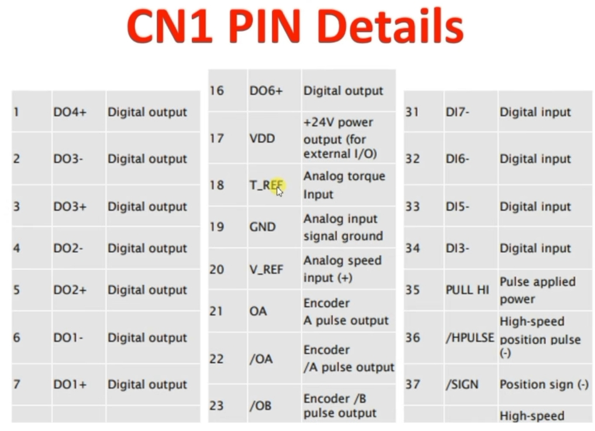

---

## 2. 伺服驅動器硬體接線 (Wiring)

**[01:25]**

本範例以 **Delta ASDA-B2** 伺服驅動器為例，說明面板上各接口的功能：

- **LED Display**：5 位數 7 段顯示器，顯示伺服狀態或故障代碼。
- **Operation Panel**：MODE / SHIFT / ▲ / ▼ / SET 功能鍵，用於狀態顯示、監控、診斷與參數設定。
- **CN1**：I/O 介面，用於連接主控制器 (PLC) 或控制 I/O 訊號。
- **CN2**：RS-485/232/422 序列通訊介面，連接個人電腦或其他控制器（編程用）。
- **CN3**：另一組 RS-485/232 通訊介面。
- **主電路端子 (R, S, T)**：接 200~230V、50/60Hz 商用電源。
- **控制電路端子 (L1c, L2c)**：接 200~230Vac 單相電源，作為輔助電源。
- **馬達輸出端子 (U, V, W)**：連接伺服馬達，切勿誤接主電路電源。
- **P、C、D 端子**：內部/外部再生電阻端子。

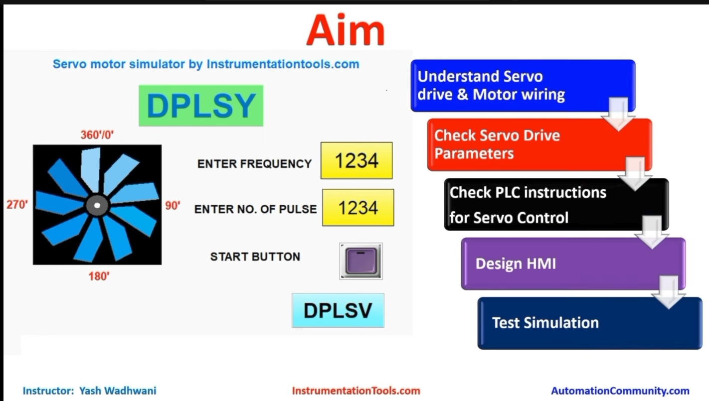

### 2.1 整體接線架構

- **主電源與輔助電源**：三相電源由 **MCB (No Fuse Breaker)** 及**電磁接觸器 (MC)** 引出，經過 **EMI 濾波器**後接入驅動器主電路；L1c、L2c 則另外連接兩相電源作為控制電路（輔助）電源。
- **馬達與編碼器**：U、V、W 三相線直接接至伺服馬達；編碼器接頭則連接至驅動器的 **CN2** 接口。
- **煞車電阻**：連接至 **P、C** 端子，用以吸收煞車時產生的再生電力，避免驅動器損壞。
- **通訊與控制訊號**：CN2 用於連接電腦編程軟體 (ASDA-Soft)；CN1 則透過**端子台模組 (ASD-BM-50A)** 轉接後，連接至外部控制器 (PLC / HMI)。

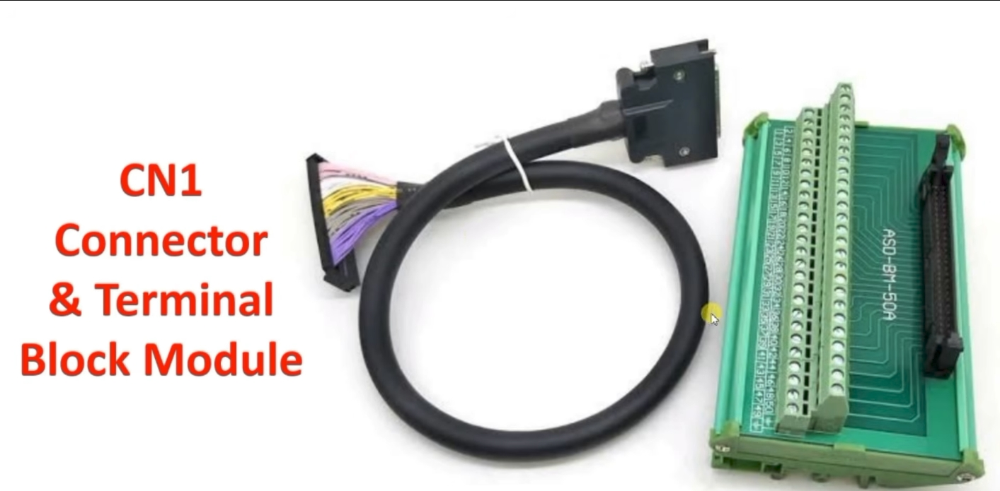

### 2.2 CN1 端子台轉接模組

CN1 為 50 pin 的 D 型接頭，實務上會使用專用排線搭配**端子台模組 (ASD-BM-50A)**，將 CN1 訊號轉接為方便配線的端子排，再與 PLC 或其他控制器對接。

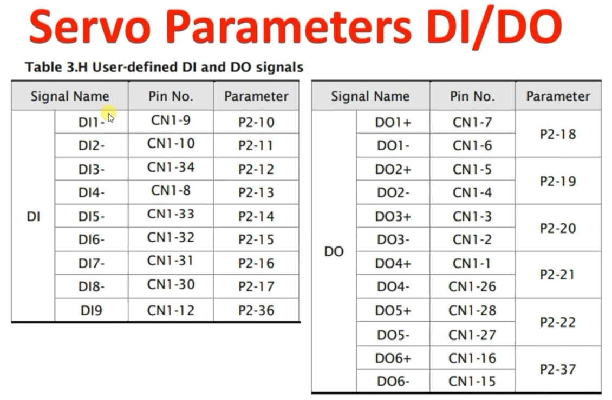

### 2.3 CN1 主要接腳定義

CN1 上常用接腳包含數位輸出 (DO)、+24V 電源輸出 (VDD)、類比訊號輸入 (T_REF、V_REF)、編碼器輸出 (OA/OB) 以及數位輸入 (DI) 等，部分重點接腳如下：

| Pin | 名稱 | 說明 |
|---|---|---|
| 17 | VDD | +24V 電源輸出（供外部 I/O 使用） |
| 18 | T_REF | 類比扭矩輸入 |
| 19 | GND | 類比訊號接地 |
| 20 | V_REF | 類比速度輸入 (+) |
| 35 | PULL HI | 脈波輸入用電源 |
| 36 | /HPULSE | 高速位置脈波 (-) |
| 37 | /SIGN | 方向訊號 (-) |

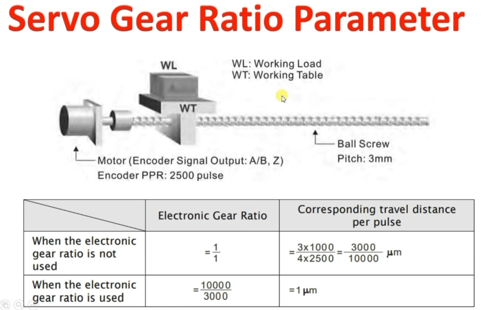

### 2.4 CN2 編碼器/通訊接腳

CN2 除了作為驅動器與電腦編程軟體的通訊介面外，也對應馬達端編碼器接頭的訊號腳位（T+/T-、+5V、GND、屏蔽等）。

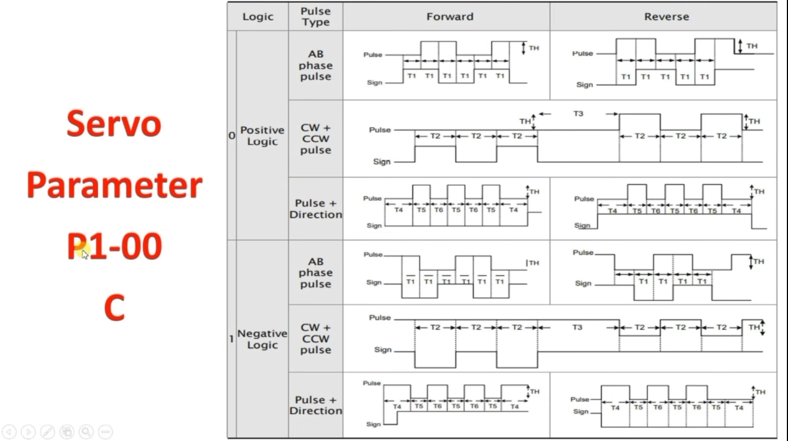

### 2.5 PLC 與 CN1 端子台接線（Open Collector 模式）

以**開集極 (Open Collector)** 接線模式為例，PLC 與伺服驅動器之間的脈波/方向訊號接線方式如下：

- 驅動器內部 **24V 電源 (Pin 17, VDD)** 短接至 **Pin 35 (PULL HI)**。
- 驅動器 **Common (Pin 14)** 接至 PLC 數位輸出的 **COM** 端。
- PLC **脈波輸出 (如 Y0)** 接至 **Pin 41 (/PULSE)**。
- PLC **方向輸出 (如 Y1)** 接至 **Pin 37 (/SIGN)**。
- 最大輸入脈波頻率為 **200kpps**。

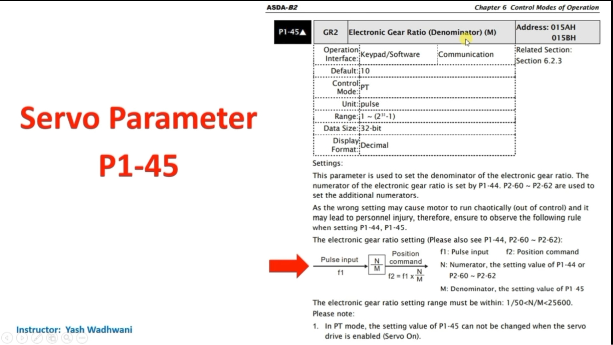

---

## 3. 常見數位輸入 (DI) 與數位輸出 (DO)

**[07:00]**

### 3.1 數位輸入 (DI)

伺服驅動器的數位輸入訊號可依需求指派到不同的 DI 接腳（透過 P2-10~P2-17 等參數設定），常見預設訊號如下：

| 訊號 | 說明 | 預設 Pin |
|---|---|---|
| **SON** | Servo On，切換伺服至「就緒」狀態 | 9 |
| **ARST** | Alarm Reset，清除多數警報 | 33 |
| **GAINUP** | 增益切換 | - |
| **CCLR** | 啟動時依 P2-50 設定執行脈波清除模式 | 10 |
| **ZCLAMP** | 馬達速度低於 P1-38 設定值時鎖定在瞬時位置 | - |

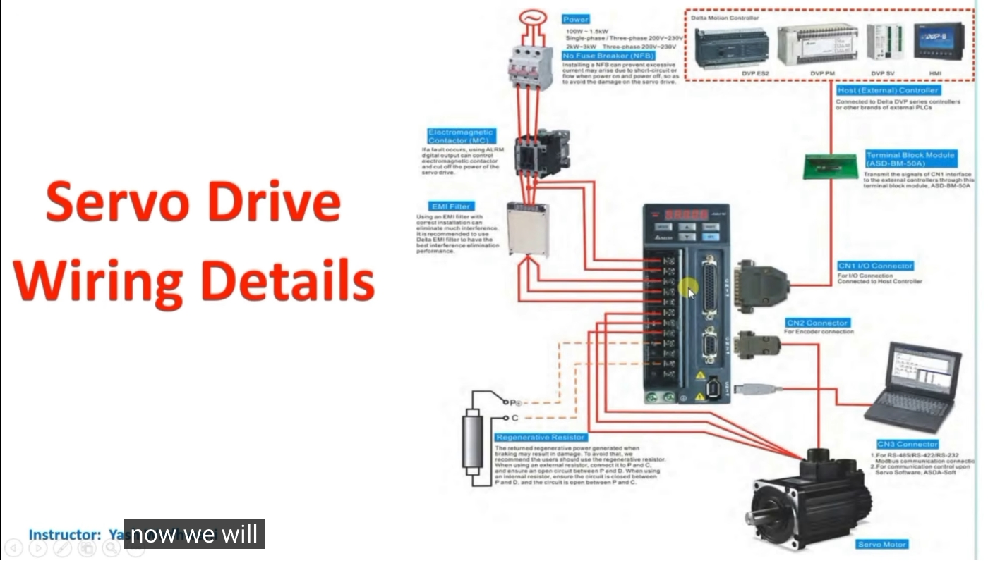

其他與極限、寸動相關的 DI 訊號：

| 訊號 | 說明 | 預設 Pin |
|---|---|---|
| **EMGS** | 緊急停止，須為常閉 (b) 接點，正常時應為 ON | 30 |
| **NL (CWL)** | 反轉禁止極限 | 32 |
| **PL (CCWL)** | 正轉禁止極限 | 31 |
| **JOGU / JOGD** | 寸動正轉／反轉 | 可自訂 |
| **INHP** | 脈波輸入禁止，啟動後外部脈波指令失效、馬達停止 | 45 |

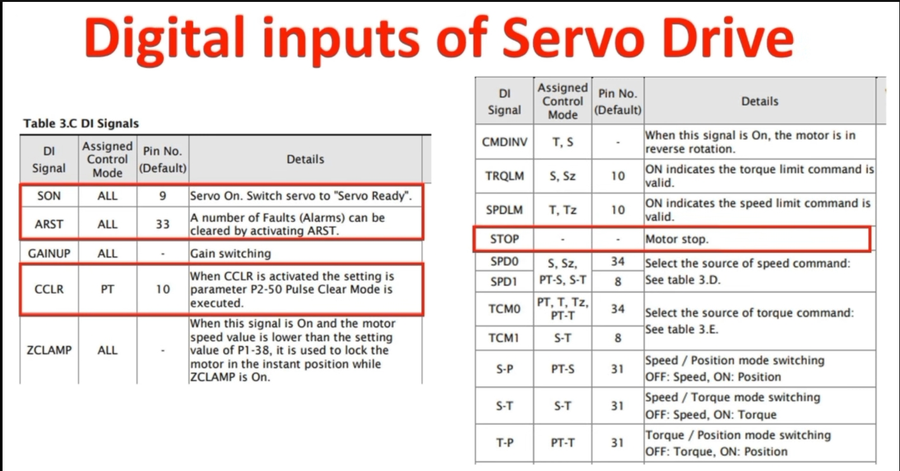

### 3.2 數位輸出 (DO)

| 訊號 | 說明 | 預設 Pin (+/-) |
|---|---|---|
| **SRDY** | 伺服就緒，所有故障/警報已清除時觸發 | 7 / 6 |
| **SON** | 伺服開啟狀態回傳（無故障時 ON） | 未指派 |
| **ZSPD** | 馬達速度低於或等於 P1-38 設定的零速範圍 | 5 / 4 |
| **TSPD** | 馬達達到 P1-39 設定的目標轉速 | - |
| **TPOS** | PT 模式下位置誤差低於 P1-54 設定值 | 1 / 26 |
| **ALRM** | 驅動器偵測到故障時觸發（異常時驅動蜂鳴器/警示燈） | 28 / 27 |
| **BRKR** | 馬達煞車控制端 | - |
| **OLW** | 驅動器偵測到輸出過載 | - |

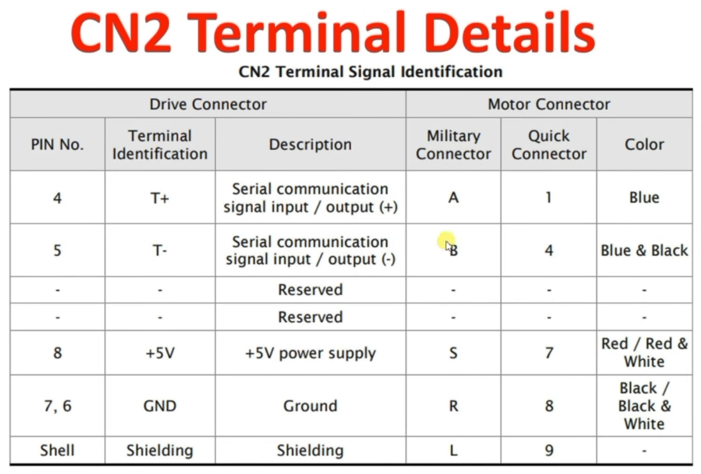

### 3.3 使用者自訂 DI/DO 對應表

實際接腳與參數對應關係（以 CN1 腳位為例）：

| DI 訊號 | Pin | 參數 |   | DO 訊號 | Pin | 參數 |
|---|---|---|---|---|---|---|
| DI1 | CN1-9 | P2-10 |   | DO1+/- | CN1-7/6 | P2-18 |
| DI2 | CN1-10 | P2-11 |   | DO2+/- | CN1-5/4 | P2-19 |
| DI3 | CN1-34 | P2-12 |   | DO3+/- | CN1-3/2 | P2-20 |
| DI4 | CN1-8 | P2-13 |   | DO4+/- | CN1-1/26 | P2-21 |
| DI5~DI9 | ... | P2-14~P2-17, P2-36 |   | DO5+/-, DO6+/- | ... | P2-22, P2-37 |

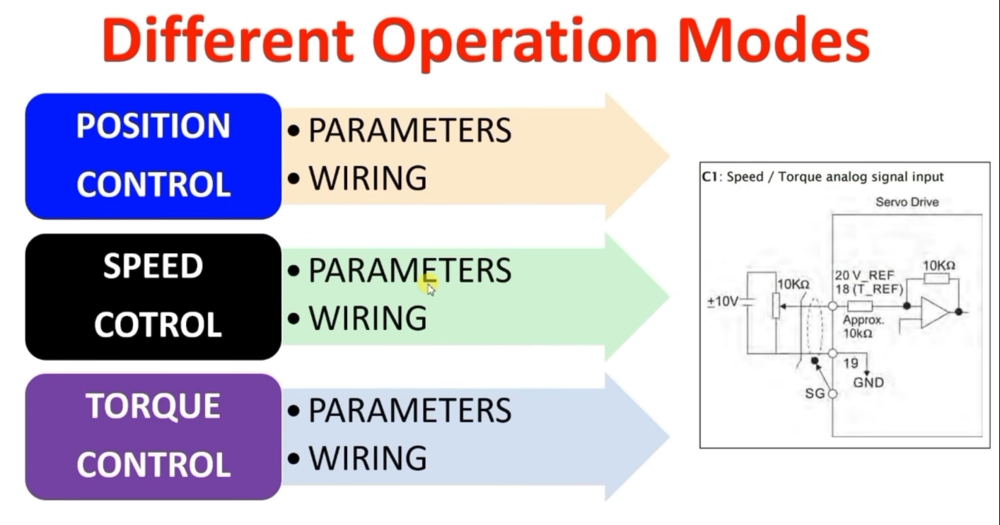

---

## 4. 伺服控制的三種模式

**[11:09]**

| 模式 | 說明 |
|---|---|
| **位置控制模式 (Position Control, PT)** | 本影片重點，透過 PLC 傳送脈波數與方向訊號進行精準定位。 |
| **速度控制模式 (Speed Control, S)** | 透過外部 0–10V 類比電壓（Pin 20 V_REF、Pin 19 GND）調節轉速。 |
| **扭矩控制模式 (Torque Control, T)** | 透過外部 0–10V 類比電壓（Pin 18 T_REF、Pin 19 GND）控制輸出扭矩。 |

三種模式各自需要對應的參數設定與接線方式；下圖為速度/扭矩控制的類比訊號輸入電路範例：

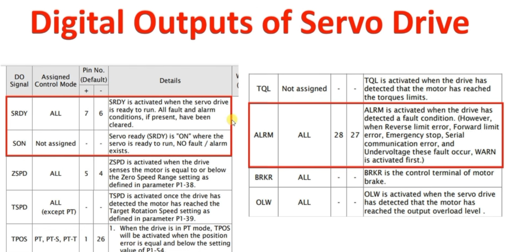

---

## 5. 伺服驅動器關鍵參數設定 (Parameters)

**[12:58]**

### 5.1 P2-10：DI1 功能定義

用於設定 DI1（預設 Pin 9）對應的功能訊號，例如 SON、ARST 等。

### 5.2 P1-00：脈波輸入格式設定

P1-00 為 4 位數（A、B、C、D）組合的十六進位參數，各位數意義如下：

- **A（脈波輸入型態）**：
  - 0：AB 相脈波 (4 倍頻，正交輸入)
  - 1：CW + CCW 脈波
  - 2：**脈波 + 方向 (Pulse + Direction)** ← 本例採用
  - 3：其他設定

- **B（脈波濾波）**：設為 **4**，代表「無濾波功能」，用於抑制雜訊造成的抖動；設定值愈大，可濾除的雜訊頻率愈高。

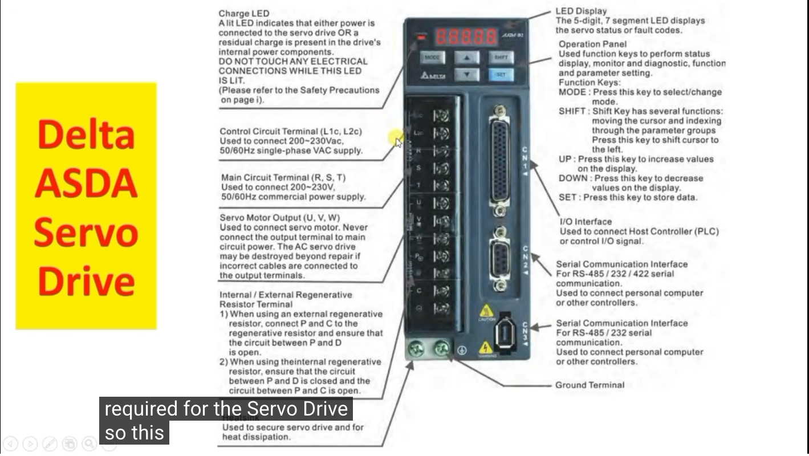

- **C（邏輯設定）**：設為 **0**，代表**正邏輯 (Positive Logic)**。下圖為正/負邏輯下，AB 相脈波、CW+CCW 脈波、脈波+方向三種型態在正轉/反轉時的波形示意圖：

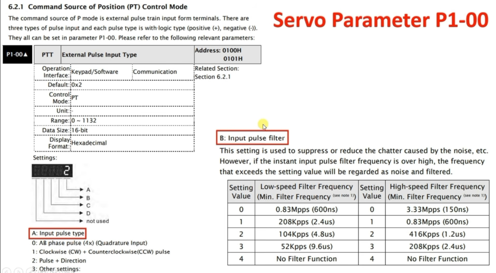

- **D（接線模式 / 脈波指令來源）**：設為 **0**，代表**開集極 (Open Collector) 低速脈波接線**（CN1 端子識別為 PULSE、SIGN）；若設為 1，則為**線性驅動 (Line Driver) 高速脈波接線**（CN1 端子識別為 PULSE_D、SIGN_D）。

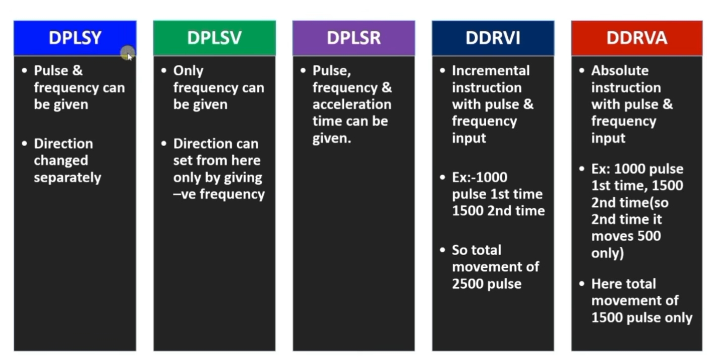

> 綜合以上，本範例 P1-00 設定為 **2, 4, 0, 0**，即「脈波+方向」「無濾波」「正邏輯」「開集極接線」。

### 5.3 電子齒輪比設定 (Electronic Gear Ratio)

電子齒輪比用於將 PLC 送出的脈波數換算成實際的機構移動距離，公式為：

```
位置指令 f2 = 脈波輸入 f1 × (N / M)
```

其中 N 為分子（P1-44 或 P2-60~P2-62），M 為分母（P1-45）。設定範圍須符合 **1/50 < N/M < 25600**。

**P1-44（分子，1st Numerator, N1）**：

- 範圍：1 ~ (2²⁶−1)，32-bit，單位：pulse
- 在 PT 模式下，僅能在伺服開啟 (Servo On) 狀態下變更數值

此外，**INHP（脈波輸入禁止功能）**可透過 DI（對應 P2-10~P2-17、P2-36）啟動；在位置模式下若 INHP 被啟動，外部脈波輸入指令將失效，馬達會停止。

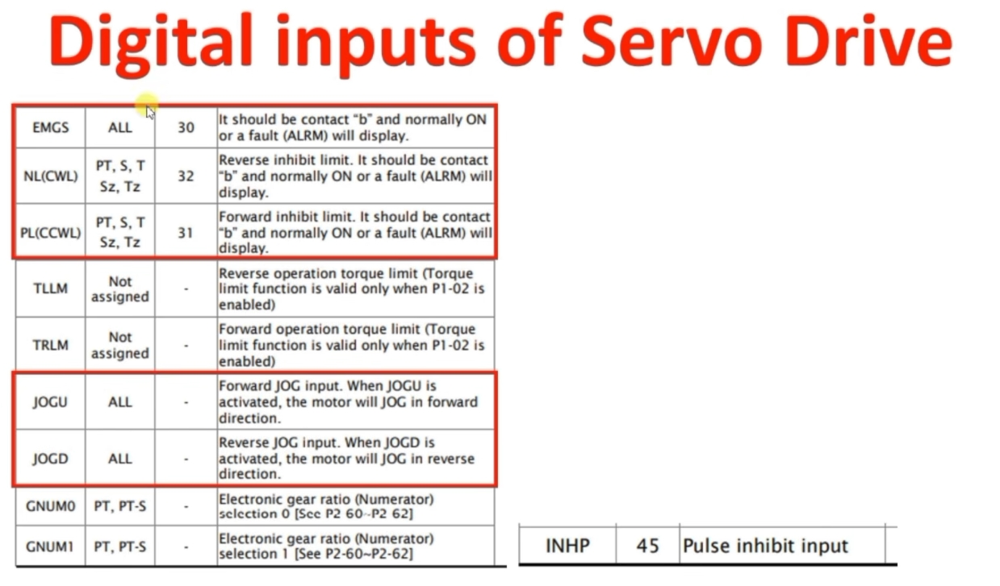

**P1-45（分母，Denominator, M）**：

- 範圍：1 ~ (2³¹−1)，32-bit，單位：pulse
- 在 PT 模式下，伺服開啟時**無法**變更 P1-45 數值

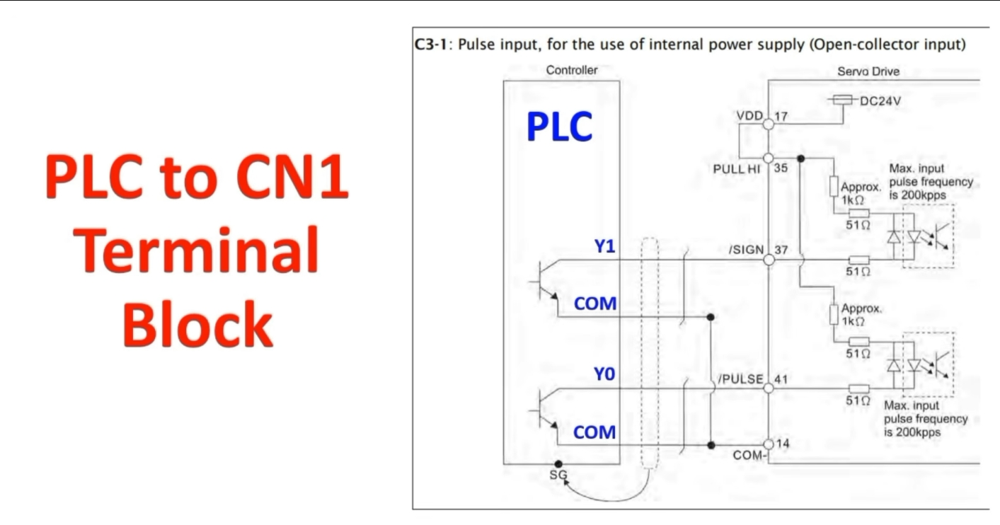

### 5.4 電子齒輪比計算範例

以「滾珠螺桿 (Ball Screw)、導程 3mm，編碼器解析度 2500 pulse/rev，馬達轉 4 圈移動 3mm（3000 µm）」為例：

- 馬達轉 4 圈所需脈波數 = 4 × 2500 = **10,000 個脈波**
- 電子齒輪比 = 10,000 / 3,000（可簡化為 10/3）
- 分子（N）寫入 **P1-44 = 10000**
- 分母（M）寫入 **P1-45 = 3000**
- 設定完成後，PLC 每發送 **1 個脈波**，機構即精確移動 **1 µm**

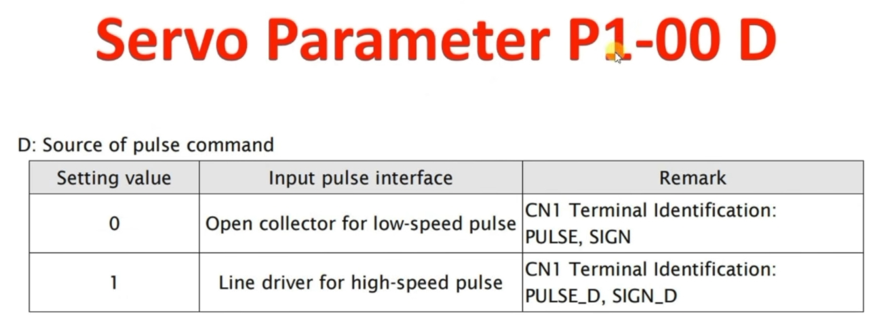

---

## 6. 台達 PLC 伺服控制指令詳解

**[18:52]**

台達 PLC（如 DVP 系列）提供多組專用指令來控制伺服脈波輸出，各指令差異如下：

| 指令 | 功能 |
|---|---|
| **DPLSY / PLSY** | 指定**脈波頻率**與**總脈波數**，發送至指定輸出（如 Y0）。方向需另外用獨立控制位元（如 Y1）切換。 |
| **DPLSV / PLSV** | 僅指定**脈波頻率（速度）**，不限制總脈波數；頻率為正數時正轉，負數時自動啟動 Y1 反轉。常用於感測器/極限開關觸發的控制。 |
| **DPLSR / PLSR** | 包含脈波數、頻率，並可新增**加減速時間**設定（例如 3000 ms 代表加減速過程為 3 秒）。 |
| **DDRVI（相對定位）** | 以**當前位置**為基準進行相對位移。例如先送出 1000 脈波移動 1000，再送出 1500 脈波則再往前移動 1500（總累計 2500 脈波）。反轉須給予負數脈波值。 |
| **DDRVA（絕對定位）** | 以**原點**為基準，移動至指定的絕對目標位置。例如先送出 1000 脈波移動至位置 1000，再送出 1500 脈波僅會再移動 500（最終到達絕對座標 1500）。 |

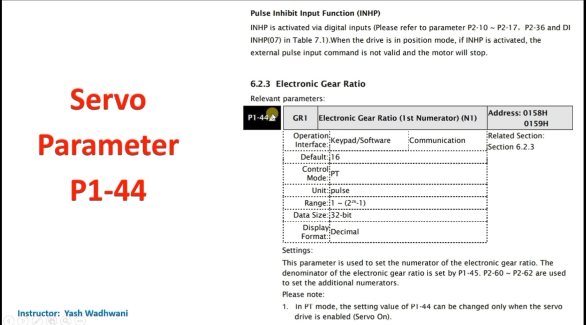

---

## 7. ISPSoft 梯形圖編寫示範

**[24:16]**

在台達 **ISPSoft** 軟體中建立專案，並設定裝置註解，方便後續程式閱讀：

- **M0 / M1**：啟動按鈕
- **Y0**：脈波輸出
- **Y1**：方向輸出
- **D0 / D2 等**：頻率、脈波數等數據暫存器

### 7.1 DPLSY 指令範例

```
DPLSY D2 D0 Y0
```

- D2：脈波頻率
- D0：脈波數
- Y0：脈波輸出
- 另需搭配一組接點控制 Y1 來切換方向

### 7.2 DPLSV 指令範例

```
DPLSV D2 Y0 Y1
```

- D2：頻率（正負值決定方向）
- Y0：脈波輸出
- Y1：方向輸出（由頻率正負自動控制）

### 7.3 其他指令示範

影片中也示範了 **DPLSR、DDRVI、DDRVA** 三組指令的參數填寫格式，並比較其在**加減速控制**、**相對定位**與**絕對定位**上的邏輯差異（詳見第 6 節比較表）。

配合本節開頭的模擬器介面（頻率輸入、脈波數輸入、啟動按鈕），可搭配 HMI 進行模擬測試，驗證程式邏輯是否正確。

---

## 參考資訊

- 影片標題：PLC Servo Motor Control - Servo Drive - Wiring - Modes - Programming
- 頻道名稱：Instrumentation Tools
- 影片連結：https://www.youtube.com/watch?v=l2MYWYrP4ao
